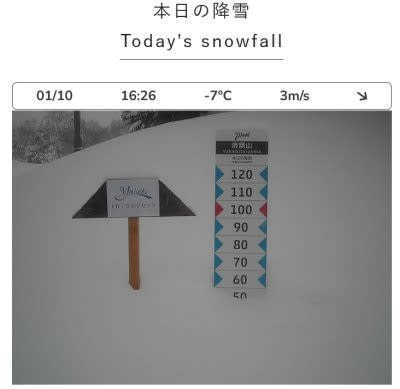

# 1月11，12，13日の3連休の志賀高原スキー場の天気，詳細予想！…そして1月10日の志賀は吹雪で昼間も30cm積雪．

📅 投稿日時: 2025-01-11 00:01:33

ってなことで．

今日は久しぶりに志賀高原特派員から

ゲレンデ状況の写真が送られてきました！

…しかし，今日は一日すごい降りだった

みたいですね…！！

前日からの積雪は予想通りの30cmでしたが．

圧雪後の朝に集中して積もったようで，

圧雪後の積雪が10cm以上．コースに

よっては20cmくらいあったようで…

さらには風も強く，

焼額は10時ごろに第2ゴンドラが止まり，

奥志賀も第2，第3，第4リフトが止まり．

そのほか横手方面も何本かリフトが

止まるくらいの強風で．

さらに気温も低く雪も降り続けるので，

今シーズンで指折りの根性の無いスキーヤー

ふるい落としデー

だったようです…

しかし，GSコースでも積雪20cm越え．

コース脇や非圧雪コースは脛パフ～

膝パフだったようで．

新雪好きには良かったのかも…？

で．

今日はこの天気で，朝までに30cm，

さらに昼までも30cm近く積もり，

1日で60cmくらい積もったみたいだし．

（[焼額山スキー場ライブカメラ](https://www.princehotels.co.jp/ski/shiga/livecamera/)より）

今日はこの天気だったので，ヤケビ

ウォールもヤケビバレーもクローズで，

明日はヤケビコーストが新たに

オープンするので…

明日は新雪ねらい目かも…！！！！

ってなことで．

明日から3連休．

水曜に3連休の天気を予想しましたが，

今日は直前の詳細天気予想です…！

11日(土)：朝までに積雪10～20cm．

　朝の気温は-11℃くらい．

　朝イチのバーンは，圧雪の上に

　うっすら軽い新雪が積もった，

　いい感じのバーン！

　非圧雪バーンは昨日までの積雪も

　あり，パウダー楽しめそう．

　天気も朝のうちは雪が降ってるけど，

　だんだん雪は弱まり，昼頃には

　止んで，午後は運が良ければ晴れて

　くれそう…！

　でも，雪が柔らかいので，午後に

　なると天気はいいけどバーンは

　ボコボコに荒れていく．

12日(日)：朝までの積雪はほぼ無し．

　朝イチの気温は-9℃くらいかな．

　雲が多いかもしれないけど，おそらく

　朝は晴れ！

　朝イチは土曜朝まで降った雪が圧雪

　された，いい感じの冷え冷えシマシマ

　バーンを視界がいい中滑れる

　いいチャンス！！

　…ただ，3連休中日だから混むかな…

　昼間もそんなに気温が上がらず

　雪質はいいけど，日差しがあると

　暖かく感じるほど．

　午後はだんだん雲が増えていくか…

　そして，バーンもちょっと荒れ気味に

　なっていく．

　夜にちょっと気温が上がり，

　ちょっと重めの雪がぱらつくかも．

13日(日)：朝までの積雪は2-3cmくらい．

　朝イチの気温は-8℃程度で雲が

　多いが朝は晴れてるかも．

　朝イチのバーンは，しっかり圧雪

　された最高シマシマバーン！

　昼に向かって雲が増えるが，朝と

　そんなに変わらない気温が続き，

　雪は1日いいコンディションが続く．

　夕方は雪がぱらつきそう．

　人が多いコースは荒れていくけど，

　人が少ないコースはそれほど

　荒れずに1日もちそう．

　

という感じでしょうか．

結構恵まれた3連休になりそうな感じです…！！

ということで．

私も3連休は志賀高原で3日間過ごしてます～！

あと3時間ちょいで出発です～！

…今日もまた睡眠時間が…（涙）

## 💬 コメント一覧

### 💬 コメント by (レインボー77)
**タイトル**: Unknown
**投稿日**: 2025-01-11 10:56:37

土曜日の志賀高原情報

夜に降ると思ってた雪が全く降らず、湯田中は平穏な朝。蓮池-9℃と冷え込むも、昨日と比べたら暖かく感じる。ニゴンも今日は減速してない。

白樺、唐松は新雪10で、滑りやすいのなんの。GSは一瞬硬い氷を踏んだけど、まあ快適。

今日解禁のヤケビコーストは、最大31度の非圧雪。私の師匠が一番乗りで10秒間隔で一人ずつスタート。いきなりの狭い急斜面でびっくりしたのか、10番乗りの友人が滑った時には、５人が転けていたとか。

私らは今季初の山の神に乗って、ダイヤのレストランで関西の友らと宴会。運転手の私は呑めませんが。

ダイアの状態は、ヤケビクオリティーには遠く及ばないものの、まずまずです。

### 💬 コメント by (レインボー77)
**タイトル**: Unknown
**投稿日**: 2025-01-11 12:55:44

つづき

昼食歓談後のダイヤ遠回りが最高でした。雪よし、人不在。

### 💬 コメント by (富山県民)
**タイトル**: Unknown
**投稿日**: 2025-01-11 15:29:59

こんにちは。

この三連休の志賀高原は比較的好条件になりそうですね。

私は今シーズンは今の所志賀高原に行く予定はないです。

一度は行きたいのですが遠いのとリフト料金が高すぎて行く気が失せます。

今シーズンは野沢温泉、赤倉観光リゾート、妙高杉ノ原、野麦峠の早割を購入したのでそちらを優先したいです。

志賀高原はなぜか毎シーズン早割を発売しないです。

### 💬 コメント by (Skier_S)
**タイトル**: 3連休初日は最高！
**投稿日**: 2025-01-11 23:44:04

＞レインボー77さま

土曜は良かったですね～！！

ダイヤ，3連休なのにすいてたんですか？？

一ノ瀬方面は激込みかと思ってました…

＞富山県民さま

3連休の志賀はいい天気になりそうです…！！

志賀は確かにリフト券高いですよね．

焼額限定券なら，早割でかなり安い一日券があるんですが…

やっぱり志賀に来たら，ほかのスキー場も行きたいですよね…

志賀高原は焼額や奥志賀，横手や熊の湯は営業努力をいろいろしてるんですが，

元締めの中央エリアと索道協会があんまり割引をする気がないので…

サービス悪化しているのに値段が上がっている状況です（泣）

