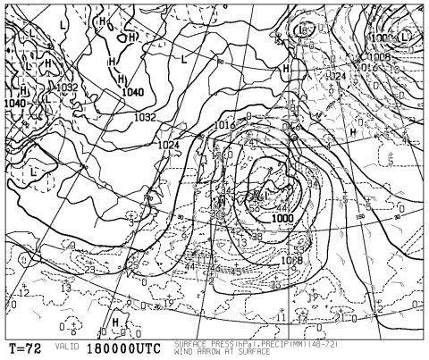
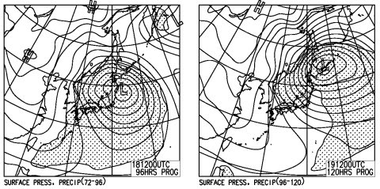
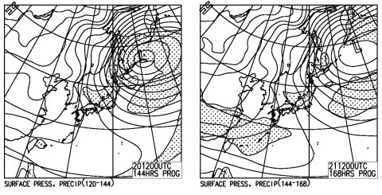

# 今週末も志賀高原…やっぱり積もらなさそうだけど，来週はすごいぞ！！

📅 投稿日時: 2016-01-15 22:29:34

🏷️ カテゴリ: [日記](cc4b5682fb7b8b144980957a978653fb0.md)

ということで．

いつも通り，この週末も志賀高原に行くわけですが．

…やっぱり，この土日．

雪が積もらなさそう…（涙）．

うーん．

また，人工雪はアイスバーン化し，

人工雪のないところは石ころバーン化

するんだろうなぁ…

しかし．

しかーーーーし．

安心するのだ，みなのモノ．

そーゆー悲しい状況も，おそらく今週末までなのだっ！！！

来週月曜，18日は…

なんだこりゃ～っ！？？

すごい低気圧が！

18日の朝は激烈な低気圧の前面で気温が上がり，

朝のうちは雨っぽいけど．

…そのあと．

18日夜から21日までの天気図は…

うはーーー！

4日間ぶっ続けの，すごい強烈な激烈な冬型！

上空の気温も超冷え冷えなので…

一週間で1m以上積もっても不思議じゃないよ！！

＃爆弾低気圧でゴンドラが止まりそうな激荒れの天気だけど

ってことで．

悲しい状況は今週末が最後…

と信じて．

土日滑ってきます～！！

## 💬 コメント一覧

### 💬 コメント by (べべ)
**タイトル**: ようやく
**投稿日**: 2016-01-16 04:54:46

ガチの冬型がきましたね！

(去年はよく見たような天気図…懐かしい…)

これでようやく志賀高原に行けそうです(笑)

### 💬 コメント by (ゆうこ)
**タイトル**: やっと降るんですね
**投稿日**: 2016-01-16 19:17:34

やっと志賀高原にも雪が降ると聞いて安心です。

私は1月最後の週末にいつものホテルに宿泊予定です。

息子も行きます！

会えたらよろしくお願いします。

### 💬 コメント by (Skier_S)
**タイトル**: 今日は結構楽しめましたよ～
**投稿日**: 2016-01-16 21:40:22

＞べべさま

いやーーー．

きますよ．

ホントにすごい冬型の荒れ荒れ天気がきますよ．

19，20，21日と3日連続でウハウハパウダーデーですよ．

来週は楽しめそう…

＞ゆうこさま

お久しぶりです～！

いやー．やっときますよ．どか雪が…

で．

ついに，スキー場復活なんですね！

おまちしておりました（笑）

1月最後の週末は，私はいつものホテルでは

ないので，ちょっと残念ですが…

焼額ぐるぐるしていますので，もし

焼額に来ることがありましたら，お会いしましょう！

