# 1月16日の志賀高原は…ガラガラ！焼額は人工雪で意外とまともだったなぁ…

📅 投稿日時: 2016-01-16 23:11:29

ということで．

今日も志賀高原に来ておりますが．

えー．

やっぱり，先週から雪はほとんど積もってません（涙）．

だもんで．

志賀高原への登り坂．

…サンバレーまで，アスファルト路面が出てるんですけど？？

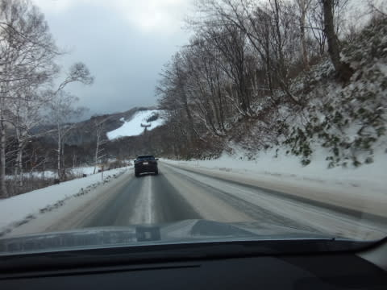

…1月の志賀高原とは思えないんですけどっ！？？

＃サンバレーより上は，本格雪道なのでご注意を．

って感じでやってきた，いつもの焼額山頂．

山頂の気温は，今日もマイナス10度と…

気温自体は冷え冷えですね．

気温だけは…

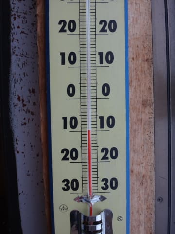

で．

朝イチのゲレンデに出てみると…

朝の天気は，うす曇り．

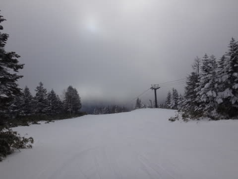

そして雪は…

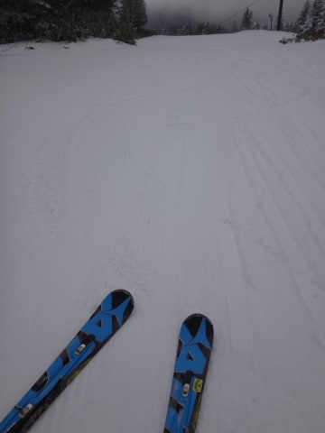

積雪はないけど，冷え冷えの締まった

いい感じの圧雪！

そしてコースは…

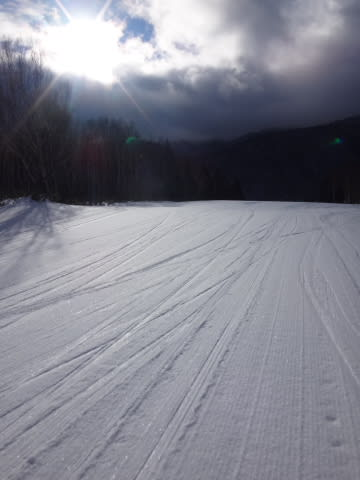

をを！

どうやら，焼額第1ゴンドラ側のGSコース．

かなり気合を入れて人工降雪をしたようではないですか！

これまで，土やブッシュが結構出ていた部分．

ほぼ完全に，ブッシュが隠れているよ！

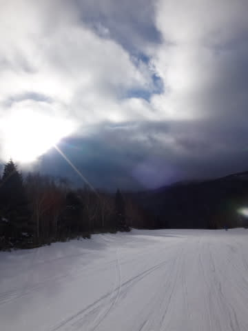

…一部，人工降雪が足りてなくて，うっすら

石が出ている部分もあるけど…回避可能レベルかな．

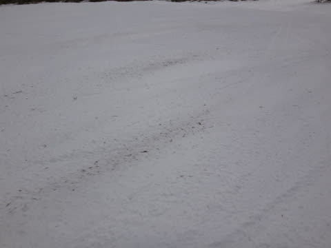

とりあえず．

先週からほとんど雪が降っていないということを考えると．

予想だにしなかったレベルで，ゲレンデ状況は

改善してます！

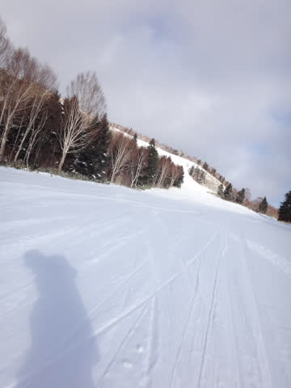

ビバ！人工雪っ！！！

…

ただ．

人工雪の欠点は．

朝イチのしばらくはいいんだけど．

数本滑ると，こんな感じで，氷のコロコロが

発生してきて…

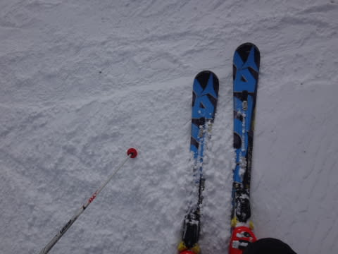

そして，そのあとは．

ところどころ，ちょっとツルツルアイスバーン化（涙）

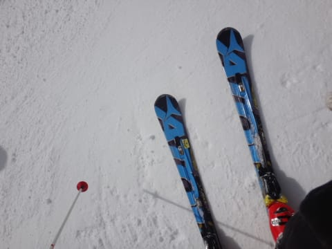

さらに，ゲレンデ上にはこんな氷の塊まで…（悲）

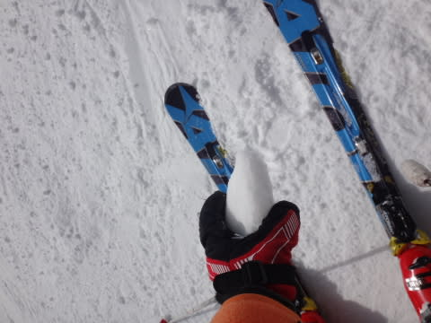

とはいうものの．

今日は，正月休み＆3連休という，怒涛の休みが終わった

次の週，ってのもあるのか．

雪不足ニュースが伝わっているからか．

…朝から，ゲレンデはガラガラなんですがっ？？

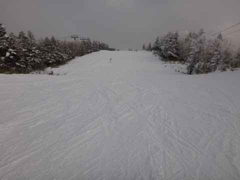

そして，ゴンドラもほぼ飛び乗り状態なんですが？？

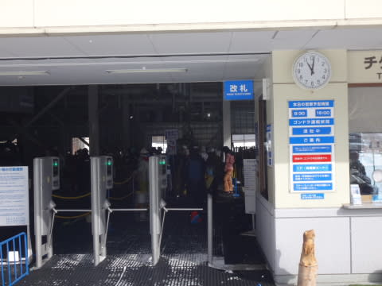

＃実際，これまでの写真に，ほとんどほかの

＃スキーヤーが写っていない…

だもんで．

先週の3連休のように．

大勢のスキーヤーで強烈に雪が削られて，

あっという間にゲレンデ全面がツルツルに…

ってこともなかったし．

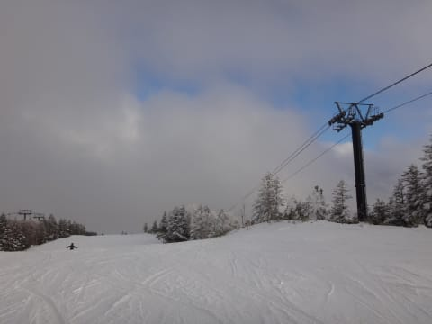

先週はひどい土だらけになっていた部分も，

しっかり人工雪でカバーされて，夕方まで

土は全く出てこなかったし．

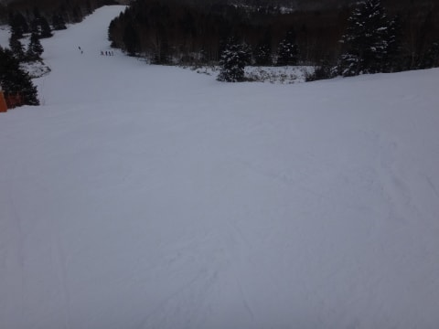

…まぁ，一部，石が浮いてる部分や…

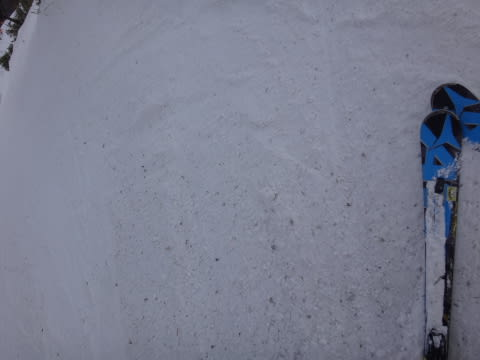

氷の下地が出ているところもありはしたものの．

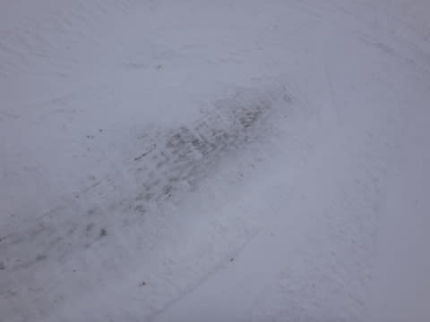

まぁ回避可能レベルだし．

人も少なくて，好きなライン取り放題なので，

石は簡単に避けれるし．

…しっかり人工雪を打った焼額．

先週に比べたら，ずーーーーっとましではないですか！

で．

曇り時々小雪．

たまに薄日も…という天気だった本日．

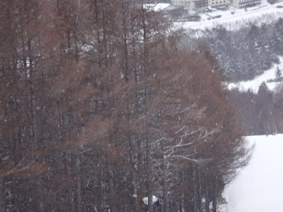

昨晩からの積雪はほとんどなかったものの．

意外と，コースわきには10cmほどの新雪もあり…

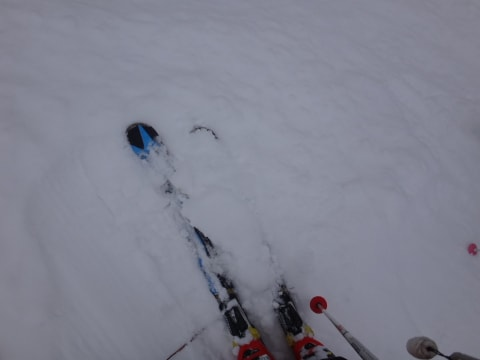

パウダー大好き娘も喜んでましたね～！

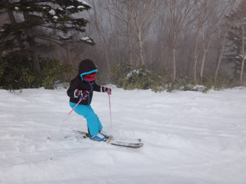

人が少なかったので，なかなか荒らされなくて．

いやーー．

がらがらなスキー場って，いいですね～！

ってことで．

予想以上に楽しめた本日も．

たっぷりリフトストップまで滑って…

…で．

いつも通りのナイターです（やっぱり）．

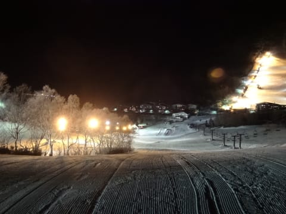

いやー！

今日のナイター．気温が低くて，

締まった雪の最高シマシマバーン！！！

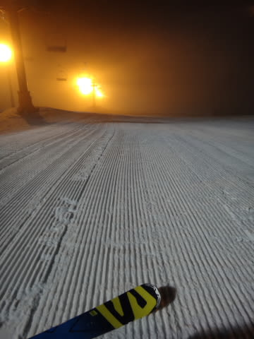

そして…

ナイターもガラガラで，人がいないんですけど？？？

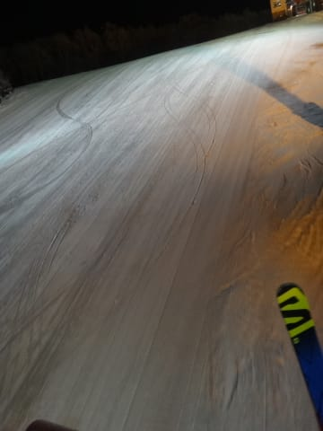

…おそらく，今日のトータルのお客さん，10人程度．

ほぼ貸し切り状態のシマシマナイターを楽しんだのでした…

いや．

今日．

人工雪がないバーンは，やっぱりまずい感じだったけど．

焼額の第1，第2ゴンドラとも．

大体しっかり人工雪をつけているので．

意外と先週より状況が改善していて．

…予想以上に楽しめた一日だったかも？？

なんにしろ．

ガラガラってのが，よかったな～！

残念ながら，今晩も雪は積もらなさそうだけど．

明日も，ほとんど人がいないゲレンデを楽しめそう！

## 💬 コメント一覧

### 💬 コメント by (Goku)
**タイトル**: 焼額山スタッフ偉い
**投稿日**: 2016-01-17 15:00:28

焼額山の降雪部隊がんばりましたね。

私、焼額山はバーンが怪しそうだったのと、天気イマイチかな～？って、早割り券消化のためにアサマ２０００行ってました。

今週はたっぷり雪が降りそうだし、いよいよ志賀らしくなってくれることを祈るばかりです。

### 💬 コメント by (デーコン)
**タイトル**: Unknown
**投稿日**: 2016-01-17 21:21:44

こんばんわ。

先週よりだいぶ良くなりましたね。

人が少なすぎじゃないですか!

ところでサニー志賀ってどうなったんですかね。

### 💬 コメント by (べべ)
**タイトル**: Unknown
**投稿日**: 2016-01-17 22:58:31

さすがヤケビ。仕上げてきますね。

私は天然雪を諦めて富士見パノラマに逃げてました(笑)

人工雪ですが冷えて雪質は良かったですよ！

### 💬 コメント by (Skier_S)
**タイトル**: 今日は土が出てきた…（涙）
**投稿日**: 2016-01-18 00:56:30

＞Gokuさま

土曜のヤケビは，意外と良かったですよ～！

日曜はGSコースはアイスバーンちっくに

なってきましたが…

日曜は，新しい板はまだ出せない感じ

でした（笑）．

＞デーコンさま

志賀の泥棒事件＆バス事故＆雪不足の

トリプルパンチで，志賀高原はありえない

レベルのすき具合でした…

サニー志賀，とりあえず普通に営業しているように

見えました…

＞べべさま

富士見パノラマですか…

人工雪，しっかり仕上がってましたか．

今日のヤケビはちょいとところどころ

固かったです…（涙）．

富士見も午後は固くなったんじゃないでしょうか？

