# 2019/3/21(木・祝)の志賀高原スキー場は…朝は雨．午後は晴れたけど，4月の気温で雪はすごいことに（涙）

📅 投稿日時: 2019-03-22 05:05:11

ということで．

春分の日の祝日の本日．

志賀高原を滑っていたわけですが…

昨日，

　ただ．朝8時頃に．

　前線が通過するしばらく，雨がぱらつきそうだけど…

と書いた通り．

雨降りで始まった本日（涙）

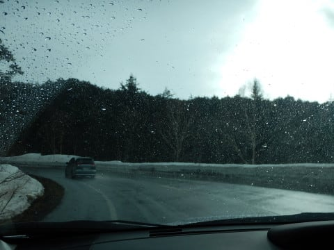

朝8時ごろの志賀高原への登り坂の途中，

パラパラと雨が降っていて．

路面の雪は完全に融けてます（泣）．

あぁ…

今日は雨の中滑るのか…

と思っていたところに．

さらに追い打ちの悪いニュース！！

なぬーーーー！！！

強風のため，焼額は第1，第2ゴンドラとも

運転見合わせ…！！（激涙）

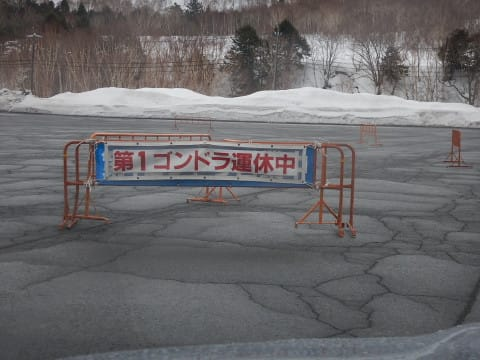

奥志賀，寺子屋も全面運休．

東館山ゴンドラも運休（泣）．

ってな感じで．

焼額の第3高速リフトで

スタートとなった本日．

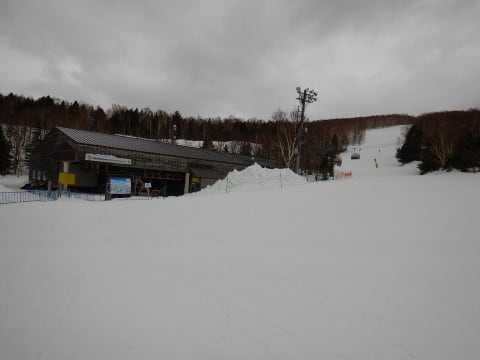

リフトのフードを，無情にも

雨が濡らしていきます（泣）．

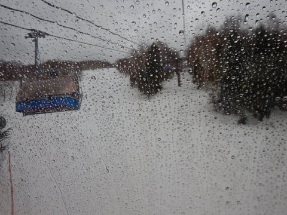

ただ，雨の降りはあくまでぽつぽつ，

せいぜいパラパラ程度で，

ウェアがびしょ濡れになるほどでは

無いのが救い…

雨の中滑ろうという人は少なく．

ゲレンデは超ガラガラで．

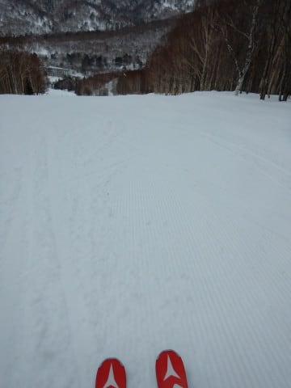

あさイチのゲレンデは，シマシマでは

あるものの…

雪質は，雨を吸った4月の

雪です（涙）

あぁ…月曜までは真冬の，

1月のトップシーズンレベルの雪だった

らしいのに．

木曜日には，4月の雪になってしまうとは…

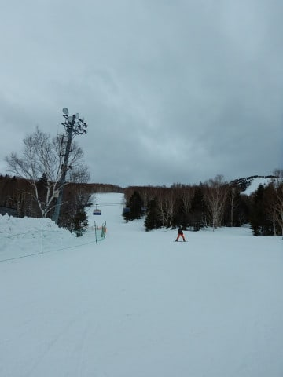

わずか2日間で，季節が3か月も進んじゃった

ようです（激泣）．

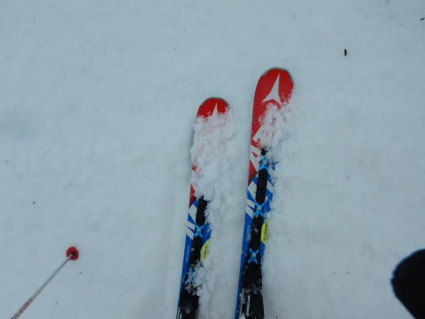

雨は，予想通りそれほどひどくなることなく，

9時半ごろにはほとんど止み．

10時ごろには完全に上がりましたが…

相変わらず曇り空で．

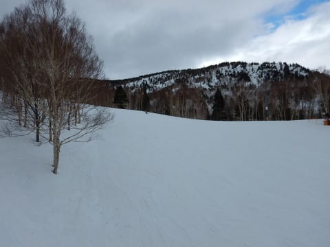

風も強く，リフトも時折

止まるほどで．

ゴンドラが動く気配，無し（泣）．

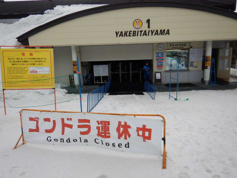

まぁ，リフトはガラガラだし．

雨も止んだから，まだいいけど．．

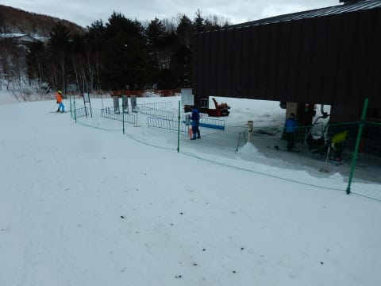

とりあえず．

ゴンドラが滑れない焼額だけ滑って

いても，飽きるので．

一の瀬方面へ脱出！！

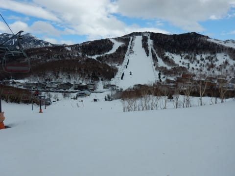

一の瀬のリフトもガラガラで…

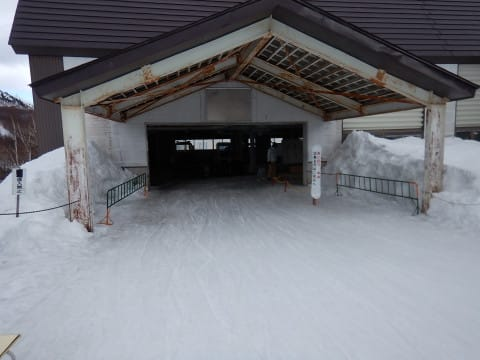

ゲレンデの人も少ないけど．

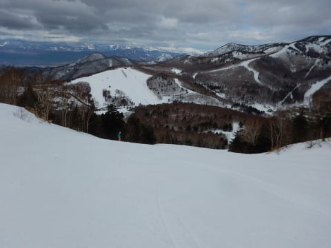

やっぱり雪は４月の雪…（涙）

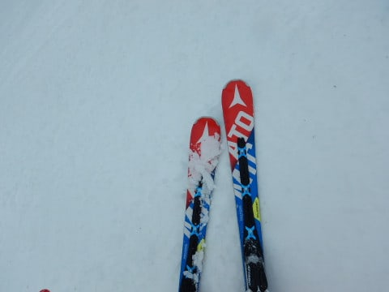

朝のうちはそれでも締まっていて

良かったけど．

昼になって天気が回復し始め…

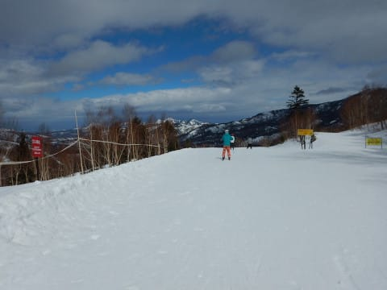

ゲレンデに日が差してくると．

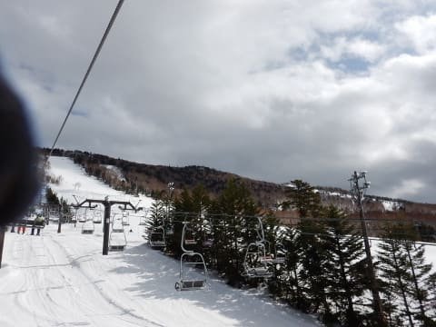

雪は水を吸った重い雪となり．

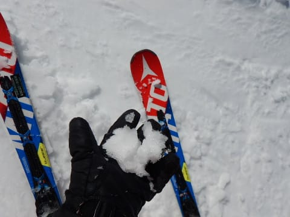

ゲレンデは荒れ始め．

さらに，板に張り付く，

滑らない雪になってきました…（泣）

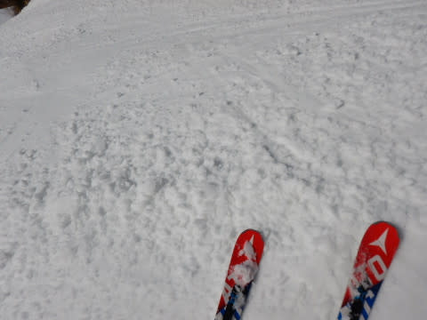

あぁ．

ダメだ．

今日はダメだよ…

そんな12時半過ぎ．

ようやく，いいニュース！

焼額の第1ゴンドラ，営業開始するよ！！

というので，焼額へ！

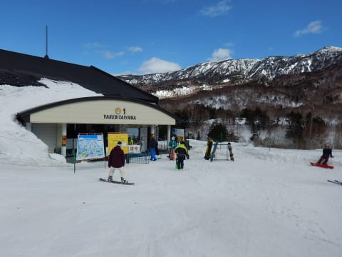

をを．

やっと，ゴンドラが動いた！！

と，喜び勇んで，運転開始直後に

乗ったものの．

山頂に着くまでに，強風で止まること

数回…（泣）

だもんで．

運転開始直後に，

「やっぱり営業見合わせます～」

との放送がかかり．

すぐに運休（泣）

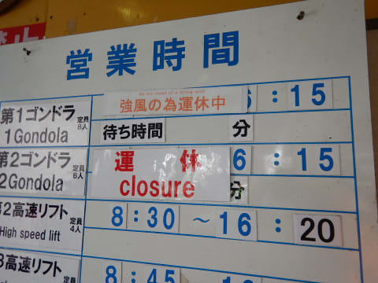

結局，この日はこれ以降，

ずっとゴンドラが動かずじまいでした…（涙）

そして．

昼の山頂の気温は+5℃と，

かなり暖かく．

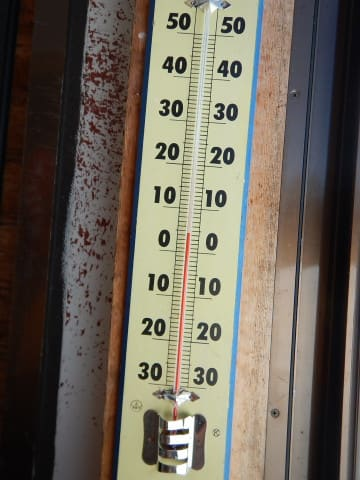

午後にはすっきり晴れてしまい，

日が差したのもあって…

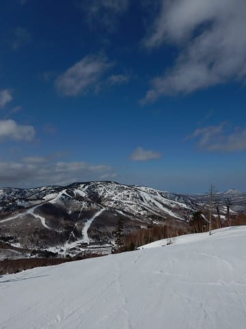

午後のゲレンデは．

志賀高原ほぼ全面，板に張り付く

滑らない雪になっちゃいました…（泣）．

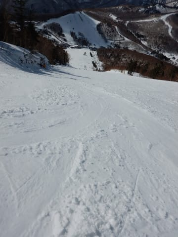

雨もそれほどひどくなく．

雪がひどく解けてしまうことが

無くて．

さらに午後は天気も良くなったので．

まぁ，その点は良かったけど．

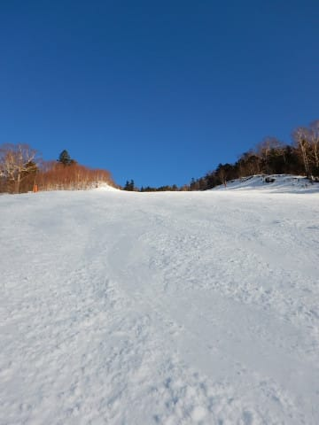

ゴンドラも終日動かず．

板に張り付いて滑らない雪で．

さらに午後には結構

荒れていったという．

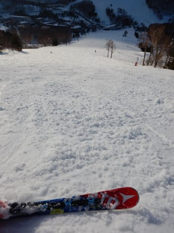

先週の天国から比べると，

「なぜ…なぜあの週末から

　わずか4日で，ここまで

　変わってしまうのか…（激涙）」

という悲惨なゲレンデを．

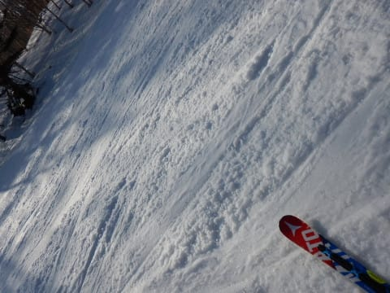

それでもやはり，

日が暮れるリフトストップまで，

滑り続けたのでした…

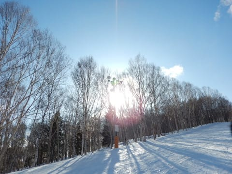

あぁ．

悲しい．

このままでは終われない．

おそらく．

気温が冷えるナイターでは，

板が滑るはずだ！！！

と，やってきました，

一の瀬ファミリーのナイターへ．

いや．

気温がそれほど冷えなかったので，

ガチガチに硬くなっておらず．

エッジが食い込む緩さのまま

板が走る，いい感じのシマシマ

バーン！！！

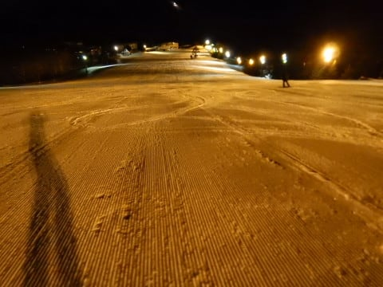

人も少ないし，いや，これは楽しいよっ！！！

…と．

遅いペアリフトの緩斜面なので．

そこそこに切り上げて帰ろうと

思っていたところ．

ついついリフトストップまで

滑り倒したのでした…

いや．

ナイターがあってよかった…

で．

明日から気温が下がり始めそう

なんですが．

このまま気温が下がると

ガチガチバーンになりそう…

ちょっとでも雪が積もってくれると

いいんだけど…

うーん．

今の天気図だと，ちょい期待薄かな…

## 💬 コメント一覧

### 💬 コメント by (Rikoriko)
**タイトル**: Unknown
**投稿日**: 2019-03-22 07:27:16

いつも楽しく読ませていただいています。

テレビの天気予報よりも的中率高く、しかも志賀高原スキー場に特化されていて、ほしい情報満載なのでありがたいです。

私達夫婦はスキー好きが高じて公務員を早期退職し、冬だけ志賀高原の麓にいます。

お天気の良い日だけ滑りに行くのですが、いつもこのブログをチェックしてから出発しています（笑）。

昨晩ナイター終了まで滑られたということはもちろん今日も志賀におられるんですよね。ちなみに今日のお天気予報はいかがでしょうか？

### 💬 コメント by (Skier_S)
**タイトル**: Unknown
**投稿日**: 2019-03-22 07:58:30

>Rikorikoさま

冬の間、志賀の麓 いらっしゃるのですか！

このblog読者にも何人かいらっしゃいますが、うらやましいです…

今日は終日曇り。

朝はガスも出ます。 バーンは固め。

ちょっと手強いコンディションです(涙)

### 💬 コメント by (かず)
**タイトル**: Unknown
**投稿日**: 2019-03-22 14:06:56

？今日志賀ですか？ゲレンデどうですか？明日どうするか悩み中です

### 💬 コメント by (パパは初心者)
**タイトル**: Unknown
**投稿日**: 2019-03-22 14:45:19

いつもブログありがとうございます。

まさかゴンドラ運休までは読めませんしねー。

私も無意識に中野のリゾートマンション情報を検索してしまいました。

いらっしゃるんですね　冬だけ移住者が！！

皆　中毒者ですな、完全なスノージャンキー。。

### 💬 コメント by (若杉勲71)
**タイトル**: Unknown
**投稿日**: 2019-03-22 15:37:38

悲しい予報的中

初めてのイチゴンから。ホ○ダご夫妻らとGSスタート。コチンコチン、濃霧、小雨の三重苦。見えなくて途中で止まってゴーグルを拭く冷静な私。うんうん。もちろんPP王者のホン○ご夫妻らはノンストップ。

そこで重役出勤のS様を待つこと10分。おかげでいろんな人に会えました。すぐに（機敏に）奥志賀へ。ダウンヒルはまずまずだけど視界不良で狭いのでエキスパートへ。

あるものです、楽園は。食い込む締まったバーン。これです、求めていたものは。食い込む、視界良好、がら空きの、三重楽。私は日頃から善行なんてしていないのに、こういう時だけの信心。

滑りやすい白樺経由でダイヤモンド休憩二時間弱（長過ぎ）。途中で一ノ瀬から戻ってきた○ンダご夫妻に必死で手を振るも・・・。

宴が盛り上がってレインボーまで30分。帰路を急いでいると、二高乗り場でS様とばったり。会える時は会えるもんですねえ。

愛車「鮎号（鮎の大きいシール付き。命名ゆみりん）」で湯田中への帰路、パトカーなどに30台以上すれ違いました。皇室は25日かと思っていましたが、ひょっとして）

### 💬 コメント by (大阪のS)
**タイトル**: Unknown
**投稿日**: 2019-03-22 17:14:59

今日は朝と夕方は焼額を滑っていましたが、なかなかお会いできないものですね。今日は奥志賀からサンバレーまで遠征しましたが、ガチガチのところがほとんどでした。おまけにガスも濃くて参りました。明日はガチガチは仕方ないとして、せめて視界良好で滑れたらと願ってます。

### 💬 コメント by (ホンダ)
**タイトル**: Unknown
**投稿日**: 2019-03-22 20:09:28

本日のヤケビは？朝は濃霧でかりかりでした。残念。でもお知り合いに会って滑りました。楽しかったですねぇ。いろいろな方とお知り合いになり面白かったです。明日はどうでしょうか？今雪降っていません。ガリガリ予想ですが皆様明日早朝お待ちしてますよー。

### 💬 コメント by (ベー)
**タイトル**: Unknown
**投稿日**: 2019-03-22 20:46:03

今日は視界が悪いのを避けて高天ヶ原より下部を滑りましたが硬い斜面が多くて参りました(汗)

志賀の湯ホテルで昼食を済ませてから期待をこめて3時頃焼額山の１ゴンに乗りましたが、全く視界がきかず早上がりです。

明日は雪質はともかく晴れませんかねぇ(笑)

### 💬 コメント by (Skier_S)
**タイトル**: 今日は微妙な一日
**投稿日**: 2019-03-22 22:07:23

＞かずさま

今日はバーン全体的に硬めです．

午前中，ちょっと緩んで良くなった感じですが，

午後はそのまま緩んで荒れたバーンと

冷えてガチガチに固まったバーンに2極化．

明日も硬いので，イマイチっぽいです．

あまりお勧めしません（涙）

＞パパは初心者

いや，ゴンドラが強風で止まるのは，天気図をしっかり

見れば予想がつくのですが…

風速30ノットの予想だったので，

止まらないと踏んだのが甘かった．

冬季在住の方は，リゾートマンションだけでなく，湯田中の一軒家を借りてる方もいますよ～！

＞若杉さま

今日はお待たせしてすみませんでした．

お会いできて良かったです…

夕方もまたガスって来て，かなり手ごわい一日でした．

明日もガチガチバーンでスタートになりそうです(涙）

＞大阪のSさま

今日は私は一日焼額を脱出しなかったのですが…

去年の古いウェアを着ていたので，きづかなかったのかも？

もう，イマイチのゲレンデコンディションでしたね…

明日もガチガチになりそうです．

一日曇りで，時折雪もぱらつくかも…

晴天にはならなさそうです（涙）

＞ホンダさま

今日はお疲れさまでした～！

みんなで爆走，楽しかったですね．

明日はガチガチ，終日冷え冷えで雪は緩まず．

曇り時々雪もぱらつく，ってところで．

終日アイスバーンを楽しめそうです（涙）

＞べーさま

今日は手ごわいコンディションでしたね．

明日も朝からガチガチバーン．

終日曇り時々ぱらつく…

という感じで．

残念ながら，明日もすっきり晴れなさそうです（涙）

