# 5月28日　土曜日　かぐらの詳細

📅 投稿日時: 2011-05-30 01:27:42

🏷️ カテゴリ: [2011スキー滑走日記](ca488c98cfb9169941c3e73770dcefb56.md)

ということで．

土曜日に，今シーズン最後のかぐらに

行ったことは速報しましたけど．

ちょっと遅くなりましたが，詳細レポートを…

天気予報では，雨といっていた土曜日．

雨の高速を走って関越トンネルを抜けると…

トンネルを抜けると，雨が止んでいるではないですか．

曇ってますが，路面も乾いていて，先日から全く降ってない様子．

駐車場は，先週までと打って変わってがらがら．

天気予報が雨だったから，人が少ないんだろうなぁ…

残念ながら，先日まで滑れたみつまたコースは雪不足で

土曜からクローズ．

この日から，ロープウェー山頂→ゴンドラ乗り場の間は

バスで移動です．

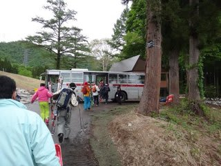

でも，ゴンドラコースは滑走OK.

滑って下山可能でした．

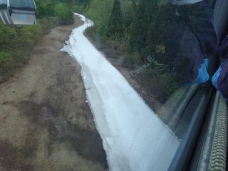

＃12時までは雪だし作業のためクローズしてましたが

で，山頂へ行くと…

滑れるのは，メインコースだけ．

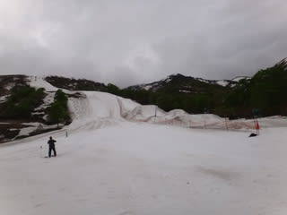

速報したように，テクニカルとジャイアントの2コースは，

完全に雪が溶けてしまっておりクローズ．

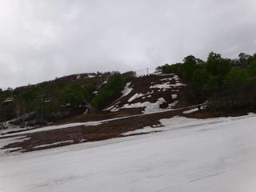

でも，メインコースは雪がほぼ幅いっぱい．

クワッドリフトをくぐるあたり，ちょっと端っこがとけてますが…

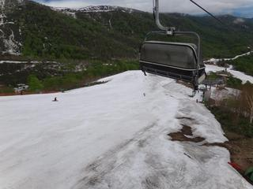

それ以外はしっかり雪が着いてます．

例年雪がきわどい和田小屋～高速リフト乗り場も

ぜんぜん余裕

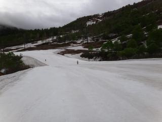

天気も，午前中はガスが出たりもせず，雨も降らず．

空気の湿度が高いからか，雪の表面の汚れが流された

感じで，板は比較的滑ります．

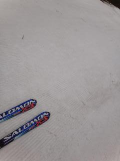

午前中は，人が少ないのもあいまって，

きれいに整地されている雪を大回りできます．

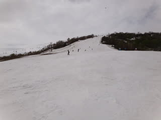

あー．5月最終週に，これだけの幅を使って

大回りできるなんて…

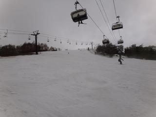

10時半ごろには，ちょっとでこぼこしてきて，

トップスピードは厳しくなってきましたが，

人が少ないので，まだ大回りOK.

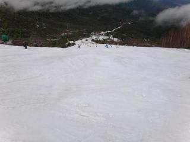

一番人が多い11時ごろでも，リフト待ちはほとんど無し．

最大でも搬器4-5個待つかどうか，って程度．

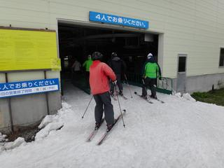

昼ごろには，ちょっとでこぼこしてきましたか…

2時ごろには，ガスが時々ゲレンデ上部を覆うように．

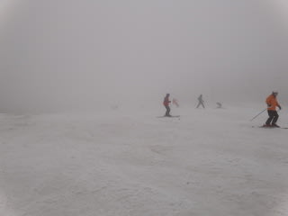

さらに，コースもかなりコブコブになってきます．

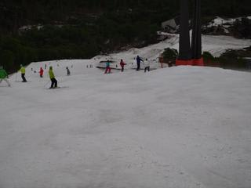

んで．

さすがに今週は，コブの溝部分，かなり雪が薄くなる

ところが出てきました…

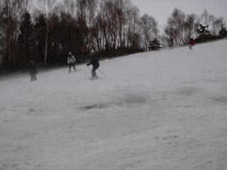

っつーか，土が出始めるようになって来ました．

クワッドリフトをくぐるくらいまでの部分と，

最後の落ち込み部分．

ところどころ，デンジャラスゾーンが…

午後3時を過ぎると，かなりコブコブになり，

ところどころ土が出てきて．

うーん．そろそろ楽しくないかな～

まぁ，雨が降るまで滑るか…

とか思ってたら，結局リフトストップまで

滑ってしまった…

なんと．

天気予報に反して，全く雨が降らなかった！

ラッキー！！！！

リフトも混んでなかったので．

この時期としてはありえない，滑走標高差12000m．

むちゃくちゃ滑りました．

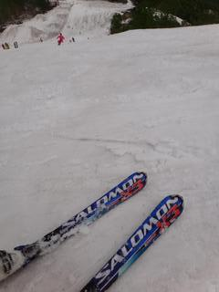

あーー．

5月末だというのに，こんなに滑れていいの？？？？

満足であった…

…しかし．

かぐらももうクローズ．

例年だと，この時期は最後ぎりぎり雪があるという程度で，

半日も滑ると十分な感じなので，

「ああ，もう終わりだなぁ…」

って感じがありますが．

今年は

「あれ？もう終わっちゃうの？」

って感じ．

来週，スキーにいけないのが信じられません…
