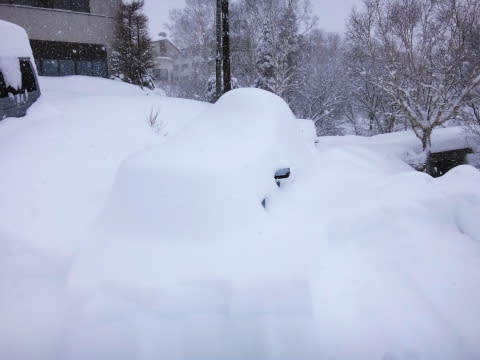

# 12月14日，日曜の志賀高原は…ひたすら雪降る一日．

📅 投稿日時: 2014-12-16 01:00:50

🏷️ カテゴリ: [2015スキー滑走日記](c09ea645cfc085f86dfcd80f49599dd89.md)

というわけで．

日曜の志賀高原，昨日速報しましたが．

今日は詳細レポートをば…

で．

昨日報告したように．

土曜からひたすらひたすら雪が降り続け，ホテルの前の車は

みんな見事な芸術作品的雪だるまと化していたわけですが．

当然，我が車も…

…こ，これが我が車か…（涙）．

…かろうじて，ドアミラーの色から

自分の車ってわかるレベルだな…

15分以上かけて車を発掘して．

朝イチ焼額に向かうわけですが．

これだけ積雪があったけど，運転リフトや滑れるコースは

昨日と変わらず．

一の瀬ファミリーはクワッドが動くものの，迂回コースのみで

メインバーン上部とパーフェクターコースはまだ滑れず．

あとは，ダイヤモンド，山の神がリフト1本ずつ動いて．

焼額は，第2ゴンドラと第2高速の2本のみが運転…

という感じ．

で．焼額に到着すると．

…うむ．

某都道府県連の指導員研修会のスタートとぶつかり，

ゴンドラは10分待ち…（涙）

．

ゴンドラ待ちは，講習参加者全員が並んだ

朝イチのこの1本以外は無かったんですけど．

朝イチのこの10分は，痛い…

で．

ゲレンデに出ると．

山頂の気温はマイナス9度と，冷えてますね～っ！！

で．

当然，車が埋もれるほどの積雪ですから．

ゲレンデも，かなりの積雪！

でも．基本的に，朝イチに圧雪がかかっているので．

コース全面のぱふぱふパウダーではなく．

圧雪の上に，10cmほど新雪が積もってる状況で…

この新雪．

楽しいというより．

あっという間に蹴散らされていき…

モフモフを楽しむというより．滑る人が増えると，

なんだかコースがかなり荒れていきます…

一見パフパフで楽しそうですが，見えない吹き溜まりと

コブっぽい凸凹にやられる，難しいバーン状況…（泣）．

で．雪は朝から終日降り続き…

コースにはずっとパフパフパウダーが

供給されていくんですが…

なんだか，一日中，コース全面こんな感じで…

みんなモフモフを蹴散らしながら滑るような感じ．

で，雪も降って，視界が悪く．

さらに，午前中は研修会の人もそこそこいたので…

こりは，結構厳しいな～．

雪質はかなりいいんですけどね～

激しく降り続ける雪で，足元も見えないし．

結構つらいかも…

でも．午後になると，ゲレンデの人も

ほとんどいなくなり．

いつも通りのガラガラゲレンデになっていきました！

ガラガラゲレンデで，雪が降り続け．

もう，コースの積雪は十分！！

昨日まであったブッシュも，ほぼ完全に隠れましたよ～

とりあえず．

一日雪が降り続け．

視界が悪く，コースも荒れ荒れで．

かなり難しめのゲレンデコンディションだったけど．

帰り際に，

索道係の方「かなり積もったので，来週からは第1ゴンドラ運転しますよ～」

とのことで．

この2日間，滑って楽しむには，ちとつらかったけど．

この雪のおかげで，一時期の「どうなることやら…」と

心配した雪不足の状態から，一気に状況は改善してくれて．

とりあえず，一安心…

で．

帰り際．

今日の昼間だけで，これだけ積もったか…

朝よりはましだけど．

また，発掘作業ですな（涙）．

## 💬 コメント一覧

### 💬 コメント by (はなげ親分)
**タイトル**: 車の掘り出し
**投稿日**: 2014-12-16 12:23:31

私も30分くらいかけて、かまくら状態の車を発掘しました（大汗！） 

今回、偶然にもゴンドラに乗り合わせ、同じホテルに宿泊となり二度ビックリでした。妻もS様が気になるようで、

あの方はどんな人？

などと聞いてくるので、鉄の体を持つ凄い人と話しておきました（笑）

### 💬 コメント by (Skier_S)
**タイトル**: はなげ親分さま
**投稿日**: 2014-12-17 01:02:57

いやー．

あの雪はすごかったですね～．

うちの車は，フロントガラスと運転席ドアの

除雪をしただけで，あとはレガシィ君の4WD

パワーで強引にラッセルで脱出しました…

でも，この週末はお世話になりました．

まさか宿まで一緒とは…

奥様にもよろしくお伝えください！

…だけど．

私は鉄の体はもっていませんが（笑）．

ガラスのハートなら持っています（＾＾；

