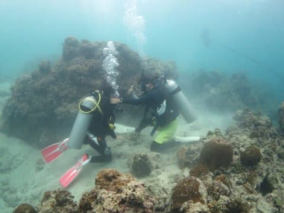

# 小学校5年生（10歳）の娘に，ジュニアオープンウォーターのダイビングCカードを取らせてみた…その4

📅 投稿日時: 2018-09-19 03:24:14

ってなわけで．

本日もご無体時間に帰宅です（涙）．

でも．

深夜にもかかわらず，必死に娘のCカード取得記を

書いている自分…

偉い！

…しかし．

今後，この記録を見て．

子供にCカードを取らせようという人が出てくるの

だろうか…

とりあえず，Cカード取得記へ，Go！

---

ってな感じで．

学科が終わったら，後は実習ですね．

んで．

実習については，どのくらいの時間，海洋実習や

プール実習をすればCカードが取れる…という，

時間が決まっているのではなく．

「これらのことがすべてできればOK！」

と，達成度レベルを満足した時が実習終了，

という名目になっています．

（海洋実習が最低4本以上というのは決まってるけど）

だもんで．

実習に必要な時間は，ショップによって

多少ばらつきがあると思いますが．

今回，[実習を受けることにしたフィリピン・モアルボアルの
エメラルドグリーンダイビングセンター](e2392590e32bc00ee97700a405ee0e944.md)では．

初日午前：学科テスト復習，プール実習，午後：海洋実習2本

2日目午前前半：プール実習，午前後半・午後：海洋実習2本

という感じで．現地わずか2日で実習終了です！

（初日の朝，プール実習前にテストを受ける娘）

で．

このショップ．

完全日本人向けのショップなので，

[オーナーの小見山さんとアサミ](http://www.emeraldgreen-moalboal.com/staff.php)さんを始め．

ガイドは基本的に日本人．

今回，娘には．

アサミさんという女性の方がインストラクターとして

ついてくれましたが．

モアルボアルまで来て，Cカード取得コースを

やろうという人は少ないため．

他の受講生はおらず，娘一人にインストラクター

1名という，ゼイタク貸し切り実習じゃないですか！

なんとスバらしい！！

…他の受講生がいると，ペースを他の人と合わせ

なくてはならないし．

いろんなトレーニングを順番でやるので，

水中で他の人が何かやっている時に

待たなきゃいけなかったりするけど．

完全マンツー実習となったわが娘の場合．

自分のやりたいペースで実習を進めることができるし．

できないことがあっても，他の実習生を待たせる心配無しに

何度でもやり直すことができるので．

すごい気が楽だったようです…

今回のインストラクターのアサミさん．

むちゃくちゃ面倒見が良い方だったので．

実習の2日間で娘からの絶対の信頼を獲得していました(笑)

もう，ワガママな娘のペースに完全に合わせて

実習を進めてくれたようです．

感謝…！

で．

プール実習（限定水域実習）は．

泊まったホテルにある，最大水深3mのプールで

やりました…

私がプール実習をすべて見たわけでないので．

娘から聞いた話をまとめると…

初日の午前中で，基本的にプール実習の全項目を

クリアしてしまいます．

まずは器材セッティングから始まり．

水中での呼吸，

　潜行・浮上，

　マスクに水が入った場合のマスククリアのやり方，

　マスクなしでの呼吸，

　レギュレータが口から外れた場合のレギュレータリカバリー，

　BCを使っての浮力コントロール，

　中性浮力，

　ハンドシグナル，

　エア切れの際の他人のオクトパスを使っての呼吸，

　水中でのBC＆レギュレータの脱着…

などなど．

実に盛りだくさんの内容を，初日の午前だけで

終わらせちゃいます．

すでに体験ダイビングを2本体験して，

その際にマスククリアやら基本的な呼吸法やらを

習ってるし．

3m程度の深さのプールなら，

小学校2年の頃から，素潜りでなんの

苦も無く底まで潜っちゃうし．

海でのシュノーケリングでも，5mくらいなら

普通に潜れるという，水にかなり慣れているわが娘．

プール実習では，全く苦労することがなかったようで．

プール実習終了後．

両親と再会して，開口一番

「楽しかった～！」

と言い放ったのでした…

インストラクターのアサミさん曰く．

「すごい水に慣れてるから，スムースに

　実習終わりました」

とのことで．

うちの場合，特に子供だから苦労したってことは，

特に無かったようです…

そして．

初日の午後は．

海洋実習ですが．

…このショップ．

いきなりボートダイビングでの海洋実習です．

やっと海に潜りに行けることが楽しみで

仕方がないらしいわが娘．

もう，怖がるとか心配とか全く無さそうな感じ…

海洋実習も完全マンツーマン，貸し切り実習なので．

インストラクターのアサミさん．

完全にうちの娘だけを見てくれてます．

基本的に，このショップでは．

親（ファインダイブ組）が潜るのと全く同じ

ポイントの，浅めの所で海洋実習をします．

だもんで，エントリーやエグジットポイントで，

実習をする娘を見ることができて…

なんだ，お前，

意外とまともに実習やってるじゃないか…

そして，アサミさんもすごいしっかり実習を

やってくれているようで．

これなら，安心して娘を預けられるなっ！

…そして，初日の海洋実習2本目．

インストラクターのアサミさんから，

「娘さんの実習に着いてきますか？」

との，願ってもない提案！

ってなことで．

一本，完全に娘の実習について行った

わけですが…

いろんな練習がみっちりのプール実習と違って．

海洋実習は海に慣れることがメインなのか．

各ダイブごとに練習する項目はそれほど多くなく．

最初の10分くらいで講習内容はすべて終わっちゃいます…

このダイブでは，コントロールされたスイミングアセンドで

と…

完全水没のマスククリア，

中性浮力トレーニング，

…って感じの何項目かを10分くらいでやってしまった後は．

残る時間，イワシポイントでイワシの群れを見ながらの

ダイビングでした…

うーん．ゼイタク！

お前は，なんてゼイタクな海洋実習を

受けてるんだ！！

大勢で実習を受けると，待ち時間が多いので．

ここまでゆっくりとできませんね…

貸し切り実習，ゼイタクすぎ！

一番最後は，他人のオクトパスからエアをもらいながらの

呼吸と…

オクトパスブリージングでの

浮上を練習して…

これで，初日の海洋実習終了．

ってな感じで．

プール実習と海洋実習2本で1日目が終わりましたが．

とりあえず．

「今日は楽しかった～！！」

と，満足げな娘．

小学生の娘でも，実習は特に苦労は無いみたいだな…

ってか．

実習してる娘を見て思ったけど．

娘，お前，海に慣れすぎ．←あまり他の小学生の参考にならないかも…
