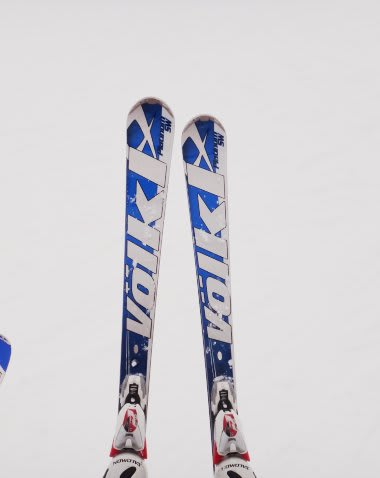

# Volkl Platinum SW履いてみたよ

📅 投稿日時: 2012-02-22 01:24:59

で．

前にも書いたように．

いろんな板を履くのが好きな私．

一緒にスキーに行った人とブーツサイズが一緒なら，

板を取り替えて履かせてもらうことにしてるんですが．

今回は，Volklの今シーズンモデル．

Platinum SWを履いてみました．

えー．

Volklの小回り基礎板，Platinum SDと同じサイドカーブで，

もう少しフレックスを柔らかくしたオールラウンド基礎板のようですが．

いやー．

まず．軽い！

軽いよ！

むちゃくちゃ軽い．

最近のVolklの傾向ですね．軽さは．

で．

履いてみたところ…

履いても軽い．

人生，今まで履いた板で最も軽い板ですな．

そのせいで．

ちょいと安定感がないんですが．

わずかな雪の荒れでラインがずれちゃいます．

ちょっとした凸凹で板が思わぬ方向に飛んで行っちゃいます．

うむ．

超どっしりの安定感を感じるSalomon 24hours LMと正反対ですね．

とりあえず．

エッジグリップはそれほど強烈じゃないです．

が．小回りベースのサイドカーブでトップが広いので，

ずれた中でも旋回力が結構出て，くるくる回っちゃう感じですね．

フレックス・トーションともちょいとマイルド目．

…ってか，ぺらぺら感がありますか．

あまり粘らない板で，比較的簡単にエッジグリップが外れ，

エッジが外れると板のすごい軽さでキョロキョロするっていうか…．

もう少し安定感が欲しいかな．

うーーん．

ちょいと私の嗜好と違う板のようですな．

昔は，こんな感じの超軽い小回りベースの板がですね．

大好きだったんですけどね．

どうも最近嗜好が変わってきたのかな…

どっしりした，そこそこ大きめのRの板が良くなってきたなぁ…．
