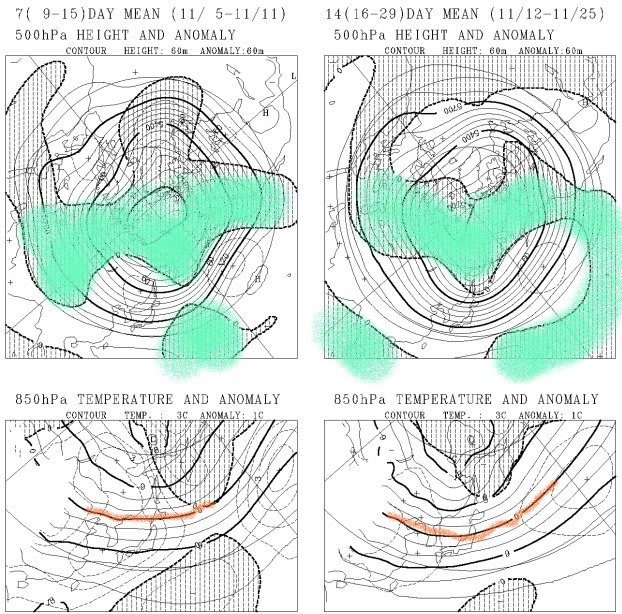
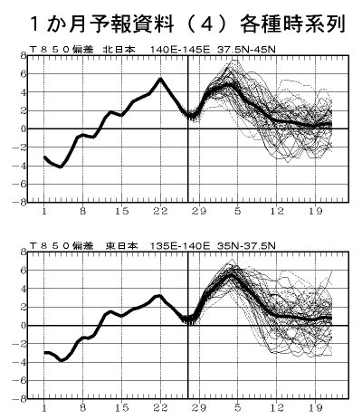

# この11月は，雪が早いか遅いか？

📅 投稿日時: 2011-11-04 00:02:12

🏷️ カテゴリ: [スキー天気予想](c6554f5c3c106093b511a8daae23757e8.md)

あー．

11月になると．

あれですね．

もう，脳みその中身はスキーのことでいっぱいですね．

早く雪よ降れ～

雪よ降れ～

ってフレーズが頭の中をぐるぐる回るわけですが．

んで．

この11月は．

スキー場は冷えて早くから雪が降りそうかな？？

というのを，11月の長期予報で調べるわけですね…

まずは．

[地球気のページ](http://n-kishou.com/ee/exp/exp.html)から．

［FCVX12］ 1ヵ月予報資料 アンサンブル平均図

を見てみましょうか…

左側が，11月5日～11日(中旬)の，右側が12日から25日（下旬)の予想平均値．

上側が500hpa高度，下側が850hpaの気温ですが…

ざっくりと説明すると，上側の図面の網掛けのかかっているところ

(緑で塗ったところ)が，平年より500hpa高度が低いところ，

すなわち，平年より冷えているところなんですが…

日本を見事に避けてますね．

…つまり．11月中は，日本は平年よりあったかいエリアにすっぽり覆われている，ってことですな．

で，下側の図面．オレンジの線で引いたのが850hpaの気温の0度線．

850hpaで0度以下になると，山沿いでは雪になるんですが…

これも右側の11月下旬の平均を見ても，東北地方程度までしか降りてきてない…

新潟や信州までは下りて来そうになく，雪は期待薄…．

下の図も，網掛けが例年より温度が低い領域を指すんですが．

日本はすっぽり例年より温度が高いエリアに囲まれてます．

…この11月，期間を通して，例年よりあったかいみたいです（涙）．

今度は，

［FCVX14］ 1ヵ月予報資料 各種時系列図

を見てみましょうか…

…

全体的に平年より気温は高め．

11月の7日ごろまでは，例年より4度くらい高そう．

12日を過ぎて，後半になると例年並までは近づいてきますが，

例年よりぐーーっと冷え込む，という可能性は低いかなぁ…

うーーん．

今年は，2007/2008シーズンのように．

11月にどかっと雪が降って，11月にかぐらが全面オープンするなんていう

奇跡は期待薄だなぁ…
