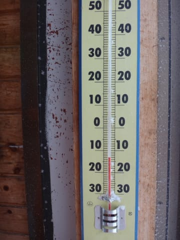

# 1月12日の志賀高原詳細…新雪をおなか一杯いただきましたっ！

📅 投稿日時: 2015-01-14 00:09:43

えー．

昨日速報した，月曜の志賀高原詳細レポートをば…

さてさてさて．

前日のナイターで，すでにブーツパフになるくらい，

すごい降りだったわけなので，

朝のディープパウダー間違いなし！

ということで，

すごい雪降りの中，いつも通り焼額に行くと…

うむ？

除雪が間に合っていないのか，本来8時半営業開始の

はずが，第1ゴンドラ以外は営業開始が遅れているようですね…

ってことで．

唯一予定通りの時間に動いた，第1ゴンドラに乗って

山頂へ向かうと…

うむ．

雪は降ってるけど，幸い，ガスはかかってないな．

で．

気温は-13度と，十分冷えてますな．

朝まですごい降りだったので，朝に圧雪したコースも

その上に雪が積もって，ブーツパフになってますな…

これは，当然．

新雪を楽しむため，もう，一目散に，

オリンピックコースへ向かうのだっ！！

…と，新雪コースへ突っ込んだところ．

こ，これは深いっ！

うはははっ！

こ，腰パフだよっ！

前が見えなくなるほど．

頭の上まで真っ白になる，パウダーだよっ！！！

ひゃっほーーいっ！！！

最高，サイコーだよっ！

時折，雪は激しく降るけど…

ガスってなくて，斜面はちゃんと見えるし．

雪質も軽いし．

いやー！

シアワセだ～っ！！！！！

…と．

午前10時近くまでは，そこそこ楽しめたけど．

うーむ．

さすが3連休，10時を過ぎると，

ちょっと人が増えて来ましたね…

でも．

コース上の人は多いとはいえ．

先日はあったゴンドラ待ちが．

この日は全くなくて，ずっとガラガラなまま．

もう，がんがんゴンドラを回せます．

そして．

10時近くになっても，エキスパートコースはまだ

深い新雪を楽しめたし…

さらに．

人の少ないコースのコース脇には，昼を過ぎても

この程度の新雪が残っているところが多数あって…

昼を過ぎても，腰パフの新雪を楽しめるというゼイタクっ！！！

で．

午後は．

3連休最終日は早めに帰ろうという人が多かったのか…

…あれ？

なんだか．ゲレンデに，誰もいなくなってしまったのですが…

ちと寂しいくらい．

でも…好きなように飛ばし放題！

わはははは！

これはシアワセだ～！

幸いなことに，新雪が積もったのに，ゲレンデは下地が

しっかりしていたからか．

圧雪斜面なのに，コブ化してしまうように，

ひどく荒れてしまうことは無く．

午後まで，比較的フラットなバーンコンディションのままで．

人が少ないのと相まって，かなり快適に

飛ばせましたよ～．

って感じで．

一日中，太陽は全く拝めなかったものの．

朝イチだけでなく，昼過ぎまでたっぷりディープパウダーを

おいしくいただき．

さらに，午後もガラガラ整地コースを楽しむこともできて．

なんだか，かなりおなか一杯楽しめた一日でした～！！

…しかーし．

しかし，だ．

これからの天気ですが．

15日は，ヘタすると志賀高原でも雨が降りかねない感じ…（;_;）

まぁ，まだ15日の予想．

低気圧がどのあたりを通るかで雨になるかどうかが微妙な感じですが．

…雪になったとしても，かなり湿った雪です（残念）．

…でも．ご安心あれ．

翌16日から17日にかけては，激冷えの雪降りに

なりそうな感じで．

とりあえず，土曜の17日までには雪質が回復して．

運が良ければ17日の朝は，またディープパウダーに

なってくれるかも…

来週もパウダーデーになってくれるといいなぁ～（願望）

## 💬 コメント一覧

### 💬 コメント by (いか)
**タイトル**: Unknown
**投稿日**: 2015-01-14 00:28:24

これは太板の出番ですねーヾ(´・∀・)ノ

私も今週末は出撃ですので、太板、ロング、ショートとどれをはくか、当日朝まで悩みます(←終わってる人間)。

太板は、ハードなやつをはくと、新雪のなかをとんでもないスピードですべれるのです！

### 💬 コメント by (Skier_S)
**タイトル**: いかさま
**投稿日**: 2015-01-15 01:53:29

そーなんですよ．

こーゆー日はデブ板ほしくなります…

でも．

デブ板，ロング，ショートって3セット持っていくなんて，

終わった人ですから（笑）

今のところデブ板購入は自制しています…

だけど，こんなパウダーが続くと，自制心

リミッターが外れそう…

