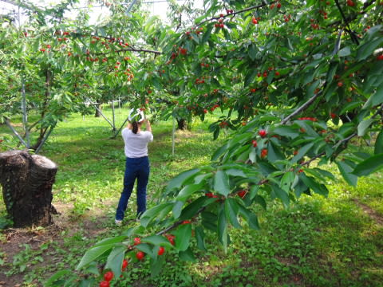
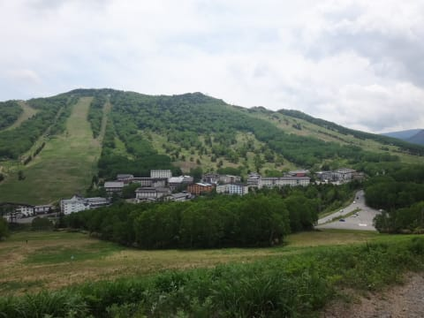
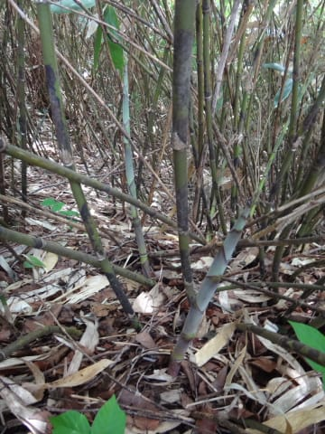
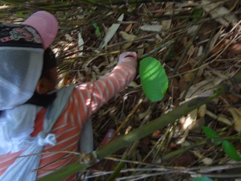
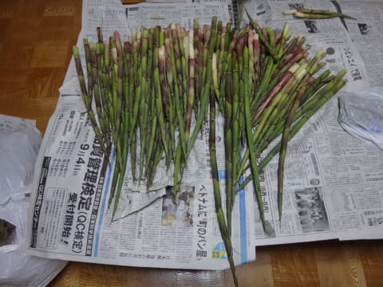

# ホントは本日，月山詳細レポートしたかったところだけど…

📅 投稿日時: 2016-06-13 00:47:23

えー．

本来であれば．

本日，月山詳細レポートをしたいところではありますが…

なぜか，先日．

睡眠時間2時間で月山に行ったあと．

娘のリクエストに応えて，サクランボ狩りをやって…

その後，5時間運転して，深夜に新潟県に入り，

新潟県某所で宿泊したのち．

本日朝にやってきた場所は…

うむむ？？

なんだ，これは…！？？

良く見たことがある景色のような気がするのだがっ！？？

ってところで．

こんなことをやって…

そしてGetした収穫物，こんな感じ（笑）

ってことで．

睡眠時間が異常に短かったにもかかわらず．

山形，月山でスキー→サクランボ狩り，温泉

→新潟県某所で宿泊→朝イチで志賀高原→竹の子狩り→

山の上で筍料理満喫→帰宅，

という．

移動距離1200kmを超える，

ありえない1泊2日の日程をこなしてきたので．

本日は，ちと月山詳細をレポートするパワーが…（涙）．

明日，月山詳細レポートしますので．

よろしくお願いします～！！！

[Gokuさん](http://red.ap.teacup.com/gokurakuskier/544.html)．本日はお世話になりました～！！！

＃しかし，[この方](http://blog.livedoor.jp/skivaca/archives/2016-06-12.html)の移動パターンと異常に似ている気がするのですが…

＃なぜだろう？？

## 💬 コメント一覧

### 💬 コメント by (すぎぃ)
**タイトル**: お疲れ様です
**投稿日**: 2016-06-13 22:07:18

準２００００ｍクラブ志賀の主、くにーさんのこと

ご存知でしたか

滑走日数は、さることながら

オフシーズンも活発な行動には頭が下がります。

### 💬 コメント by (Goku)
**タイトル**: 来年も！
**投稿日**: 2016-06-13 22:34:58

昨日は楽しかったですね～♪

来年も是非やりましょう。

タケノコも美味しかったけど、赤い宝石もとっても美味しかったです。

### 💬 コメント by (Skier_S)
**タイトル**: Gooブログメンテでコメント遅くなりました…
**投稿日**: 2016-06-15 03:08:39

＞すぎぃさま

志賀高原常連で，くに～さんをご存知ない方は

いないのではないかと(笑)

くに～さんは，早朝スキーを含めると

一日25000mを超えたことがある方なので，

「超」20000mクラブ会員かと(＾＾；

私は足元にも及ばないですよね…

＞Gokuさま

日曜はありがとうございました～っ！！！

むちゃくちゃ楽しかったです．

娘も来年どころか，毎日でも行きたがっています(笑)

来年も，ぜひ，ぜひっ！

奥様にもよろしくお伝えください…

おにぎりありがとうございました～！

