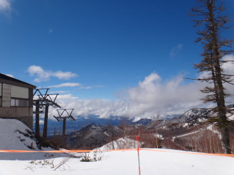
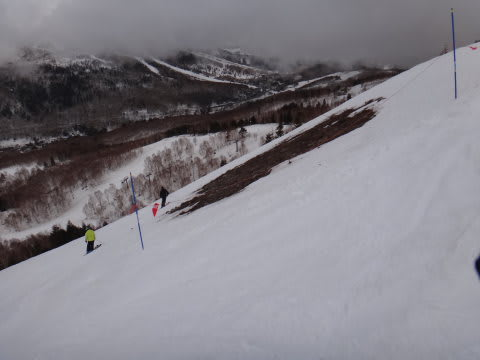

# 4月7日日曜の志賀高原詳細…予想よりは良かった．予想よりは…

📅 投稿日時: 2013-04-09 00:26:48

で，

昨日速報しましたが．

悲惨な土曜日に続く，日曜の志賀高原の状況はどうだったかというと…

…予想よりは，よかったんですよ．

予想よりは．

朝7時ごろまでは，予想通りのかなりの雨…

だったんですが．

7時すぎごろには雨がやんで．

それどころか，なんと！青空も見えてきましたっ！！！

金曜の私の[天気予想](e509f1566123c1b6df90da0e1336bd20f.md)では，

…でも，雨は，意外と午前中早い段階で弱まりそう．

うーん．午前9時くらいからは曇りで，時々雨がサーっと降る，

って感じかな．

って書いたように，9時くらいにはやむかも…とは予想していたけど．

1時間ちょい前倒しで雨が上がったよ！

それも，日が差すとは…(喜)

風がまだそこそこ強かったので，奥志賀ゴンドラ，焼額第2ゴンドラ，

寺子屋は動かず．一の瀬クワッドも営業開始が15分ほど遅れ，8時45分スタート…

って感じでしたが．

ヤケビは減速運転とはいえ，第1ゴンドラは動いたし．

昨日動かなかったダイヤモンド，山の神は動いたという…

昨日より，運転リフトも増えました！

やったー！

雪質は雨上がりで重いけど，土砂降り強風に比べれば1億2500万倍ましだっ！

やはり，私の日ごろの行いが良いからかっ！←違うって(自己突っ込み)

と，喜んで滑っていたのもつかの間…

滑り始めて1時間ちょっとで，にわかに掻き曇り．

なんだか，すごい勢いで雨が降ってきたんですが…(涙)．

やはり…

「午前中はときおり雨がさーっと降る」

という，私の天気予想は正確だったようです．

＃こんなことは当たらなくていいのに(泣）．

しかし，1時間弱くらいで雨はやみ…

をを，また日が差し始めた！

今度こそ，本格的に晴れるか！

…と思ったのは超甘くて．

その30分後には，今度は激しいアラレがスキーヤーを痛めつけます．

それも，かなりの雨混じりのアラレで，またもやずぶぬれに…

やはり，今日は，かなりの根性を持ったスキーヤだけが

すべることを許される日だったか…っ！

と思ったところ．

12時半ごろ，何とかアラレ混じりの霙も止んで．

またまた日差しが戻ってきました．

をを！

雲が切れた！

山頂付近は，さっきのアラレが積もった，新雪っぽい感じになってます．

いやー．

しかし．晴れたよ．すっきり．

午後は冷え始め，時折晴れ間も．晴れ・曇り・霙～雪がめまぐるしく入れ替わる．

って天気予想だったけど，このまま晴れるのでは？

と思ったところ…

そうは問屋が卸さない．

雲が激しく流れて，曇ったり晴れたりを繰り返しながら…

午後3時過ぎに．

なんか，小雪がちらついてきました…

…これは．

晴れ・曇り・霙～雪がめまぐるしく入れ替わる

って私の天気予想．

もしかすると，すごい精度で当てたんじゃなかろうか…

さらに．夕方には雪もカリカリした感じに固まり始め．

夕方に向かって，ちょっとゲレンデが固くなって行くかも…

というところまで正解だった気が…

うーん．

今回．かなりの精度で私の予想通りの天気になったわけだけども．

ということは．

この週末，

『マイナス10度まで冷え込み，腰までのパウダーになるでしょう』

って私が書いたら，そうなるかも．書いてみようかな？？？←ならないから(自己突っ込み)

あー．

あと．

この週末．

輪が愛する焼額第1ゴンドラの最終営業日でした．

第1ゴンドラにお別れを告げてきましたが…

なんだか．GSコースの下やら…

オリンピックコースの真ん中やら．

もう，土が出てきてましたね～(涙)．

やっぱり例年より，雪解けが早い…

でも．

この日の第1ゴンドラ沿いコース．

人が異常に少なかったので．

夕方ゴンドラストップ近辺まで，ほぼ完全フラット圧雪バーンで，

超快適でしたよっ！

やはり．神様は．

こんな天気にまで滑りにきた(馬鹿な)スキーヤーに，ご褒美を与えてくれたようです…

＃一の瀬はボコボコだったんだけど…

さよなら～！第1ゴンドラ！

また来シーズン！！

## 💬 コメント一覧

### 💬 コメント by (いか)
**タイトル**: Unknown
**投稿日**: 2013-04-09 00:58:39

この週末は本当に、大荒れの天気だったようですね。これだけめまぐるしく天気が変わるとものすごく疲れそうです…^^;

今年の雪解けは本当に早いですね。今週後半から、白馬に向かう予定ですが、日頃の行いが良いせいか(←)、少しばかり冷えそうで期待です(^^)　次の週末は晴れますように…。

### 💬 コメント by (Skier_S)
**タイトル**: いかさま
**投稿日**: 2013-04-09 01:31:22

いやー．

なかなかエキサイティングな週末でしたよ(汗）．

今週は冷えそうなんですが…

あんまり雪は積もってくれなさそうですね(涙）．

いいコンディションで滑るためには，日ごろの行いに

気をつけましょう！（何か違う)

