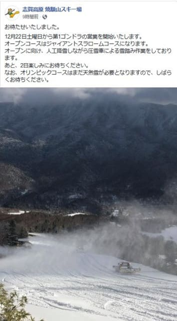

# 今週末から1ゴン運転らしいけど…

📅 投稿日時: 2018-12-21 05:37:38

えー．

今日もご無体時間に帰宅で．

そして，今から家を出なくてはいけないです（涙）

とりあえず．

今週末の3連休から，

焼額第1ゴンドラの運転が正式に決定したようです～！

うーむ．

20日から21日にかけての積雪が

効いたのか…

20日はいいコンディションだったようですし．

ってなわけで．

今週末の焼額，1ゴン＆2ゴンの両ゴンドラが

動くようです～！

が．

22日，23日はやはり時折小雨がぱらつきそう…（涙）

なぜ，3連休を狙ったように…（泣）

とりあえず．

22，23日が雪になるよう，狂ったように

踊っています…

## 💬 コメント一覧

### 💬 コメント by (若杉勲71)
**タイトル**: 奥志賀ダウンヒル一番のり
**投稿日**: 2018-12-21 08:50:04

奥志賀が第四以外営業。杉山進先生にもお会いできました。雪質最高です

### 💬 コメント by (若杉勲71)
**タイトル**: 志賀高原情報
**投稿日**: 2018-12-21 09:21:07

奥志賀エキスパートは圧雪が悪く縦のウェーブと横のウェーブがあって、私ではカービングでは無理でした。

### 💬 コメント by (MZMM)
**タイトル**: 👌👍✌️👏🙌 https://headlines.yahoo.co.jp/hl?a=20181220-00000017-tenki-soci
**投稿日**: 2018-12-21 10:51:00

“ ... 24日(月)は、冬型の気圧配置となり、日本海側の雨は雪へと変わって、ホワイトクリスマスになるでしょう。山沿いなど内陸では大雪の恐れもあります。太平洋側は日差しが戻るものの、北風が強くかなり冷たいでしょう。イルミネーションを見に行かれる方は、万全な防寒対策をしてください。

年末寒波　12月として記録的か　東北荒天

画像：tenki.jp

27日以降　強烈な寒波到来!

25日(火)は、次第に冬型の気圧配置は弱まり、日本海側の雪も小康状態となるでしょう。風もおさまって、おだやかなクリスマスになりそうです。ただ、26日(水)は低気圧が北日本を通過する予想です。通過後の27日(木)以降は、強烈な寒波がやってくるでしょう。仕事納めとなる方の多い28日(金)が寒気のピークとなり、東北北部の上空1500メートル付近はマイナス18度以下(ひと冬に何度もないような強烈な寒波)の寒気に覆われそうです。降れば大雪となる目安がマイナス12度と言われていますから、日本海側や山沿いでは、今回はさらに大雪に対して警戒が必要になるでしょう。風もかなり強まって、猛吹雪になる恐れもあります。

帰省で移動される方も多い時期ですが、交通機関が乱れるかもしれません。最新の情報や交通情報を確認するようにしてください。“

### 💬 コメント by (Skier_S)
**タイトル**: 土曜は志賀にいけず（涙）
**投稿日**: 2018-12-22 02:18:28

＞若杉さま

奥志賀，よかったようですね～！

ダウンヒル，ブッシュや石は出てなかったんですか…？

土曜からは第4も動きそうなので．

奥志賀は3連休から全面オープンですね！

そして，焼額第1ゴンドラも土曜からオープンですが．

…でも，私は土曜は焼額にいけません（涙）

1ゴンのスタッフが，私がいないことを不審がるんじゃないか…

と思ってます(笑)．

＞MZMMさま

そうなんですよ．

24日はそこそこ積もりそうなんです．

で，27，28日は…

むちゃくちゃ積もるかもしれません．

でも，この2日間でむちゃくちゃ積もって，

それでも平年よりまだ雪が少ないくらいか

もしれませんが…

