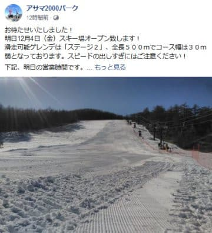

# 志賀高原，雪が降ってます！…そして，この12月は5～12日ごろは暖かいけど，それ以降はちょっと冷えるよ

📅 投稿日時: 2020-12-04 01:09:42

えー．

3日から4日に日付が変わった現在．

志賀高原では雪が降っています…！

道路に雪が積もっています！

（[北信建設事務所道路気象情報カメラ](http://hokushin.pref-nagano-roadcamera.jp/)より）

ふははは！

昨日の記事に，

　4日（金）：3日夜から4日朝にかけての積雪は10cmほど

　あるかも…

と書いた予想の通り，

明日の朝までにおそらく10cmくらい

積もるのだ！！

…運がよければもう少し積もるかも…

…って感じで．

そろそろ冷えて，ちょっと天然雪も積もり

はじめたので．

当初より遅れましたが，明日12/4（金）から，

アサマ2000もオープンです！

（[アサマ2000FaceBook](https://www.facebook.com/asama2000park/photos/a.544794985545947/5459370697421660/?type=3&theater)より）

…そういえば．

昨日，焼額オープンの案内が出ている…と

焼額のFacebookを引用しましたが．

Facebookではなく，焼額公式ホームページの

オープン案内を見てみると…

（[焼額山スキー場ホームページ](https://www.princehotels.co.jp/ski/shiga/informations/open/)より）

ええええ！？？？

コース幅10～30cm！？？

…これは…狭い．

10cmって，スキー1本の幅より狭いよ…！！！

ということで．

今週末オープンの焼額．

どうやらみんな片足で一列になって滑らないと

いけないゲレンデ幅

のようなので．

皆さん，ご注意ください…

（ヤケビスタッフの人もこのBlogを見てるかもしれないので，速攻で修正されるかも…）

で．

毎週木曜は，気象庁から一か月予報図が

公開される日なので．

果たしてこの12月は冷えるのか？

と，これから一か月の予想を見てみると…

うーむ．

これから12日くらいにかけては

平年より気温が高くなりそうです（涙）

…でも．それ以降．

水色で描いた15日前後は平年より

冷えそうだし．

それ以降年末にかけては平年並み程度で．

この11月中旬ごろからの異常高温

の悲劇を繰り返すことは無さそうだな…

と，ちょっと安心．

昨シーズンのような，年末になっても

スキー場がオープンできないという

恐怖シナリオはなさそうです…！！

## 💬 コメント一覧

### 💬 コメント by (さち)
**タイトル**: Unknown
**投稿日**: 2020-12-04 08:04:42

10cm…

滑るのも難しいが、作るのはもっと難しいのでは…？

さすがプリンスさん、匠技ですね。

ちなみに8時現在は直ってませんでした。

マジなのでは？

### 💬 コメント by (Skier_S)
**タイトル**: ＞さちさま
**投稿日**: 2020-12-05 00:50:58

すごい…確かに超絶な匠の技ですね！！！

…まだ直ってないので，ホントに10cmなのかも…

