# Garmin Fenix7Xのスキーモードを使ってみた…スキー終了後の記録をPCやスマホで確認できるよ！

📅 投稿日時: 2022-11-21 00:53:10

🏷️ カテゴリ: [PC,カメラ&小物](c0d8caed13e597efe97b661a8ae56bed0.md)

ってなことで．

現在，志賀高原は雨が降っているようです…（涙）

標高が高い横手山も雨で．

明日，21日月曜の朝まで降り続けそうです（泣）

その後，22日朝はギリギリ横手の

標高なら人工降雪が動かせるかどうか？

というところまでは冷え込みますが．

標高2000m以下のスキー場では

28日ごろまで人工降雪機が

動かせなさそうな感じで．

23日の祭日も，26日の週末も，

新たなスキー場のオープンは

難しそうな予感…

…とりあえず．

今となっては，

週間予報が外れるよう，全力で祈って踊る

ことしかできないので．

これから12月にかけて，ひたすら

冷え冷え踊りを踊り続けましょう…

ってなことで，本題へ．

[前回](e88b67e95fd3f92f8f1c4c51bb2327da6.md)，Garmin Fenix7Xのスキーモードの

紹介をしましたが…

その時は，スキー中のウォッチ画面の

説明だけで終わったので．

今回は，スキー終了後にPCやスマホで

確認できる記録画面について紹介します～！

スキー終了後，スキーモードを終了すると．

記録がスマホに転送されて，

詳細な滑走記録が確認できるように

なります…

逆に言うと，

滑走中はスマホやPCでは滑走記録が

見れません．

その日の滑走が終わって，スキーモードを

終了させて初めて，その滑走記録が

見ることができるようになります

で．

滑走終了後に，スマホでは下の写真の

ようなデータが見れるようになります…

まずは，

基本的な滑走時間と

滑走距離，滑走標高差，

そして地図画面

ですね．

ちなみに，滑走時間はログ開始から

終了の時間ではなく，純粋に滑った

時間．

リフト待ちやリフトに乗っている時間は

カウントされません．

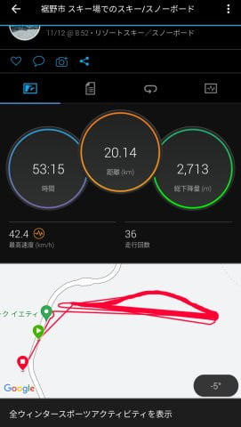

で．

地図部分をタップすると，地図画面の

詳細が見れます．

地図画面をさらに拡大できますが．

コースのどのあたりを滑ったかが

ちゃんと分かるくらいで，

GPSの精度はさすがに高そうです！

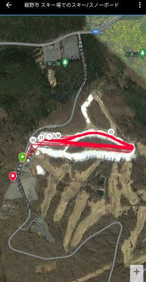

そして，次の画面が…

詳細データ画面ですね．

平均速度や最高速度，滑走時間

滑走時間（移動時間）や

ログ開始から終了までの経過時間，

平均心拍・最大心拍，

滑走標高差や最高・最低高度

なんかが確認できます…

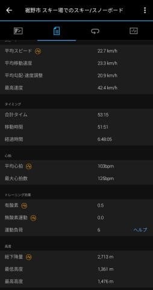

その次の画面が，ラップ記録．

1本ごとの滑走にかかった時間，

滑走距離，滑走標高差

を見ることができますね…

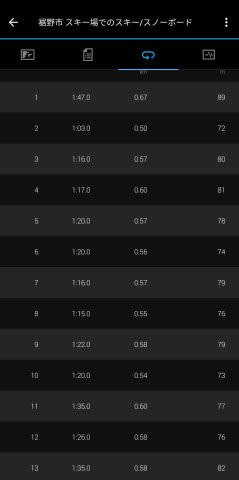

最後の画面が，グラフ画面．

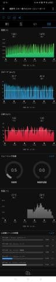

この画面の上の方には…

標高グラフ，

滑走速度のグラフ，

心拍数のグラフ

が出ていますが…

見て分かるように，滑走している時

のみ記録されているグラフで，

リフト待ち時間や乗車時間中，

休んでいる時間の記録は飛ばされてます．

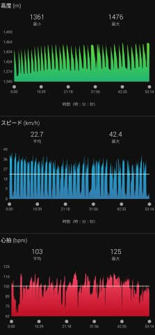

この画面の下の方では

トレーニング効果，

気温，心拍ゾーン

の記録を見ることができます．

気温は時計が体温を拾っているので，

かなり高めに出てますね…

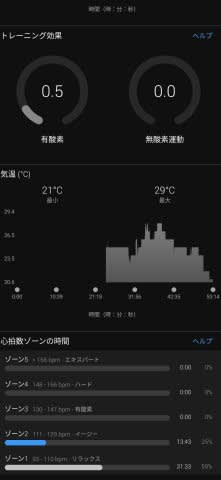

うむ．

イエティを滑っている程度では，

有酸素トレーニング効果0.5，

無酸素トレーニング効果は0.0と，

ほとんど運動になってない

というGarmin様のお告げですね…

心拍ゾーンもゾーン3にすら入ってない

状況なので，まぁ運動している

部類には入ってない感じでしょうか…

ってな感じで．

スマホ版はこんな感じですが．

PCのGarmin connect経由でも同じ

データにアクセスできます…！

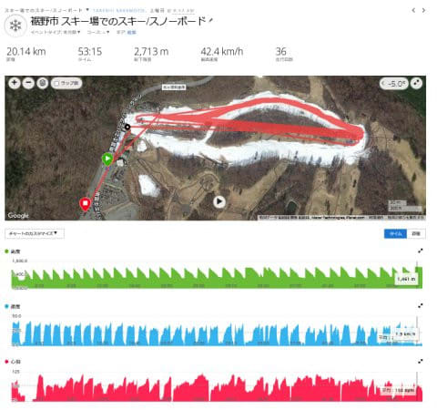

詳細数字データもスマホより

データ数が多く…

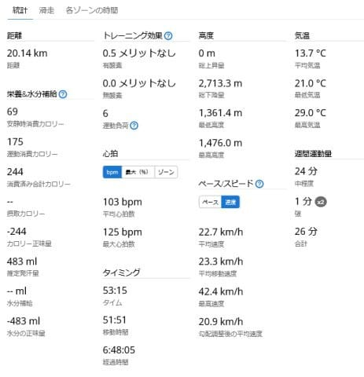

1本ごとの滑走データも，

スマホだと1本あたりの時間と

標高差しか見えないところ，

PC版だともっと詳細なデータを

見ることができます！

グラフも，画面が小さいスマホより

PCで見た方が詳しく確認できて．

この標高グラフを見ると，リフト登りが

記録されておらず，滑走している

下りだけ記録されているのが

分かりますね…

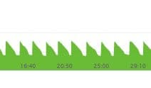

で．

GPSデータもPCで見た方がより詳細に

見ることができます．

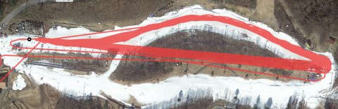

GarminさんスキーモードのGPS記録は，

滑っている間だけしか記録されず．

リフト待ちやリフト乗車中は

記録に残らないのですが．

その滑り初めのタイミングをGPX

ビューワーで詳しく見てみると…

赤丸のリフト降り場からしばらく

滑った水色の〇のあたりから記録が

始まってます．

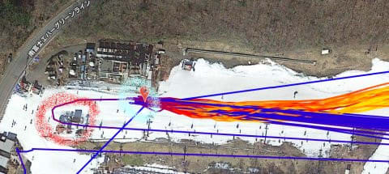

うーん…

この「滑り始め」の判断．

スピードがある程度出たらなのか，

標高差がある程度下がったらなのか，

運動して心拍数が上がったらなのか，

よく分からないのですが…

この記録のように，ときどきかなり

滑って行った赤丸のところが「滑り始め」

と判断されるケースもあります．

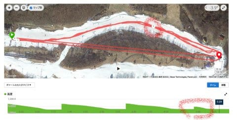

リフトを降りたところからピッタリ

測定開始というわけではないので，

1本の滑走標高差が，実際の滑走標高差より

5-10mほど少な目に出ます…

そのため，リフト1本の標高差と滑走本数

から計算した滑走標高差より，

Garminさんで測った方が1割弱，

今回で言えば200mほど少ない感じに

なりました…

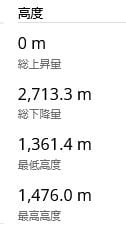

まぁ，おそらく，滑走標高差を測るのが

目的じゃなく．

「どのくらい運動したか」を測るのが

Garminさんの使命なので．

「力を使わない遅いスピードでトロトロ

　滑ったのでは，運動と認めない！！」

みたいな判断なのかな～…

さすがスパルタGarminさん．．．

せいぜい最高速度も40kmちょい程度．

平均でも22kmくらいで，

そんなに運動強度が高くなかったので…

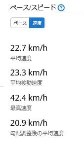

さらに心拍数も上がっていなくて．

最大心拍もせいぜい125くらいで．

ゾーン3にすら入らなかった今回．

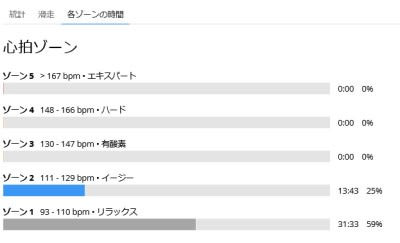

今回は．

9時から午後4時までの丸一日の

運動消費カロリーは，

わずか175kカロリー

と判断されて．

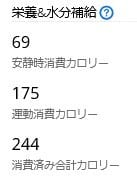

Garminさんに．

おまえ，運動しとらへんやないか！！！

と指摘された気分だったのでした…

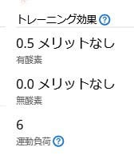

とりあえず．

いろいろデータを見れて面白いし．

GPSの精度もすごい高そうだったけど．

運動していないと判断されるような

低速では，滑走記録が残らないのが，

「どのくらいトレーニングしているのか？

　どのくらい体力が上がったのか？」

を監視するGarminさんらしいなぁ…

と思った，Skier_Sだったのでした…

うむ．

Yetiで滑るのって，ほとんど運動に

なってなかったのね…

## 💬 コメント一覧

### 💬 コメント by (副院長)
**タイトル**: Unknown
**投稿日**: 2022-11-21 08:54:40

S様、ゾーン2ですかぁ。精神のリラックスのために、雪上に立ってられるんですね。一日で、滑走時間1時間足らずとは、リフト乗るために行くようなものなんですね。また、ヤケビでの解析お願いします。

### 💬 コメント by (真美子)
**タイトル**: Unknown
**投稿日**: 2022-11-21 21:07:43

21日、2時間半、軽井沢で初滑りをしてきました。

楽しかった、暑かった、人が多かった、たくさんの若者がボードであった、年配者がスキーだった。

人工スキーって、こうやって作るのねと、始めて知りました。

次のスキーは12月の焼額、スキーヤー様にお会い出来るといいな。

### 💬 コメント by (Skier_S)
**タイトル**: Yetiはリラックススキー
**投稿日**: 2022-11-21 23:48:48

＞副院長さま

ゾーン2どころか，メインはゾーン1です…

もう，安息のために雪上に立ってるんですね（笑）．

朝9時から夕方4時までで，実質1時間も運動していないというのは

私も驚きというか，がっくりでした．

＞真美子さま

初滑り，おめでとうございます！！

無事2023シーズンが始まりましたね…

今日は平日なのに，そんなに混んだんですね…

12月の焼額でまたお会いしましょう！

### 💬 コメント by (油漏＠あちこち)
**タイトル**: 物欲
**投稿日**: 2022-12-07 12:13:56

世間？では物欲選手権が盛り上がっていますね。

Ｓ様のGarmin Fenix7Xのレポートを読み、特にナビ機能が羨ましすぎて、更にはブラックフライデーの熱気に煽られて、FORERUNNER955DUAL POWERを買ってしまいました。

更に物欲を開放しノートパソコン、スマホと連敗しまくりました。

早速日曜日に碓氷峠の登山道を歩いてきましたが、期待通りのナビ機能で満足しています。登山中は道を間違えそうになることが多いので、これは物欲ではなく安全のために買ったのだと、自分を正当化しています。古い93５はメルカリで現金化しました。

### 💬 コメント by (Skier_S)
**タイトル**: ＞油漏れ＠あちこちさま
**投稿日**: 2022-12-08 01:56:11

物欲選手権，盛り上がりを見せてますね～…

ForeRunner955行きましたか！昨日はFenix7とほぼ同じなので，お買い得だと思います…

私もFenix7Xを買ってから，山登りで道間違いが無くなったのですごい助かってます．

そうですね．これは安全のために買ったんですよね…（自己正当化）

### 💬 コメント by (ntwk)
**タイトル**: GPS設定について
**投稿日**: 2023-01-18 09:33:10

以前長野住んでた時は毎週スキーでしたが今は関西方面におり月イチがいいとこです。さて教えていただきたいのですが、スキーの時GPSの設定はどうされてますか？GPS、GPS＋GLONASS？

### 💬 コメント by (Skier_S)
**タイトル**: ＞ntwkさま
**投稿日**: 2023-01-18 09:48:02

関西からですか！

関西からなら，月一でも大変ですよね…

私の経験では，GPSでもGPS+GLONASSでもあんまり精度はかわらない感じです．

GPSモードでもみちびきをつかんでいるみたいなので，GPS+GLONASSにしても

そんなに精度は上がらない感じです．

### 💬 コメント by (ntwk)
**タイトル**: Unknown
**投稿日**: 2023-01-18 15:51:05

レスありがとうございます！私はInstinct2 Dual Powerを使っております。ランニング、ウォーキング登山、スキーでGPS設定はGPS+GLONASSにしていますが、GPSだけでも試してみようと思います。ちなみに関西在住の今は信州ではなく関西圏のスキー場ばかりです。時期によりますが雪質は意外と良いです。

### 💬 コメント by (Skier_S)
**タイトル**: ＞ntwkさま
**投稿日**: 2023-01-19 05:13:44

登山の時も，GPSだけとGPS+GLONASSでそんなに精度が変わらないイメージがあります…

関西圏のスキー場だけじゃなく，時折志賀高原にもお越しください！！

