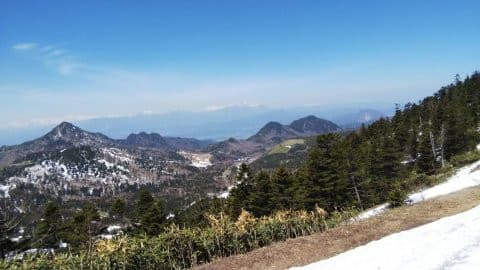
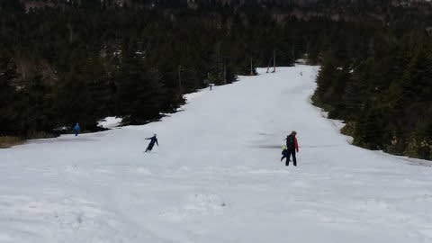
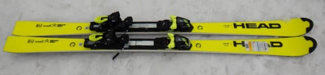
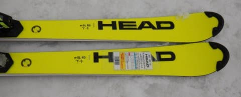
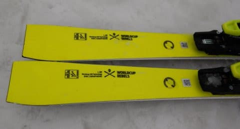
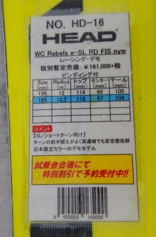
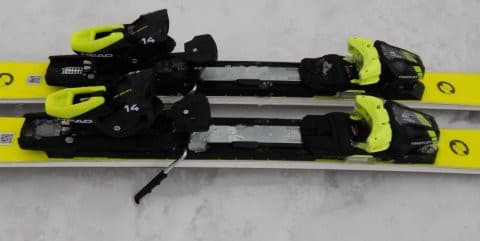

# 2021シーズンモデルのスキー板，試乗レポート…HEAD WC REBELS e-SL RD

📅 投稿日時: 2020-05-15 00:53:38

えー．

ようやく，8都道府県を除く39県で，

緊急事態が解除されたのですが．

残る8都道府県も，21日に解除判断がなされる

可能性があり．

まだ今月いっぱいは，県をまたいだ移動は

控えるようにとの要請はあったものの．

このまま上手く事態が落ち着いて行ってくれれば…

と，ちょっと明るいニュースが出てきてくれた

わけですが．

…そんなニュースがあった本日．

志賀高原は相変わらず，いい感じで晴れてた

ようです…！

某特派員より，

「朝の一本目はサイコー」

という一言が送られてきました…

でも．

昼間は+10℃を超える気温になり．

天気が良かったってのもありますが，

やはり横手山は，日差し＆高温で，

徐々に雪が薄くなって来てますね…（涙）

…まぁ，この時期ですから，雪が減るのは

当たり前で．

逆にこの時期になって徐々に雪が増えて

行ったら，それはそれでいろんな意味で

心配になっちゃいますから（笑）．

で．

整備でしばらく止まっていた渋峠，

明日から営業再開で．

週末はさらに横手第3も動いて，

朝6時の早朝から営業のようですね…！

…ただ．

残念ながら，土曜16日は朝から

雨っぽいです…（残念）．

17日は晴れそうですが，

…どちらにしろ，関東在住の私は

行くことができません（涙）

ってことで，本題へ．

2021シーズンモデルのスキーの試乗レポートが

続きましたが．

…4月の試乗会が中止になったので，

いつもの30種類以上と比べると，試乗した数は

圧倒的に少なかったですね～．

うーん．

NordicaとかHEADで，もう少し履いてみたい

板があったんですけど…残念…

てなわけで．

今日は，ヘッド編です．

では，どうぞ～！

○HEAD WC REBELS e-SL RD FIS 165cm

SL競技用

FIS認定のガチの競技SL用トップモデルの板ですが．

技術選選手向けにはこの板を小回り用として

推しているので，競技用の白だけじゃなく，

基礎ラインモデルを示す色である，

ネオンイエローでも発売されるこのモデル．

白とネオンイエローの板は，色が違うだけで，

どちらも同じものです…

で．

今回は，テスト用のワンタッチでソール長を

換えられるビンディングが着いてましたが…

本来だったら，確かこれと違うFreeflexビンディングが

着くんじゃなかったかな？

ってなことで．

履いてみますが…

…これは，強烈っ！！

かなり強い．

かなり強い張り．

メタルが強い．

すごいグリップが強い．

R=12.3という超ショートターン用のラディウスにも

関わらず．

雪が柔らかかったというのもあり，

このフレックスがかなり強い板では，

結構なスピードを出してもなかなか

たわまず，板なりに滑るとミドルターン

くらいまでが精いっぱい．

私の技術不足か，かなり力を入れてたわませないと，

ショートターンまで持っていけませんでした…

おそらく，ガンガンに硬い雪だと，

もう少し楽に小回りにもっていけそうだけど．

ものすごいスピードで急斜面を落下しながら，

左右にふっとんでいく小回りになりそう…

でも，この板の強さ，そしてどこまでも

スピードを上げても，

「え？まだこの程度？余裕なんですけど」

という余裕のある安定感で．

普通のゲレンデではそうそう出すことが無い

ハイスピード域での中回り，大回りを

やるのにちょうどいいくらい．

おそらく，ゲレンデ用ハイスピード大回り~中回り

板として使えば，柔らかかろうが荒れていようが，

激烈なグリップ力のもと，鉄板の安定度でガンガン

滑って行けるので，かなりゴキゲンな

ミドル～ロング用として使えるんじゃないかな？

ただ，グリップが強烈に強いので．

ズラしての小回りとかは，あまり向きません．

ずらしていくことはできますが，かなりの

力を必要とします．

だもんで，ずらそうと思わず，縦目に落ちて行って，

強いグリップを活かしながら，気持ちよく

ハイスピードでミドル・ロングで滑っていくと

私にはいい感じ．

…でも．この板が気持ちいいスピード域は，

人がいるゲレンデで出すと危険なスピードに

達しちゃうので．

うーん．

普通のゲレンデで履くには，ちょっと手ごわい

板かも…
