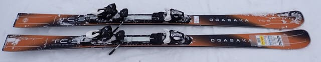

# 2026シーズンモデルのスキー板，試乗レポート速報版！その2…OGASAKA編

📅 投稿日時: 2025-04-02 00:58:33

えー．

4月1日の志賀高原は，そこそこ冷えて

くれたので．

空から降るのは液体ではなく，ちゃんと

雪が降ってくれたようですが…

ただ強風のため，焼額の第1，第2ゴンドラ

とも終日動かなかったようですね…（涙）

（[焼額山スキー場Facebook](https://www.facebook.com/yakebitaiyama/posts/pfbid02nmzqLPUUMBBfjb8yovtbLD9nzALRQwkw2a3oQCbdBBuwyYisupZsefLZmRW9GjpGl)より）

で．

4月1日深夜現在，蓮池あたりでは

雨か雪か微妙なものが降っていますが…

硯川では，カメラ前面に水滴が

張り付くようなかなり湿った雪ながらも，

路面は積雪しているので，降っている

のは雪のようですね…！！

（[北信建設事務道路気象状況カメラ](http://hokushin.pref-nagano-roadcamera.jp/)より）

うーん．今は雪だとしても，

2日の水曜の昼間は，志賀高原でも

降るのは雨か雪かかなり微妙なところ…

山頂付近や横手山方面は雪だろうけど．

麓までちゃんと雪のまま一日過ぎてくれるか，

かなり微妙な気温…（涙）

雪のまま一日過ぎてほしい…

でも，3日木曜の夜から4日金曜の朝に

かけてちょっと雪が降りそうなので．

4，5日は割といいコンディションで

滑れそうかな…！

ただ，5日の土曜は朝は冷えていい

雪だけど，昼間は気温が上がって

晴れるので，雪が緩みそうな感じ…

また明日，週末の志賀高原の天気の

詳細予想します～！

…しかし．

どうやら3月29，30日の週末で終わって

しまったスキー場も多く．

そろそろ今シーズンのスキーは終わりという

人も多そうなので，スキー場の天気予想を

待っている人は少なそうだけど…

でも．

もう今シーズンのスキーを終えるだなんて

もったいない！！！

志賀高原やかぐらはまだまだ滑れますよ！！

志賀なんて，運が良ければまだまだ

いい雪質で最高シマシマが滑れますよ～！！

そして，この週末から焼額は早朝営業も

始まるし…

私もまだ今シーズンはあと15日以上は

滑りますよ～！！

まだまだスキーシーズンは終わりじゃない

ですよ～！！

と主張したところで，本題へ．

本日は2026シーズンモデルのスキー板の

試乗レポート速報版，OGASAKA編です！！

〇OGASAKA TC-S + SR585 165cm

基礎小回り．

TC-Sでも，最も強いSRプレートとの組合せ．

フレックスは強めに感じるけど，

旋回性が高い板．

グリップがかなりしっかりしていて，

それでいてトップが内に入ってくる

ように，グイグイ回っていきます．

返りも強く早めなので，踏まなければ

まっすぐ目に落とすこともできるけど，

やっぱり小回りに特化して設計された

感じの板．

ズラしていった時も，トップとテールが

スッと外に逃げていくズレではなく，

トップよりテールが外に出ていく感じで

旋回性が高いズレをしていく，

ズレでもキレでも旋回性が高い板．

ただ，SRプレートだとグリップが強めなので

あまりズレを使っていこうと思わない感じ．

旋回性が強いので，ゲレンデでオールラウンド

に使うのは厳しいかな．

小回り専用機と割り切れば，かなり強い

武器になりそうな板．

〇OGASAKA TC-S + FM585 165cm

基礎小回り．

同じTC-SでもさっきのSRプレートより優しめの

FMプレートを着けたモノ．

…やっぱりプレートで全然性格変わりますね．

この板，プレートはかなり気を付けて選んだ

方がいいです…

SRプレートだと，強めのハイスピードで戦う板…

という感じだったのが，

FMプレートだと，素直なかなり乗りやすい板…

という感じに印象が一変します．

ズレ・キレの出し入れがしやすく，SRプレートの

板よりズレに入れやすくなります．

逆に，トップスピードまで速度を上げると，

もう少しグリップがしっかりしててもいいかな，

と感じる時もあります…

ただ，よっぽどなスピードを出さない限りは

十分なグリップでガッツリカービング小回り

していくし，その中でも板を動かしてズレで

弧をコントロールしやすいので，FMプレートの

方が，板が軽く感じるし，どこでも滑れる万能性が

高い感じ．

コブも行けますね．SRプレートだと手ごわいコブでも，

FMプレートならいい感じ．

コブとか春の雪とかも滑りたいなら，SRプレートの

方がいいと思います…

〇KS-UP + SR585 165cm

基礎オールラウンド．

来季のKEO'ｓでトップになるモデル．

165cmだとラディウスが13.8ｍという

ことで，完全小回り用よりはわずかに

Rは大きめかな…という感じだけど，

しっかり傾けていけばしっかりグリップで

トップからテールまでしっかりエッジが

効いた感じで小回りしていき，

あまり踏まなければミドル～ロングっぽい

ところまで行けるかな…

という感じ．

グリップさせていこうと思えばそこそこの

スピードまでグリップする耐スピード性は

もちながらも，ずらそうと思えば優しく

雪面を撫でていける，何でもできそうで

かなり気楽に履ける感じの板．

適度なグリップとバネ感もあるし，

それでいてゆっくり滑っても板を動かし

やすく，すごい素直な感じの板．

これがすごい！という，一口目で感じる

分かりやすい味が無いので，刺激が

足りない感じがあるけど…

逆に言うと何でもできそうで，

どんな雪でも滑れる感じがあるので…

意外と普通にゲレンデで履くには，こういう

板が良いのかも？？
