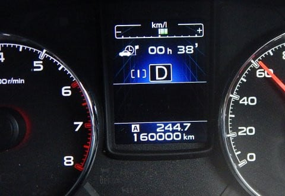
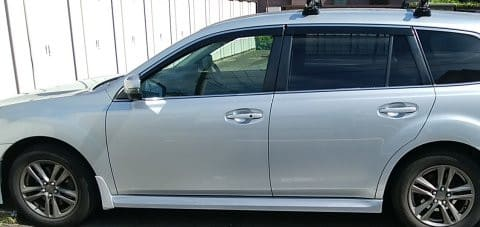
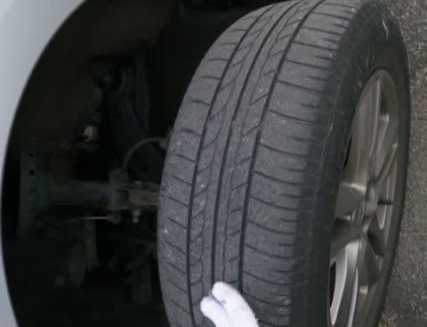
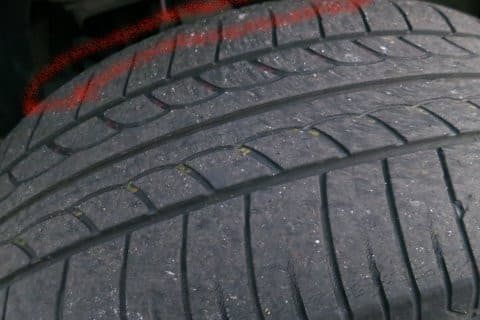

# BRレガシィ君，16万km突破！…そして，プロジェクトX2開始…か？

📅 投稿日時: 2018-06-01 03:46:17

🏷️ カテゴリ: [車](cba0e8330b3f2ded7c1addfacc75d4547.md)

先日のこと．

そろそろ購入5年目が迫りつつある，

我がBRレガシィ君ですが．

…この間，ついに走行距離16万kmを

突破しました．

いやー．

[あの日々](eb1b0e385b422753c3e3aad5a58c12234.md)から5年．

年平均3万2千kmペース．

良く走ったもんだ…（感動）

ってなわけで．

私の車の宿命である，過走行状態なわけですが．

まぁ，かなりしっかりメンテをしているので．

不具合もないし．

ドライブシャフトのブーツ割れやら

オイルにじみやらもないし．

そして．

見た目もまだまだきれいだし…

…とはいえ．

そろそろ，フロントロワアームのブッシュに

ひび割れがでてきてたり，

下周りやエンジンブロックに一部錆が出て

きてる部分もあったり．

オイルの減りが心持ち早くなったり…

と．

さすが16万kmも走ると，気になる部分が

出てきますね…

…いや，まだ乗れるんですけどね．

まだ全然快調なんですが．

とりあえず，もうじきやってくる車検に備えて．

ディーラーで車検を通すといくらくらいかかりそうか，

見積もりに持っていってみたわけなんですよ．

私「あのー．

　車検の見積もりお願いします…」

Dらー「え？？車検…ですかっ！！？？」

私「車検です」

Dらー「車検，通すんですか…？

　16万km超えてますけど…？？」

私「いや，やっぱり通そうかな…って…」

　（5年目車検で買い替えるかも…って

　　言ってきたからなぁ…）

Dらー「…とりあえず，お車見せてもらいますので，

　少々お待ちください…」

…待たされることしばし…

Dらー「すべて見きれたわけでは無いですが，

　お車を一通り点検して，必要そうなものを

　ピックアップしてきました」

Dらー「ブレーキパッドはまだフロントが6mm以上残ってますので

　大丈夫ですね」

私　「ふむ」（16万km走ってまだ半分減ってないのか…

　　30万kmパッド交換無しで行けるかも…）

Dらー「でも，距離を走っているので，ブレーキフルード交換と

　一緒に，ブレーキキャリパ―，マスターシリンダーの

　オーバーホールはやっておいた方がいいかと思います．」

私「うーーむ…フルードは換えてほしいけど，

　キャリパーとマスターシリンダーのOHは

　いらないかな…」

Dらー「あと，タイヤ，ちょっとヤバいですね…

　車検は通せますが，買い替えた方が良いかと」

タイヤか…

確かにこんな感じで，

まだ溝はあるんだけど．

フロントインサイドの減りが異常に早い，

BRレガシィ．

赤で囲ったインサイド部分．

もう溝が消えているのだ…

Dらー「あとは，ざっと見たところでは問題なさそうです．

　細かく見るといろいろ出るかもしれませんが…

　5年ともなると，バッテリーも交換推奨ですし…」

私「バッテリーはもう少しもたせたいです…」

わがBRレガシィ．

アイドリングストップ車なので，それ用の

充電受け入れ性能が高いバッテリーを

積んでいて．

さらに長距離を走ることが多いので，

バッテリーはいつでもほぼ満充電状態．

満充電状態をキープしているとほぼ劣化しない

鉛バッテリー．

解放時電圧を時々測ってやってるけど，

ほぼ新品時と変わってないので，

まだまだ行けるはず…

いや，アイドリングストップ車バッテリー．

私のような使い方の場合，寿命が延びるという

副次的効果があるという．

Dらー「マフラーはまだ大丈夫ですが，そろそろ錆が

　出そうな時期ですので，耐熱防錆塗装を…」

私「いや，さびないようにこまめに気を使ってるので

　大丈夫です！」

Dらー「あと，冷却水の交換もそろそろ…」

私「たしか，マニュアルには初回交換22万kmってあったし，

　まだ16万kmだから大丈夫です」

Dらー「そうですか…」

私「あとは下回りスチーム洗浄と，エンジンクリーニングと，

　エンジン洗浄剤とか見積もりに入ってますけど，

　切ってください．要りません」

と，余計なものを切ったけど．

やっぱりいつも通り，必要なものが抜けてるんだな…

私「ただ，前回交換から4万km近く走ったので，

　フロントとリアのデフオイルにCVTオイル，

　エアクリーナエレメントは交換しておきたいかな…

　あとフューエルフィルタも長いこと換えてないので

　お願いします」

Dらー「分かりました…」

ということで．

作り直してきた見積書を見てみると．

私「た，高い…（涙）」

エンジンオイル＆エレメント，ブレーキフルード，

CVTオイル，F/Rデフオイル，エアクリーナ，フューエルフィルタ

交換以外，全て切ってもこの値段か…

私「…ちょっと考えさせてください…」

ってな感じで．

一旦引き下がったけど，

CVTやデフオイル交換，オイル交換は，

変な格安店に行くより，ディーラーが

一番安いんだよな…

あと，スバルのCVTオイルは特殊なので，

純正オイル指定だし…

これらの交換だけディーラーでやって，

車検は格安車検店で通すか？

…としても．

トータル10万は軽く超えそう…

…それに．

まだ乗り続けようと思うと．

夏タイヤも換えないといけないし．

スタッドレスもこの冬は新しくしないと…

となると，乗り続けるのに○×万円かかるということ

か…（ちょっとため息）．

うーむ．

どうするか．

ついに，プロジェクトX2，始動か…？？

## 💬 コメント一覧

### 💬 コメント by (ほっぽ)
**タイトル**: オフシーズンの風物詩
**投稿日**: 2018-06-01 07:08:09

Ｓさん

物欲選手権とプロジェクトＸ２、このblogの夏の風物詩ですね。(^^;

レガシィ、まだまだ現役だと思うので車検通して継続で良いのでは？と思いますが、一方でプロジェクト発動にも興味ありです。

私のＢＰレガシィも今年１３年経過後の車検、１１年経過後の車検でお金を掛けて整備したので今回はほぼ通すだけですが、ＡＴＦ（ＣＶＴフルード）、前後デフオイル、私の場合はパワステオイルはせめて車検毎には交換したいですよね。

燃料フィルター交換を指摘されているところも流石です。

１１年経過の車検のときは、ブレーキキャリパーのＯＨ、ブレーキホース交換、ローター交換など、ある程度手は入れましたが、マスターシリンダーは交換しませんでした。私もＳさんの使い方ならフルード交換のみで充分かなと思います。

ところで、プラグはどうなんでしょうか？

私のレガシィは先日の富士スピードウェイ走行会でタービンアクチュエーターとバイパスバルブを留めているピンが吹っ飛んでしまい、現在ブーストが０より上がらない状態で近々修理予定です。

特定の条件での高回転で失火する症状もあるので、イグニッションコイルかプラグか、どちらかがダメな可能性もありそうです。

先日の走行会では、ＷＲＸ　Ｓ４（ほぼレヴォーグ２．０ＧＴと同じ）と同じ走行枠で走りましたが、ストレート加速が私のレガシィと同じでびっくりしました。Ｓ４（レヴォーグ２．０も）ほぼノーマルでも速いなと。

ただ、連続全開走行しているとＣＶＴ油温上昇でシフトエラーが出るようで、１５分程度しか持たないようでした。

### 💬 コメント by (ぴよ＠太田市)
**タイトル**: ５万円
**投稿日**: 2018-06-01 10:42:43

うちのBS9君も１月の車検で7万キロ

めでたくシビアーコンディションに指定され、車検費用が高かったです..

ただ、今回の車検で5万円稼いでくれた大変な働き者でもあります(^^)/

ちなみにアプライドD型ではアイサイト135ｋｍ/ｈ設定が可能ですよ！！

### 💬 コメント by (おおすぎ)
**タイトル**: Unknown
**投稿日**: 2018-06-01 14:36:14

こんにちは！お久しぶりです、

皆さん真面目に車のメンテとD－ラーにお布施を払っていらっしゃるのですね！

やはり安全とお金は変えられませんからね・・・

かくいう私は、全部自分でやって来ています（かれこれ17年Dには入庫していません・・・）

この前は、（軽ですが）エンジンも載せ替えて来ちゃいました！！

あと何年乗ろうかな～

### 💬 コメント by (Skier_S)
**タイトル**: 意外と人気なプロジェクトX記事
**投稿日**: 2018-06-02 04:12:35

＞ほっぽさま

プラグは10万kmで換えてます！

https://blog.goo.ne.jp/tsakamot2001/e/0d9f436b430d412c9b9a303445077c66

10万km毎交換のイリジウムプラグなので，

次は20万kmまでもちます…

しかし，S4，サーキットでも早いんですか…

でも，サーキット走るなら素直にWRXが正解だと

思うんですが（笑）．

CVT油温警告出ること覚悟でサーキット走る

ってのがすごいですね．

＞ぴよ＠太田市さま

走行距離で車検費用そんなに上がっちゃうんですね…

私はいらないものはひたすら切るので，

そんなに高くなった思い出は無かったのですが．

しかし，車検で5万円稼いだってのは…何があったんでしょうか？？

あと．

アウトバックもD型で，足回りのセッティングとか

かなり変わったみたいですね．

うーむ．

でも，アウトバック．

高いんですよね…（涙）．

＞おおすぎさま

え？？？

エンジン乗せ換えも，自分でやられたんですか…？？？

すごい…

チェーンブロックとかお持ちなんですか？？

私もいろいろ自分でやりたい派なんですが，

オイル交換すらディーラー頼みです．

いや，安いペール缶を買って自分で換えれば

安いんでしょうけど…

ペール缶置いておくスペースやら廃オイル

処理を考えるとついつい…

CVTオイルなんかは自分で換えるのは

厳しそうと諦めてます．

あと，最近の車はややこしくて．

時折ディーラーに持っていくと

ECUのリプロで知らぬ間に性能向上したり

バグフィックスがあったりするので…

今の車はいろいろブラックボックス

過ぎるところが多いです（笑）．

### 💬 コメント by (ほっぽ)
**タイトル**: Unknown
**投稿日**: 2018-06-02 07:05:22

Ｓさん

プラグは前回車検で交換済だったんですね。

私はスキーシーズン以外に何度かサーキットを走るので、

プラグはイリジウムプラグを３万ｋｍ毎に交換しています。

面倒ですがＤＩＹで交換しています。

先日、エアフローメーターとスロットルをＤＩＹで洗浄したら、

エンジンが綺麗に回るようになりました。

それと、私の場合は車検毎にＷＡＫＯＳのＲＥＣＳという点滴と、

その後にＦＵＥＬ１という洗浄剤を使っています。これはおまじない程度の効果かもしれませんが。

Ｓ４、ＣＶＴだし速くないだろうと思っていたら

予想外にストレートが速くてビックリしました。

でも、オートマで走るとどうしてもＡＴＦ（ＣＶＴＦ）

の油温上昇対策をしないといけないんですよね。

ＣＶＴＦクーラー付ければ解決します。

サーキット走るなら、ＳＴＩが基本だとは思いますが、

最近は２ペダルの車両で走る人も結構多いです。

Ｓ４（レヴォーグ２．０ＧＴも）があれだけ走ることが分かったので、

私の時期愛車、レヴォーグも有力候補になりました。

エンジンオイルクーラーとＣＶＴＦクーラー取り付ければ、

連続全開走行にも耐えられると思います。

### 💬 コメント by (Skier_S)
**タイトル**: ほっぽさま
**投稿日**: 2018-06-03 01:30:07

イリジウムプラグを3万kmですか！

かなりの交換頻度になりますね…

あと，スバル車のプラグ，換えにくいですよね．

それをDIYでやるとは…

エアクリーナーボックスとか

外さないとダメなんですよね？

プラグレンチも，ちょうどいい長さのエクステンションが

無いと辛そうですよね…

ちなみに，エアフローとスロットルの洗浄って，

どうやってやるんですか？？

何か洗浄剤みたいなのをエアクリーナ

下流に流し込むんでしょうか？

しかし，次はレヴォーグも候補ですか…

ここはいっそWRX STIに行って，3ペダルに

乗ってみるのはいかがですか？？

…決して長距離運転してスキーに来るような

車ではありませんが（笑）

