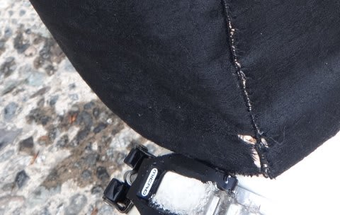
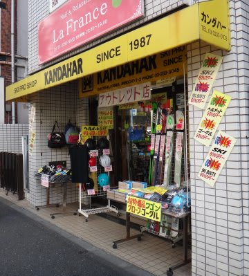
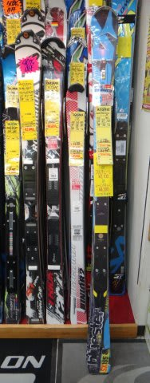

# 神田に行ったSkier_S続き…何も買わずにいられるのか？？

📅 投稿日時: 2013-07-10 02:15:35

ってことで．

昨日の続きの文章ですので．

[昨日の記事](ebea1e9e359cc665d9cc2929e08045177.md)を読んでない人は分からないかと思いますが…

なんだかわけの分からない文章，続きます…

----

アナウンサー「さて．『第1回 スキーヤーの物欲を刺激する街

　神田に来て，物欲にまみれたスキーヤーが買い物をせずに

　我慢できるか選手権』.

　スキー板が安いという，フソウスポーツにやってきた

　Skier_S選手ですが，スキー板という大物の誘惑に耐えられるのでしょうか…？

　…おおっと．予想外に，板ではなく，ここでもまずウェアから見に行きましたね～」

解説「うーむ．

　彼は，あまりウェアにこだわりがないので，いつもぼろぼろになっても

　4-5シーズンくらいは平気で同じウェアを着続けるんですが…

　このシーズン，ウェアを買ったばかりのSkier_Sとしては

　珍しい行動パターンですね．」

レポーター「えー．放送席ぃ～，放送席ぃ～」

アナウンサー「はい」

レポーター「たった今，入った情報ですが…　Skier_Sが

　今シーズン買ったばかりという，ウェアのパンツですが．

　酷使しすぎて，どうやらもう裾が擦り切れているようなんですよ」

アナウンサー「え？今シーズン買ったばかりのウェアがですか？」

レポーター「はい．ウェアにこだわりがないSkier_Sが，激安の

　8000円の安いパンツを買ったからか，1シーズンもたずに擦り切れて

　来たようなんですよ」

アナウンサー「なるほど…それで，ウェアを真剣に見ているわけですね」

解説「そうなると，この勝負も危険ですね～．

　次のシーズン途中で穴が開くかも…と考えると，

　普通なら新しいのを買おうかと思いますよね…」

アナウンサー「パンツをいくつか眺めていますが…

　あ，どうやら．ここでもまだ自制心を失っていないようですね．

　軽く眺めただけで，ウェアのコーナーを通り抜けました」

解説「まぁ，彼は穴が開いても擦り切れても，同じウェアを

　着続けますからね．

　この勝負は，まぁ問題なく勝利でしょう」

アナウンサー「さて．Skier_S選手．次は階段を下りて…

　危険なスキー板のコーナーに近づいていきます！」

解説「ここは，一直線にATOMICのコーナーに向かって行きましたね～．

　ただ見るだけなら，こうは真っ直ぐ板に向かいませんよ」

アナウンサー「どうやら，店員に値段を聞いているようですが…

　おおっと！　動揺しています．

　Skier_S，動揺しています！

　予想外の値段が出ているようです！」

解説「昨年では，12月にならないと出なかった値段がいきなり出て，

　びっくりしているようですね～」

アナウンサー「いや，でも，ここはこらえました．

　こらえました，Skier_S．

　値段を聞くと，すぐに店を出ました．

　スキー板という大物の誘惑にも，無事耐えたようです．」

解説「いや…そうとはいえませんよ．

　次は違う店に寄って，同じスキー板の値段を確認していますから．

　…どうやら，ここでも同じ値段が出てるようですね．

　さらに無償チューンナップ付きということで，昨年格安だと思った

　値段より，実質さらに1万円近く安いお値段がでたようです．」

アナウンサー「まさか，ここまで来て，Skier_S，ついに大物の

　誘惑に負けてしまうのか…？

　ここであっさり，スキー板の誘惑に屈するのか…？

　…どうでしょうか…

　いや，

　どうやら．

　大丈夫なようです．

　無事，お店を出てきました」

解説「いや…それはどうでしょう．

　最後に一番危険なところにやってきました」

アナウンサー「これは…いつものお店にやってきましたね…」

解説「でも，この時期のこのお店で．

　激安店と同じ値段が出るとは思えませんから．

　ここは耐えるかと…」

アナウンサー「そのようですね～．激安店より5000円以上高い値段を

　提示されて，踏みとどまったようです…

　11万円近いお値段に，さすが買う気を失っているようです」

解説「あ，Skier_Sの動きが変ですね…

　どうやら，激安店の値段を伝えているようで…

　店員決裁範囲を超えているのか，いったん店員さんがお店の

　奥に引っ込みましたね～」

アナウンサー「店員さんが出てきましたが…

　あ，これは明らかに動揺しています！

　Skier_S,驚いています！」

解説「信じられないのですが，格安店と同じ値段で，

　さらにチューンナップ付きという条件まで出たようですね…

　これは…昨シーズンこの店で板を2セット買っているというのが

　効いているんでしょうか．

　これは危険だぁ…」

アナウンサー「これは…

　これは…

　あーーー！

　ダメです！

　ここにきて．

　Skier_S，ここにきて，ついに物欲に屈しました～っ！！！！

　ウェアも，グローブも，ブーツもガマンしたのに．

　ここにきて，

　ついに．

　ついに．

　スキー板という，一番の大物にやられました～っ！！！」

解説「…想定の範囲内の結果ですね」

アナウンサー「ということで，今回は，Skier_Sの完敗という

　結果に終わった，『第1回 スキーヤーの物欲を刺激する街

　神田に来て，物欲にまみれたスキーヤーが買い物をせずに

　我慢できるか選手権』．

　これにてお別れです．

　さようなら～」

＃ってことで．

＃想定外に，買っちゃった…

## 💬 コメント一覧

### 💬 コメント by (miya)
**タイトル**: 楽しく読みました(^-^)
**投稿日**: 2013-07-10 12:42:06

いつもと違うパターンで

面白かったっす(^o^)v

でも買っちゃったんですねー

うらやましいー

次は店を巡るskier_sさんの心の声を

聞いてみたいですねー♪

### 💬 コメント by (ゆうこ)
**タイトル**: 買ってしまったんですね。
**投稿日**: 2013-07-10 22:07:54

どうなるのかなぁと、ハラハラ記事を読んでましたが、板を買ってしまったんですね。

予想外でした。

グローブとか小物を買うのかと思いました。

私は、今は北海道の利尻島礼文島にきてます。利尻富士をにはまだ雪が残っていて、滑れないかなぁと眺めてしまいました。

冬の間は下り専門なので、夏になって登ると足の筋肉痛が大変なことになります。つらい。利尻富士登山に9時間半かかりましたー。

### 💬 コメント by (いか)
**タイトル**: Unknown
**投稿日**: 2013-07-11 00:29:06

ぼくも先日そこにお世話になってしまいました(笑)

### 💬 コメント by (Skier_S)
**タイトル**: 物欲に勝てなかった…
**投稿日**: 2013-07-11 01:41:39

>miyaさま

いつもと全然違うパターンでしたが，

楽しんでもらえたようで…

…でも．ホントにこの日は何も買わないつもりで

神田に行ったんですが．

やはりあの街は魔物が住んでます（笑）．

>ゆうこさま

おー．

利尻＆礼文島ですか．

いいですね～．

利尻は私も行ってみたいなぁ…

しかし．

なかなかのハラハラ感だったでしょ（笑）．

最後はこんなオチか！

って感じで…

全く想定外に板を買ってしまいました．

車を買ったばかりなのに…

>いかさま

おっとっと．

悪魔の住む町，神田に行ってらっしゃいましたか．

物欲に負けませんでしたか？（笑）．

### 💬 コメント by (いか)
**タイトル**: Unknown
**投稿日**: 2013-07-11 01:45:33

大回り用の板を探しているところだったので、先日の月山詳細レポのとこのコメントにくっつけた写真の板を買ってしまいました…*\(^o^)/*

### 💬 コメント by (Skier_S)
**タイトル**: いかさま
**投稿日**: 2013-07-11 01:56:09

あらら…

コメントにリンクが貼ってあったのに気づきませんでした．

これは…確かに，「いつものお店」のシールが

貼ってありますね（笑）．

しかし，日本に入ってないはずのCode speedwallって，

…なかなか渋い選択ですね．

でも，このお店，平行輸入品も扱ってるとは知らなかったです…

