# 熊の湯スキー場11/23オープン決定！かぐらは23日のオープン延期．そして奥志賀高原スキー場の第6リフトが無くなってる！！！！

📅 投稿日時: 2023-11-22 02:26:27

🏷️ カテゴリ: [スキー雑談](c1f9d2cb7478308da16419928ea3945e9.md)

えー．

20日の積雪が予想以上にあったようで．

さらに21日朝までに人工降雪が動かせた

というのもあり…

22日に気温が上がり，人工降雪が動かせ

なくてもオープンできる目途がついたようで．

なんと．

熊の湯スキー場，私の予想より早い23日に

オープンします…！！！

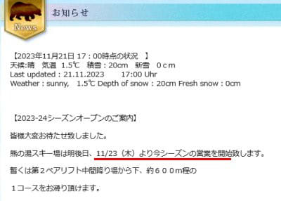

（[熊の湯スキー場ホームページ](https://www.kumanoyu.co.jp/lift/)より）

うーん．24日の積雪の後のオープンだと

思ってたんだけどなぁ…

19，20日の積雪が予想より多かったんだなぁ…

予想は外したけど，いいほうに外れたから

ヨシ！！←予想を外したのをごまかしてないか？

で．

18，19日に一旦プレオープンした横手山．

23日から本格オープンです！

滑れるのは海和ゲレンデのみ，

営業開始は朝8時半から．

リフト1日券は5400円です．

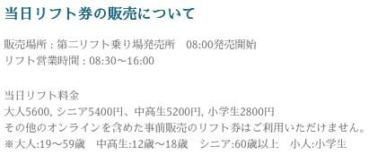

（[横手山スキー場ホームページ](https://yokoteyama2307.com/2023/11/21/11_23_open/)より）

そして，オープンの23日，横手山は抽選会を

やるようですね…！

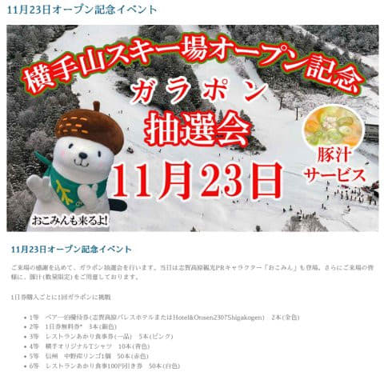

（[横手山スキー場ホームページ](https://yokoteyama2307.com/2023/11/21/11_23_open/)より）

ってなことで．

横手・熊が23日にそろってオープン．

横手は当初の11月3日よりかなり遅れましたが…

熊の湯は18日オープン予定からわずかな

遅れで営業にこぎつけたので，

暖冬予想にしては上出来かも…？？

ただ，その一方で．

かぐらは11/23のオープンをあきらめたようです（涙）

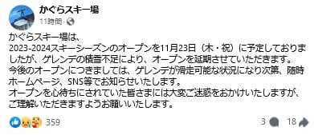

（[かぐらスキー場Facebook](https://www.facebook.com/snowkagura/posts/pfbid02NAn9ceQixBt7cdR9iAUc2a9MQDy4zHC5MmXi39686zxRC7KinU23uAMJWeC2A565l)より）

さらに，湯の丸スキー場も11/25の予定から

遅れそうというアナウンス…

でも，もしかしたら24日の雪でオープンできる

かも？？

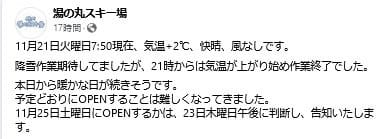

（[湯ノ丸スキー場Facebook](https://www.facebook.com/yunomaruski/posts/pfbid02fChB2k6u9HguLcd688XSgTanfE9P9CF3AvDq5ih9USFpTVeNikUPQxvhWzgTMyudl)より）

そのほかのスキー場，11/25オープンを

予告していた丸沼やたんばら，鹿沢は，

まだ延期かどうかアナウンスはありません．

ちなみに，例年この時期にオープンしていた

高峰マウンテンパークスキー場（旧アサマ2000）は

11/30オープン予定で，例年のオープン遅れに

懲りたのか，今年はいつもより遅めの営業開始

予定です…

で．

この後ですが…

やっぱり24日はかなりの雪になりそう…！！

なんてたって，850hPa図を見ると．

真冬並みの水色の-6℃線が志賀高原に

かかってるし…

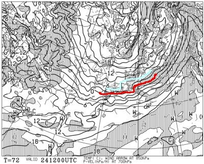

そして，地上天気図もすごい冬型！

日本海側に雪雲の降水域がかかっているので…

これは降る！！

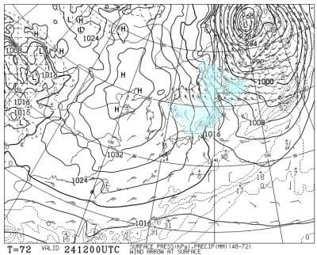

24日から25日の積雪量は志賀で20cm，

新潟や白馬はもう少し積もりそう．

山陰地方まで雪になるんじゃないかな？？

白馬方面も，早ければ25日にオープン

できるスキー場が出てくるかも…

この天気図なら，かぐらも25日．

遅くても26日にはオープンできそうな

予感…！！

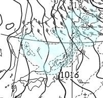

ってな感じの，ちょっと期待できる

ニュースの後は．

某20000mな方から教えてもらった，

衝撃の悲しいニュースを…

いや．

私も初めて聞いた時は信じられなかったのですが．

奥志賀高原スキー場の[ホームページ](https://okushigakogenresort.com)が更新されたので

みてみると…

2024シーズンのゲレンデマップがあるわけ

ですが．

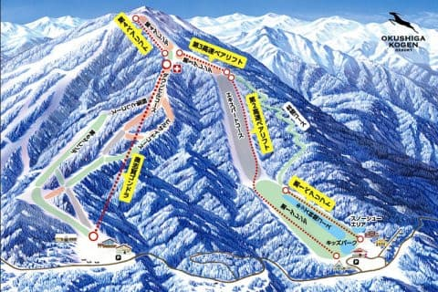

（[奥志賀高原スキー場ホームページ](https://okushigakogenresort.com/slopes/)より）

このゲレンデマップに，かすかな違和感を

抱いてよく見てみると…

ええええええ！！！！

赤くくった部分の第6ゲレンデにあった，

第6リフトがない！！！！！！！！！

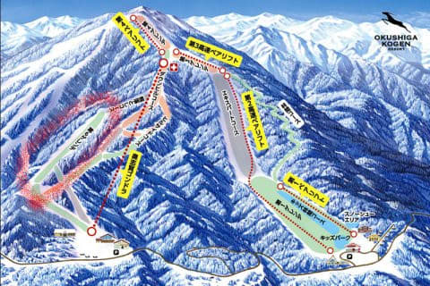

うぎゃーーーー！！

第6リフトが…第6リフトがなかったことに

されている！！！！

え？これって，第6ゲレンデのパークは

どうなるの？？？

と，見てみると．

パークの営業および運行はございません

との冷徹な案内文が…

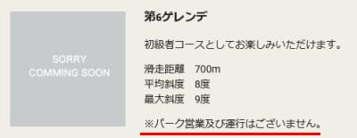

（[奥志賀高原スキー場ホームページ](https://okushigakogenresort.com/slopes/)より）

ガーン　ガーン　ガーン　…

第6リフトが営業しないだけじゃなく．

これまで，パークとかで遊びたいボーダーを

惹きつけてやまなかった，奥志賀パーク．

今シーズンは営業しないようです…（泣）

残念…

今シーズン，中央エリアはクローズされた

コースやリフトはなく．

焼額はむしろコースが増えたくらいなのに…

奥志賀のリフト＆パーク廃止は，かなり

残念な感じ（涙）

残念だ…

あぁ…奥志賀のボーダー人気は一気に

落ちるんだろうなぁ…

…そして，焼額に人が集まりそう．

昨シーズン，雪が足りなくて

アイテムがまともにできたのが2月に

なったというのが効いたのか…

とりあえず．

今シーズンはなるべく早くからいっぱい

雪が積もって．

たくさんのお客さんが来て，スキー場が

潤って欲しい…

あるいは，新しくリフト作るから，だれか

私に100億円寄付してくれるのでも

いいんだけどな…←そんな人いないから

## 💬 コメント一覧

### 💬 コメント by (ひゃくりん)
**タイトル**: Unknown
**投稿日**: 2023-11-23 00:02:47

奥志賀のフリーラインパーク休止は、

8月中旬に奥志賀公式HPから発表があり、

スノーボード界隈が少しだけざわついていましたね。

フリーラインパークを滑っていたスノーボーダーとしては残念です。

春シーズンは人が多くて大人気でしたが、

ハイシーズンは人が少なく、

第6リフト休止もスキー場経営的にしょうがないのかなと思います。

先シーズンのフリーラインパークは、

2/3(金)の予定通りオープンでした。

パークをガチで作っているスキー場は1月からパークをオープンさせますが、

一般的なスキー場のパークオープンは、

雪の量が増えて安定してきた2月オープンが多いです。

なので、奥志賀パークのオープンは特段、遅いわけではないです。

どちらかというと、3月の高温と4月の週末ごとに天候不良で融雪によりパークが早期クローズしてしまったのが痛かったのかなと。

噂レベルですが、先シーズンから第6リフトの休止は決まっていたとかいないとか。

奥志賀パーク休止の影響は、焼額山・奥志賀ともに

混雑やリフト待ちに大きな影響はないと思っています。

パーク目的の人はパークしか滑らないので・・・。

しいていうなら、春に奥志賀ゴンドラ乗り場の駐車場の車が減るぐらいかなと思います。

第6リフトのゲレンデは、適度な緩斜面で起伏があり、人がいないので午後でもピステンが残っている

最高のカービングゲレンデだったので、リフト休止は残念ですが、

コースの圧雪してくれるなら、熊落としからの穴場コースになるかもしれません。

### 💬 コメント by (Skier_S)
**タイトル**: ＞ひゃくりんさま
**投稿日**: 2023-11-23 03:35:05

え！

奥志賀のパーク休止，そんな前に発表があったんですか…

知らなかったです…

パークは2月オープンが普通だってことも知りませんでした…

そして，パーク目的の人はパークしか滑らないんですね．

奥志賀の第6にアクセスするための朝のゴンドラ待ちはちょっと減るのかも．

で，第6リフト休止だったら，確かに熊落としから滑った人は昼過ぎになっても

シマシマが滑れそうな感じですね…！

