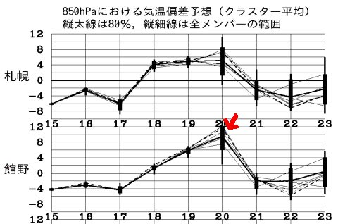
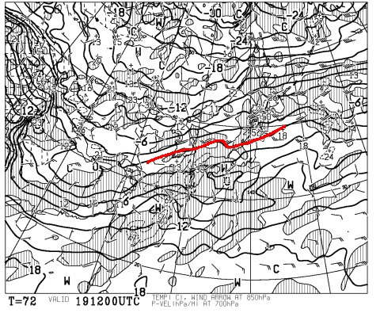
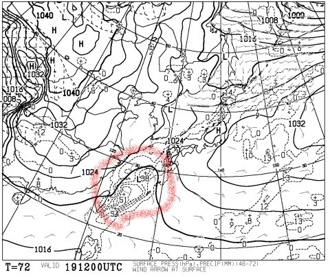
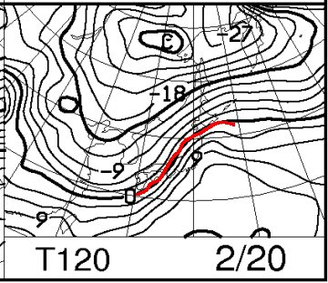
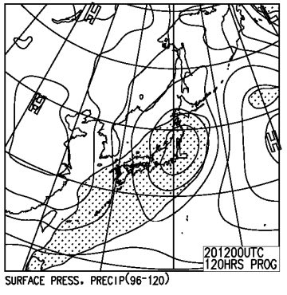
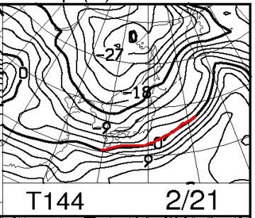
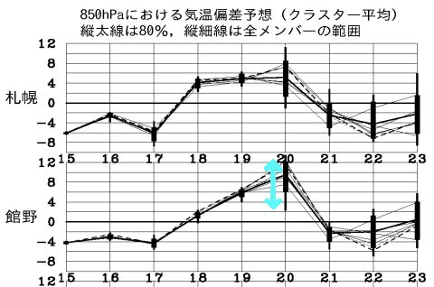

# え？このままだと，今週土曜，2月20日も…また雨？？？そんなバカな…（涙）．

📅 投稿日時: 2016-02-17 03:16:52

🏷️ カテゴリ: [スキー天気予想](c6554f5c3c106093b511a8daae23757e8.md)

えー．

普段なら．

毎週水曜日が定番の天気予想の日なんですが．

そう．普段なら．

…今年は異常気象が続き．

天気図を見て，

「なんじゃこりゃぁ」

と，なることが多くて．

そのたびに，臨時で天気予想をやってきたわけですが．

はい．

今日も，臨時天気予想です．

また，「なんじゃこりゃぁ」

です（涙）．

とはいえ，昨日予告したので．

ある程度の覚悟はできていると思いますが…

じゃ，行きますよ．

どどーん．

今週土曜日，20日の気温予想．

また，グラフの上を突き抜けてきました～（涙）．

昨日までは，20日の予想，ぎりぎりグラフの

中に納まってましたが．

今日の予想では，上に突き抜けましたよ～

はははは．

これで，3週間連続で．

狙ったように週末に，予想気温が

グラフの上を突き抜けてきましたね～．

笑うしかないですね～（ひきつりながら）

とりあえず．

19日金曜日，夜9時の850hpa気温図を見ると…

…すでに，金曜夜から．

0℃線は志賀高原より北に上がっちゃってますね…

そして．

19日金曜日，夜9時の地上天気図は…

まだ，降水域は志賀高原にはかかってませんが．

赤くマークした，発生したての低気圧が，

ぐんぐん成長しながら，西からひたひたと近づいてきます．

ええ，ひたひたと．

で．

20日土曜日，夜9時の850hpa気温は…

うがぁ～っ！！！！

だ，ダメだっ！！

低気圧前面で，強烈な南風が入るパターンです．

0℃線は志賀高原よりはるか北．

志賀高原はプラス3℃線が…（涙）．

そして，地上天気図は…

…あぁ．

日本全域に降水域の網掛けが…

ということで．

このままの天気図なら，土曜の20日は雨になる可能性が高いです（泣）．

また，南風なのでゴンドラも止まるかもしれません（涙）．

なんてこった…っ！！（悲）

…まぁ，一昨日の壊滅的低気圧に比べれば，低気圧の発達も弱く．

暖気流入も弱そうなので．

ぎりぎりみぞれっぽい湿った雪，

というくらいのところにとどまってくれるんじゃないか…と，

楽観的に思ってますが…

ただ，予想が高温側にちょっとでもずれると雨です．

きわどいところです．

でも，21日日曜は．

こんな感じで0℃線は，いつもの2月の平均的な場所，

日本よりずっと南まで下がってます

だもんで，日曜は雪です．

冷え冷えです．

雨の心配はいりません．

＃ゲレンデの下地がアイスバーン化しそうだけど

ということで．

土曜日，だ．

17，18日はそこそこ冷えて，

17日はドサドサ積もるほどではないとはいえ

雪も降ってくれそうな感じなので．

土曜に雨が降らなきゃ何とかなる．

土曜の雨さえ回避できれば…

…そう，

まだ，望みはあるっ！

こんな感じで，20日の気温の予想の幅は，

水色の矢印で示したようにかなり大きく．

運が良ければ，20日は平年比+2度程度で収まるっ！！！

その程度で収まれば，志賀高原は間違いなく雪です．

普通に雪です！！

はい．

はい，はい．

分かりますよね～．

みなさん，分かってますよね～．

そうです．

今週も引き続き．

スキーヤーの願いを結集するのだ！

激しく，休まず，情熱的に，踊るのです！！！！

冷え冷え踊りPart3～終わりなき戦い～をっ！！←なんだかもうホントにわけ分からなくなってきた…

＃…しかし．今年は異常すぎる．

＃もう踊り飽きた．

＃そろそろ，踊らずに済む週末を迎えたい…と願うのは，

＃私だけではないはずだ…

## 💬 コメント一覧

### 💬 コメント by (のび太)
**タイトル**: Unknown
**投稿日**: 2016-02-17 12:37:42

いつも楽しく天気予報記事、読ませてもらってます。

今週末、我が家も万座です。

やっぱり雨の可能性、高いですよね～。

同様日は軽井沢辺りでショッピングと温泉かな。

冷え冷え踊り、踊らせていただきます。

### 💬 コメント by (Skier_S)
**タイトル**: のび太さま
**投稿日**: 2016-02-18 01:34:30

お久しぶりですね～！

今週末は万座ですか！

今のところ，土曜は雨になりそうですが…

ただ，午前中はもちそうかな．

午後も降っても，それほど強い降りには

ならないんじゃないかな…？

と，楽観的に考えていますが…

まぁ，

もし家族で行かれるなら，

土曜午前だけ滑って，午後はのんびりって

感じがいいかもしれません．

とりあえず，土曜午後，雨にならず，

ちゃんと雪になるように．

冷え冷え踊りを踊り続けてください！（笑）．

土曜雨だったら，日曜は下地が完全にアイスバーン

になっちゃうので…

