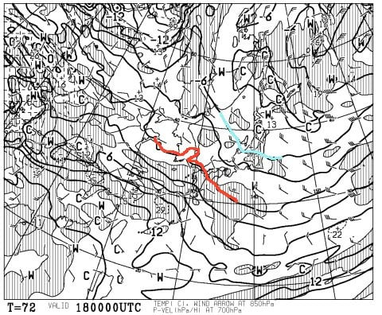
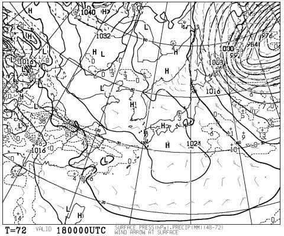
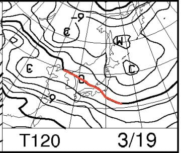
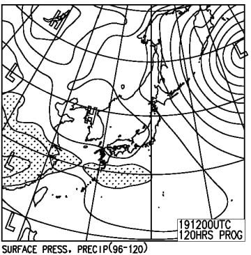
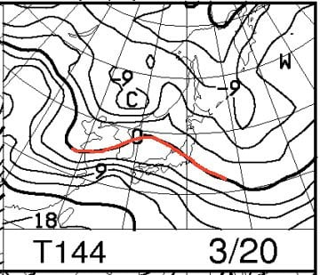
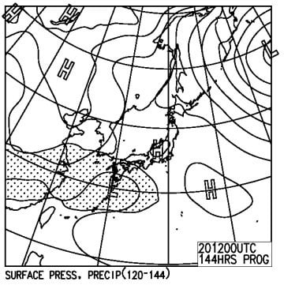

# 3連休，3月18，19，20日のスキー場の天気は？…概ね晴れ．3月中旬としては恵まれてる感じかな…

📅 投稿日時: 2017-03-16 01:37:17

🏷️ カテゴリ: [スキー天気予想](c6554f5c3c106093b511a8daae23757e8.md)

ということで．

そうです．

そうなんですよ．

なんと．今週末．

3連休ではありませんか！

ってことで．

「昨日のSX購入の話の続きをやらんかい！」

…って声も聞こえてきそうですが．

でも．

今日は水曜定番の，週末天気予想を行くのだ！

えー．

まず．

3連休初日，18日土曜の850hpa気温図を見ると…

うむ．

赤く印した0℃線は，志賀より南…

というより，西ですか．

で，志賀高原には，水色で示した-6℃線が

掛かっているくらいなので．

土曜日は，3月にしては冷え冷え！

朝は-10℃近くまで冷え込み，昼間も山頂は-3℃程度

までしか上がらないかな…？

で．地上天気図はこんな感じで，

すっぽり高気圧に覆われてます…

だもんで，基本的には晴れそうですが．

ただ，上空に寒気が入るので，時折雪雲が

飛んでくるかも…？

そして，中日の日曜，19日ですが．

850hpa気温を見ると．

あら．

赤く印した0℃線が志賀高原に近づいているので…

土曜より，気温が上がりそうですね…

昼間は，0℃を上回りそうな予感…

地上天気図を見ると．

ふむ．

この日もまだ高気圧に覆われるので，晴れますね．

うーむ．

気温が0℃を超えて，日差しが当たるので．

ちょっと春っぽい雪になっちゃうかな…？？

で．

3連休最終日，20日の月曜日ですが．

850hpa気温図は…

おっと．

赤く印した0℃線が，志賀高原よりわずかに北に

上がっちゃってます…

これは，昼間は間違いなくプラス気温になりそう．

…まぁ，3月下旬なら．

この程度が平均的な感じなんですが．

これまでが恵まれすぎましたかね…

そして，地上天気図を見ると…

西からひたひたと低気圧が近づいてますが．

でも，まだ小さな低気圧が信州上空にいるので．

まぁ，この日も晴れそうでしょうか…

ってことで．

まとめると．

初日，18日土曜：朝は多少雲がかかってるかもしれないけど…

　-10℃程度の冷え冷え．

　前日からの積雪は無く，締まった圧雪でスタート！

　天気は時折雲が飛んでくるかもしれないけど，

　基本的に晴れ．

　昼間も気温は焼額山頂で-3℃程度までしか上がらないかな？

　昼間，南斜面の日が当たる部分で多少重めになるものの．

　全体的にいい雪質をキープ！

　午後はちょっと下地の固いのが出てくるかもしれないけど．

　晴天，雪質Goodという，3月にしては恵まれた日になるかな？

中日，19日日曜：朝から晴れ！

　朝は放射冷却で-5℃以下まで冷え込むかな？

　朝イチはかなりしっかり固めの圧雪斜面！

　結構なハイスピードバーンの朝．

　しかし，昼に向かって気温が上がっていき，

　昼ごろには春の日差しと相まって，

　雪はかなり重めの，しっとりした春の雪に…

　ただ，壊滅的にザブザブにならない．

　下地はしっかりと固い雪が残る．

　天気は終日晴れるものの，

　夕方から気温が冷えていき，しっとりした雪が

　そのまま固まる難しいコンディションに．

最終日，20日月曜：この日も朝から晴れ！

　朝は放射冷却で冷え込み，ちょっとカリカリした感じのある，

　固めでスピードが出るバーン．　

　この日も昼に向かって気温が上がっていき，

　昼間気温は，焼額山頂でもプラス2-3℃まで上がりそう．

　昼間，日が当たる南斜面はザラメっぽい雪にまで

　溶けちゃうかも…

　北＆西斜面はしっとりと重い雪になる程度かな？

　日差しがある暖かい典型的春スキーの一日．

　雪は重くなるけど，普段ならザブザブ雪になりかねない

　3月下旬と考えれば，いい感じかな．

　この日も夕方最後の方，日が陰ってくると，

　溶けた雪が固まってなかなかエキサイティングな

　バーン状況になりそう…

って感じで．

まぁ，3日間とも天気に恵まれそうだけど．

後半は気温が上がり，だんだんと春の雪に

なっていくかな…

雪質的には，土曜がベストですね～．

今のところ3連休の翌日以降もしばらく，

壊滅的高温になったり，雨になったりすることは

なさそうな天気図なので．

やっぱりこの春は，恵まれてますよ～！
