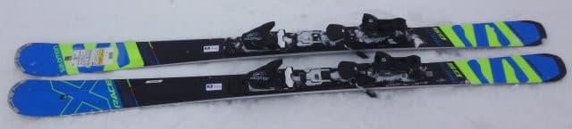
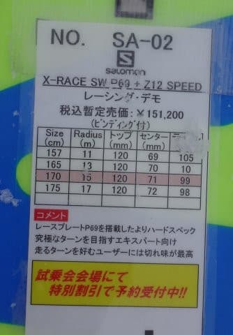
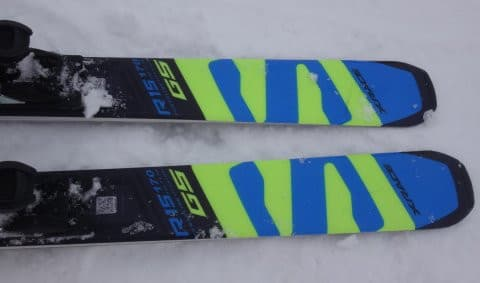
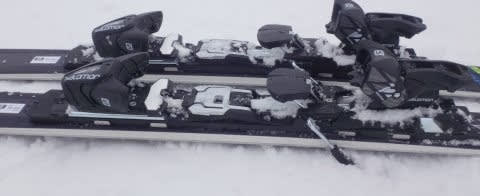
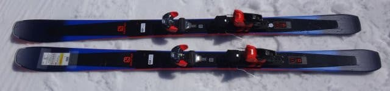
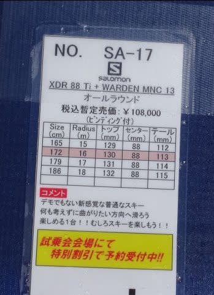
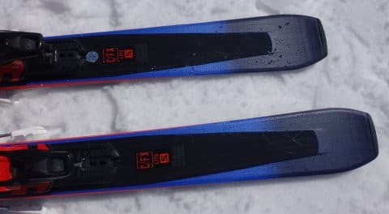
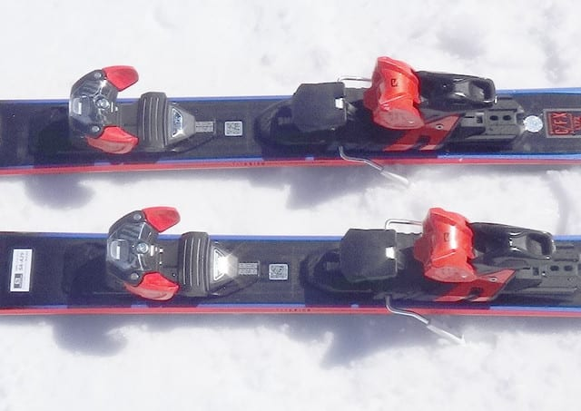

# 2018シーズンモデル，スキー試乗レポート第9回…SALOMON編その3

📅 投稿日時: 2017-05-17 01:31:18

えー．

雨の土曜日のかぐらはガラガラでしたが．

…晴天の日曜日は，激込みだったようですね…

うむ．

やはり，土曜にスキーに行って良かったな～！←いろいろ自分をごまかしている

で．

本日は，スキー試乗レポートの続きをば…

今回は，サロモン編です．

では，どうぞ～！

---

SALOMON X-RACE SW＋P69プレート　170cm

基礎オールラウンド

170cmだと，R=15mということで．

小回りとも大回りともつかない微妙な板ですね…

板のテールにはGSって書いてるけど，とても

GSに使える競技板じゃない気が…

ってことなので，エキスパート向けオールラウンド

というのが分類上の正解かと思いますが．

X-RACE SWでも，P69プレートを付けた方の，

強いモデルになります．

乗ってみると…

やはり，どっしりと重く，強さを感じる板です．

かなり粘りを感じる強いフレックス．

そして，強い返りを感じる板です．

グリップがガッツリ強く，強い返りと

相まって，板のヌケもいい感じ．

グリップがガッツリ強いので，

ズラシてコントロールしても面白くない

カービングマシンです．

角づけするだけで，簡単にエッジに乗った

カービングに入れます．

そこからスピードを出していくと，板がたわんで

強烈なカービングに入っていきます．

プレートが強くなった分，フレックスは強く，

高速耐性もプレート無しよりかなり高め．

板のおいしいエリアは，かなりハイスピード域に

なります．

板の重量感が案じられ，かなりの高速安定感がありますが．

どっしり感という点では，私が今履いている

'16までのX-RACEの方が強いか…

SALOMONらしく，比較的テール加重でコントロール

する板で．

谷回りでトップのエッジが利いてトップから

インに入っていくというより，

テールのエッジが利いてトップが浮かぶように

回ってくる感じ．

山回りでテールをたわませると比較的小さい半径で

回りますが，170cmのこのモデルだと，

小回りは厳しいですか…．

板の重さとグリップの強さから，

小回りはあきらめた方がよく．

170cmの長さのこのモデルは，ハイスピードの

ミドル～ロングカービングを楽しむ板ですね～．

板の強さ・重さから，体力のない人が

気楽に履ける板ではない感じですが．

体力のある人が，ガッツリカービングで

かなりのハイスピードでロング目の

ターンをしていきたい…

というのに向く板です．

○SALOMON XDR88 Ti 172cm

オールマウンテン，オールラウンド

来シーズンからラインナップに追加される，

新しいモデルのようで…

センター幅88mm・84mm・80mmの3種類があり，

今回試乗したのはXDR88という名前から分かるよう，

センター88mmの最も幅広のモデルです．

かなり軽快そうなビンディングがついて，

履いた感じ，板自体も軽く感じます．

ただ…

板の軽さから感じるより，フレックスは強く．

ペラペラの頼りない板ではないですね～．

結構しっかりした張りを感じる板です．

この板は，午後の結構荒れ始めた春雪になった

タイミングで試乗したのですが．

板の幅の広さが効いているのか．

荒れた雪をものともせず，かなりハイスピードで

細かな凸凹を蹴散らしていき，すごい楽に

滑れたことに，驚き！

かなりのハイスピードで，荒れ荒れ

雪を滑っても怖くないし，疲れません…

自分から仕掛けていく板ではなく，

板の上に乗っかって，軽く左右に傾けるだけで，

ターンが始まり．

そのまま，板なりに落ちていくだけで，

縦目のロングターンで，何の怖さも感じることなく

荒れ荒れ斜面を結構なスピードで滑り落ちて行けます．

…ピカピカ整地での性能は分からないけど．

荒れ荒れ斜面では，かなり無敵の板かも…

でも．

もうひたすら板に任せて，板なりに

気楽に落ちていくだけで，超ラクチンに

滑っていく板で．

決して，ずらすとか，小回りをするとか，

板をたわませてターン弧をコントロール

するとか，そういうことをしたくなる板では

ないので．

私がこれをずっと履いていると，完全板任せの

ダメスキーヤーになってしまいそうな予感…

とりあえず．

荒れた斜面でも，重い雪でも，

体力を全く使うことなく蹴散らして

かなりのスピードで滑っていけるので．

体力のない人でもガンガンロング

クルーズができる板だと思いました…
