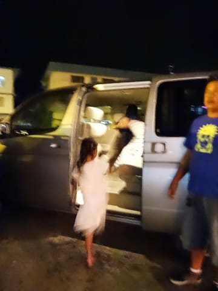
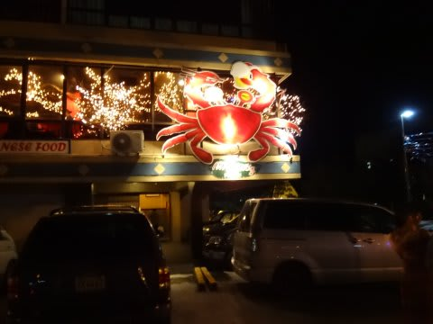
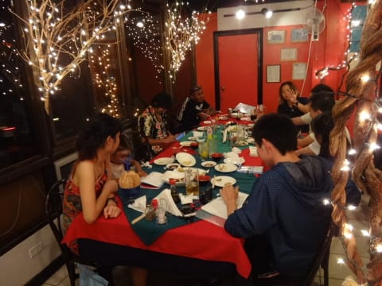
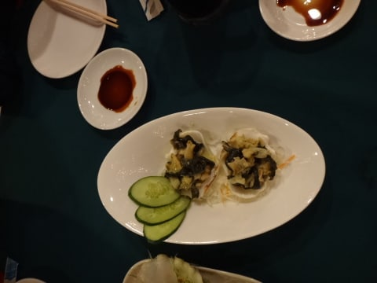
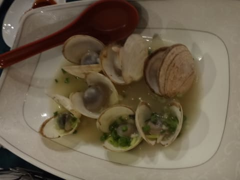
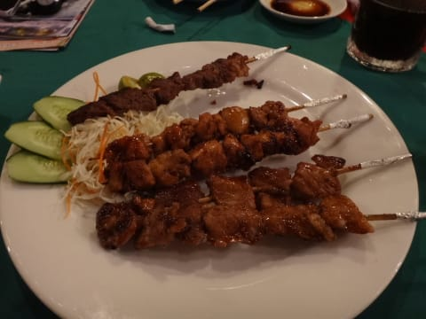
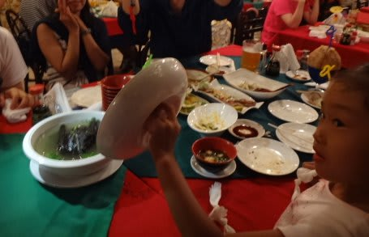
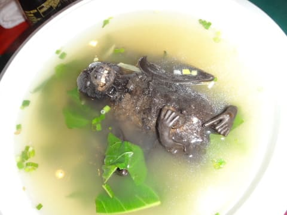
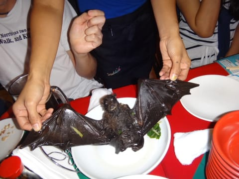

# 2014年10月，小学生の子連れでパラオへダイビングに行ってみた，その28…そして，断水の夜

📅 投稿日時: 2015-09-14 02:31:07

とゆうことで．

パラオ市街全域が断水状態の中，

ログづけ後に，ホテルに帰りますが．

…気になるのは，水が出るかどうか．

ホテルに着いて，蛇口を開けると…

をを！

水が出る！

急いで，娘と妻が，海で塩まみれになっている

身体をシャワーで流しますが…

なんと．

…その間に，水が弱まってしまい．

ついに止まってしまいました…（涙）．

私はシャワーを浴びれずじまいなんですが．

あぁ．間に合わなかったか……（泣）

そして．

これから先，トイレの水は，タンクに残った最後の

一回分が流せるのみ．

まぁ，歯磨きや飲み水は，ペットボトルの水があるから．

何とか一晩は乗り越えられるかな…

とりあえず．

ホテルは水が止まっちゃいましたが．

…とはいえ，夜ご飯を食べなくちゃならない．

でも，街中が断水の影響で，営業していないレストランもあり．

ダイビングショップの人が，断水の中でもやっている

レストランを予約してくれました．

レストランピックアップの車に乗り込み…

やってきたのは，パラオで比較的有名らしいレストラン，

「モグモグ」です．

ここは，断水にも関わらず，営業をしており．

本日は，ゲストみんながこのレストランに会して

夜ご飯です．

娘も，昼間に一緒に遊んでくれたおねーさんの

隣に座って，また遊んでもらえて大喜び．

で．

なんだか，いろいろ出てきてましたが…

とりあえず．

今回圧巻だったのは．

今回の参加者がみんな「これ，頼んでみよう！」

って感じで．

ネタとして頼んだ，こいつ．

娘が蓋を開けてみますが…

中から出てきたのは．

…なんでしょう．

広げてみると…

…これは．

あれですね．フルーツバット丸ごとのスープです．

うーん．

ちょいとグロテスク…

味は…かなり淡白で，臭みも何もない，あっさりした味．

…だけど，食べるところはほとんどないよ（笑）．

まぁ，ネタですね～．

これは．

という感じで．

ダイバーでワイワイやって，

夜遅くまで，お酒もたらふく飲んで．

楽しいですね～．

やっぱり，ダイバー同士での夕食は！

とりあえず．

たらふく食って，飲んだ後は．

ホテルに帰って，即寝したのでした…

PS.このレストランのトイレは，大きなごみバケツに

　水が入れたものが置いてあって，手酌で水をすくって

　トイレに流してました…
