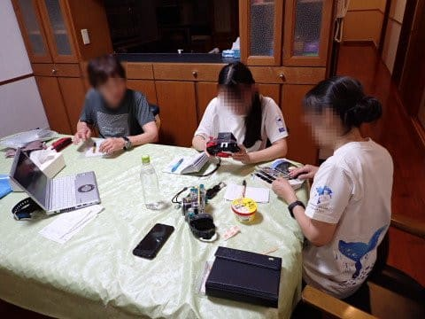

# 2024年8月，今年も座間味で親子ダイビング！その10…2日目の夜ご飯は三楽さん．そして翌3日目の朝も晴天！

📅 投稿日時: 2024-09-03 02:52:30

🏷️ カテゴリ: [ダイビング日記](ce3a7a8d424d112fce83ee85c81a0e344.md)

そーいや，このBlogはしばらく沖縄

でのダイビングネタが続いてますが…

まぁ，こういう写真を見て，

「沖縄に行きたいなぁ…」と思う人は

そこそこいると思いますが．

キレイな景色やら何やらが全く出てこない

のに，沖縄に行ったことがある人なら，

この動画を見ると，[沖縄に行きたくなるに
違いない（？）…という動画](https://youtu.be/WHy2lBKEY-g?si=Mo9rOglz26chZCJn)を見つけました．

…いや．

たまたまこの動画を見つけたので観ていると，

なんだかすごい沖縄に行きたくなって

しまったんですが．

沖縄が好きな人は，おそらくこれを見ると

沖縄に行きたくなると思います…

いや～．この動画作った人，一人ですべての

声と編集から何から全部やってるみたいだけど，

すごい…

ってなことで，今日も本題の沖縄は座間味の

ダイビング日記です…！！

ーーー

（[前回はこちら](eda921cfd875d1bb2ebd4a78be4413360.md)）

ということで．

ダイビング後に阿真ビーチを散歩し，

帰路に向かったわけですが…

帰り道の途中．

港のそばまでやってくると…

子供向けの遊具がそろった公園が

あるのですが．

この公園．

[実はお前が2歳の時にダイビングに来て](efe11073b24918f5d6a428d81fe95aefa.md)，

まだどちらかが子守するために夫婦で

交互で潜っているときに，

子守役がボートを待つ間に遊びに

来たところだよ…

と言っていたら．

「へー．全然覚えてない」

あ，そうですか．覚えてませんか…

まぁ，当時と遊具が全く変わってるし．

むしろ2歳のころのそんな記憶が残ってたら

すごいか．

しかし．もう高校生というのに．

公園の遊具で満面の笑みで遊んでました…

（顔が見せられないのが残念）

ってなことで．

また道すがらに出会ったネコに挨拶しながら，

のんびり帰っていくと…

ちょうど夕食を予約した18時．

今日の夜は，泊まった星砂さんのすぐ裏にある，

去年も来た「三楽（さんた）」さん．

お刺身盛り合わせやら…

ラフテーやら…

なぜか娘が大好物なモズクの

天ぷらやらを食べて…

最後はしらすいくら丼で締め！

どうでもいいけど，モズクやら

海ぶどうやらジーマーミー豆腐やらが

大好きな娘．

沖縄料理が好きだけど…

どう考えても，酒飲みのチョイスだよな．

ってなことで．

この日の晩御飯もたらふく食ったというのに．

その後，また105ストアへ繰り出し，

夜のおつまみと酒を買いだしに行きます．

その途中，娘は相変わらずネコちゃんに

ちょっかいを出し…

帰ってきたら，ダイビングのログ付け

タイム！

ビールを飲みつつ，撮ってきた写真を見て，

夜までログ付けと称するのんびりタイムを

過ごしたのでした…

そうそう，105ストアにこんなものがあった

ので買ってみたんですが…

なんだ？このちんすこうアイスって！？？

とりあえず，クッキー＆クリームみたいな

感じで，中にちんすこうの砕いたやつが

ちょっと入っている，まぁまぁイケる味でした．

ってなことで．

ログ付けを終えて，健全な夜10時過ぎには

寝ましたが．

翌朝，朝7時の朝食前に目覚めると…

いや．

今日も見事な晴天ですね！

風もないし，今回の座間味旅行は

天気に恵まれてます…

朝7時から朝ごはんですが．

我々が泊っているのは，星砂さんの

「別邸3F」

星砂さんの朝ごはん，写真で撮ると

そうは見えませんが．相変わらずボリューム

たっぷりです…！

結構おいしいし，かなりお腹いっぱいになります．

うーん．

朝食だけじゃなく，夕食も復活してほしいなぁ…

朝ごはんを食べ終わって準備して．

今日は昨日より30分遅め，8時45分に

ボートに集合なので．

8時40分過ぎに港へ向かいます…

いや，ホントに天気いいな！！

ボートに乗り込んで，器材をセットしたら…

直ちに出港！

1本目のポイントへ向かいます…

（[続く](e1dd38d6dea338bc05a7071cf800fad02.md)）

## 💬 コメント一覧

### 💬 コメント by (1kamakura)
**タイトル**: Unknown
**投稿日**: 2024-09-03 05:42:02

江戸の秋

ダイビング後の沖縄ライフも最高です！

なんでダイビング記事だと見る人少ないのか、理解できないわ〜🤔

遊具で遊ぶお嬢様、可愛い。

我が家の娘（27歳）も遊びますよー。

実は私も滑り台大好き。

三楽さんのお料理美味しそうです🤤

ダイビングログ懐かしい🤿

家族全員でダイビングって、羨ましいです！

### 💬 コメント by (サザビーワン)
**タイトル**: 沖縄愛
**投稿日**: 2024-09-03 09:59:09

ダイビングやったことありませんが楽しそうですね、私にはスキーでいっぱいいっぱいですが、

それと因みに私の妻は石垣島出身です。今年も高校生と大学生の息子を連れて半月帰省していました。

私は仕事の為行けず毎年のように留守番です。小さい時から石垣島の海しか知らない息子に、

去年伊豆の海に一緒に行ったとき「伊豆まで来ると海きれいだろう」って言ったら、

「エッこれできれいなの」って言われてしまいました。海と言えば湘南だった私からすれば十分にきれいなのですが、

やっぱり沖縄の海とは比べられないですね、普段は方言がもう出ない妻ですが、

帰省から帰ってくるとかなりなまって帰ってきます。今年もお土産の沖縄食材で晩酌楽しみました。

私もゆっくり沖縄に行きたいです。２０年ぐらい行ってません。

### 💬 コメント by (Skier_S)
**タイトル**: また南の島に行きたくなってきた…
**投稿日**: 2024-09-04 01:12:37

＞江戸の秋さま

このBlogでは，ダイビング記事はホントに人気ないです…

スキー記事の5分の1くらいのアクセス数です（涙）

書くのにかかる時間は変わらないのですけどね～．

でも，娘さんは27歳でも公園で遊びますか（笑）．いいですね～！

やっぱりダイビング旅行は楽しいので，ぜひまたダイビング復活を…

＞サザビーワンさま

ダイビング，楽しいですよ～！！！

ダイビングだけじゃなく，そのあとでダイビングの話をしながら一緒に潜ったメンバーで

飲むのも楽しいです．

でも，私も昔は伊豆でよく潜りましたが，さすがに石垣の海とは

比べ物にならないですね（笑）．泳いでいる魚もカラフル熱帯魚というよりおいしそうな感じだし，

ワカメとか海草とかあって夏は濁りぎみなので，みそ汁感が…

でも，伊豆の海は意外と生物相が多様で，じっくり潜ると面白いですよ～！！

とりあえず，ぜひ今度ゆっくり沖縄に行ってみてください…！

