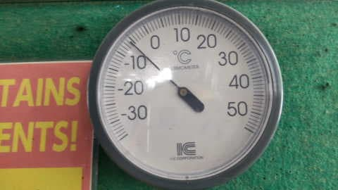
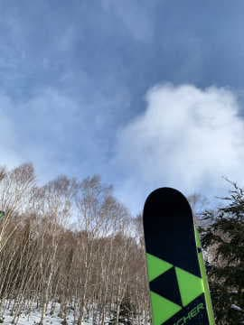
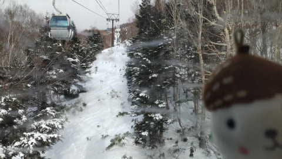
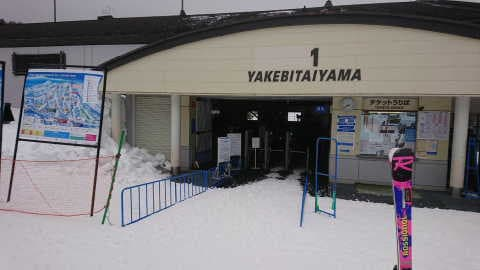
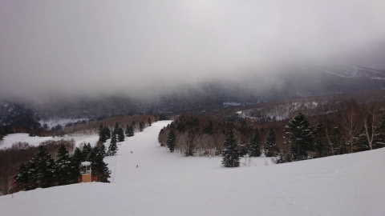
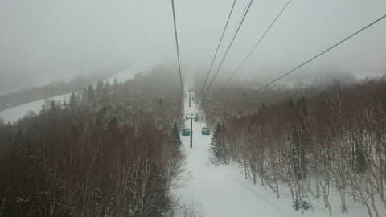
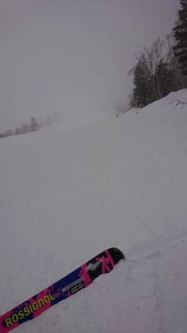
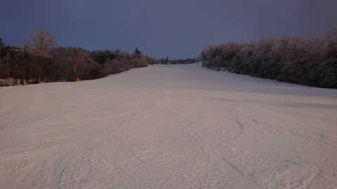

# 1月18日(水)の志賀高原スキー場特派員から…朝は晴れ間もあったけど曇り．ゲレンデの雪は硬くなってきたみたい

📅 投稿日時: 2023-01-19 05:44:10

🏷️ カテゴリ: [日記](cc4b5682fb7b8b144980957a978653fb0.md)

えー．

水曜夜の記事は，本来なら天気予想のはずですが．

…天気図を読んで記事を書いている暇がない…

今週末，なんとかスキーに行くために

睡眠時間を削って，土日ぶんの仕事を

平日にこなそうとしているので．

今日もこんな時間…(涙)

一応，今週こそスキーに行こうと

思ってるけど，ホントに行けるのかな…？？

（かなり心配）

ってなことで．

天気図を読んでる時間がないので．

今日もありがたいことに特派員から

写真が送られてきたので．

志賀高原特派員レポート！！

まず．

あさイチの気温は-6℃と，この時期に

してはそれほど冷え込みは強くない

感じの朝で…

朝のうち，晴れ間がのぞくタイミングも

あったようですが．

基本的に曇り空だったらしい本日．

なんだか，今日は焼額第1ゴンドラが

不具合で昼間で動かなかったようですが…

それでも，人が集中するはずの第2ゴンドラの

待ちは最高は5分程度．

そこまで混まず，昼に第1ゴンドラが

運転開始するとガラガラになったようです…

そして，この日も積雪が無かったので．

バーンコンディションはアイスバーンと

言うほどではないにしろ，だんだん硬く

なっていっているようです．

スピード派の人にはいい感じみたいですが…

1月の志賀高原のふわふわ雪ではないのが

残念…

で．

昼過ぎからはガスが濃くなってきたようで…

ちょっと視界が悪く，滑りにくいタイミングも

あったみたいですが．

夕方営業終了の頃に雲も切れ，日が射した

みたいですね～…

とりあえず．

火曜はちょっと積雪があったものの．

水曜は積雪が無く．

まだ，ゲレンデには土日の雨の影響が

強く残ってしまっていますが…

このあと，志賀高原に雪が降るのは

20日の深夜から．

でも．そこまでドサドサ降らず，

21日土曜の朝までにせいぜい5～10cm，

21日昼間にも5～10cm積もる程度

でしょうか…

そして，22日の日曜も降らなさそう…

うーん．積雪が足りない…（涙）

でも．

そのあと，23日から25日は積もりそうな

天気図になってます…！！

来週末は，バーンコンディションは

トップシーズンらしい状況に戻って

くれるかな…？？

また明日，詳細天気予想やります～！

…やる予定です…

…やれるかな？？

（こんな時間に更新しているような，

今の仕事の進み方だとヤバい）

## 💬 コメント一覧

### 💬 コメント by (レインボー75)
**タイトル**: Unknown
**投稿日**: 2023-01-19 16:01:38

木曜日の志賀高原情報

私のまだ少ないシーズン29日間で、ベストの一日でした。

朝の蓮池-10℃。爽やかに晴れ渡ってます。12時過ぎまで雲一つなく北アルプスが鮮明に拝めます。

パノラマのファーストゲット。オリンピックも綺麗に整備されてまっ平ら。ヤケビの整備はやっぱり凄い。

冷え込んで斜面は硬くて気持ちいい。強く踏み込んでもあまり削られないからずっと朝のまま。

日々の生活のためレインボー(２時)までにはやめなければいけないなんて、スキーに行けないエス様と同じくらい不幸です。

### 💬 コメント by (アリス)
**タイトル**: Unknown
**投稿日**: 2023-01-19 16:51:03

こんにちはS様

シーズンベスト本日更新です☀️

ヤケビブルーの下北信五岳の稜線がくっきり🎵

鹿島槍、剣、五竜、妙高が目視できます🙆

白樺、オリンピック、GSとぐるぐる廻しで何度滑っても飽きない❗️

止まったり休憩するのが勿体ない一日でした😅ヤケビだけ別次元ですね🎵

8時30分と言わず、7時にリフト、ゴンドラの営業を始めて欲しい気分です😆🎵🎵

### 💬 コメント by (Skier_S)
**タイトル**: あと1時間ちょいしか寝れない…
**投稿日**: 2023-01-20 06:41:34

＞レインボー75さま

積雪が無くまだバーンは硬いと思っていたのに…

まさか今シーズンベストの日になるとは．

金曜も冷え冷えで締まったバーンだと思いますよ！！

＞アリスさま

今シーズンベスト，うらやましい…

土日は私もゲレンデに復活予定です！！

…ホントに行けるかなぁ…

