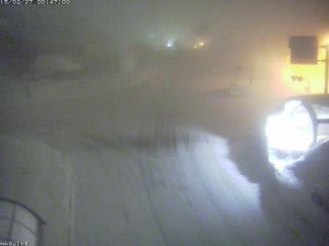

# そして…この3月は暖かいのか？冷えるのか？？

📅 投稿日時: 2015-02-27 01:14:55

ううううーーむ．

やはり．

やはり，志賀高原でも，今日の夕方から雨になったようで…（涙）．

午後5時前の蓮池のカメラですけど…

雨が降って，レンズに水滴が（泣）．

しかし，2月の志賀高原の夕方で，気温プラス1.3℃って，

どうゆうことよ？？

そして…

午後6時を過ぎても，雨…（悲）．

それも，気温1.9℃って…夕方より上がってるやん…

ただ．ついさっきから雪になったようで．

ようやっと，路面に雪が積もり始めてますね～．

この雪は．

明日一日…というより，土曜の朝まで降り続くので．

土曜には，ゲレンデ状況は改善しているはず…（祈）．

とりあえず，土曜は朝は雪が降ってるけど．

午後にはすっきり晴れた，スキー日和になるはず！

…日曜は微妙だけど（泣）．

ってことで．

もう，この日曜から3月ですが．

一体全体，この3月は冷えるのか，あったかくなるのか，

大変気になるところ．

んだもんで．

また，専門天気図にお出まし願いましょう…

ここでめったに使うことがない，[FCVX14ってやつ](http://n-kishou.com/ee/exp/exp01.html?cd=fcvx14&cat=e4)です．

このうちの，東日本の850hpaの気温偏差を見ると…

こんな感じになってます．

真ん中の線から左が2月の過去の傾向，

真ん中の線から右が，今後の予測ですが．

赤い矢印で記した，2月前半部分．この時期はずっと冷え冷えが続いて，

パウダーパフパフだったのを覚えているかと．

それに比べ，青い矢印で記した2月の後半部分．

先週末から，ずっと雨や高温が続きましたね…

…ってことで．このグラフの線が上に上がると高温で雨，

下に下がると冷え冷えの雪になるわけですが…

…真ん中の線から右の，今後の予想を見てみると．

一番太い，中間予想値（センタークラスタの値）は．

まぁ，大体平年並みか，ちょっとだけ高めになりそう…

って感じですね．

うーむ．あんまり冷え冷えにならなさそう…（残念）

とりあえず．

今後の気温傾向は，こういう資料があるですが…

東日本は，平年並みになる確率が40％，平年より高めになる確率が40％

ってことで．

だいたい，FCVX14の予想通りですね…

んで．

これから3週間，大体同じ傾向が続く，と…

うううううーーん．

どうやらこの3月．

あまり冷え冷え激烈寒気は期待できなさそうで．

「あー，3月だなぁ」という感じの日が続きそうです…

冬来たりなば，春遠からじ…

（意味：楽しい季節のあとには，悲しい季節がやってくる）
