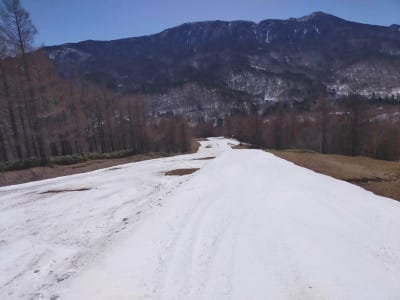
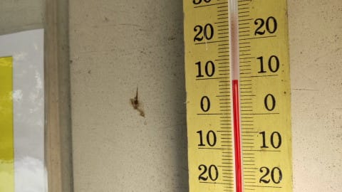

# 2021/4/23(金)の志賀高原スキー場，特派員情報！…高温，

📅 投稿日時: 2021-04-24 01:45:14

🏷️ カテゴリ: [日記](cc4b5682fb7b8b144980957a978653fb0.md)

本日の志賀高原も．

昨日予想した通り，晴天＆高温だったようで…

特派員からの写真を見ると．

朝から見事に晴天！！

で，朝イチのバーンは，一見シマシマで

すごくいい感じに見えますが．

朝から，山頂の気温はなんと+7℃！！（泣）

すでにかなりヤバい感じ…（涙）

だもんで，一見まともに見えるバーンも，

すぐにザクザクに緩んで行ったようで…

それだけじゃなく．

どうも昨日・今日の雪解け，かなり

激しい感じです（激涙）

なんと．

奥志賀ダウンヒルコース．

2壁と3壁の間，雪寄せした廊下以外は

かなり穴が空きはじめてますよ！？？

うーむ．

25日にクローズ予定のダウンヒルコース．

やっぱり今週日曜までが，営業できる

ギリギリの感じかな…？

そして．

ついに3壁はクローズされてしまった

ようです（泣）

だもんで，第6ゲレンデ側を迂回させ

られるわけですが…

う回路側も，ちょっと雪が薄くなって

ヤバい感じ…（涙）

クローズになった3壁を見ると．

下の部分，確かにもうコースが

切れかけてますね…

早い…早すぎる．

GWまでもたずに奥志賀ダウンヒルコースが

死に絶えるとは，

早い…（泣）

さらに．

今日の昼間も気温は+10℃近くまで上がった

ようで．

ダメだ…

ダメだよ…

こんな高温なので．

今日も緩斜面は妖怪板掴みが

発生していたようで．

あまり楽しくない感じだったようです…

そして．

明日の24日土曜．

同じような感じの終日晴天＆高温の

一日になりそうで．

朝からプラス気温，昼間は+10℃くらい

まで行きそう…

…これは，早朝勝負ですね．

で．

25日．朝は晴れてるかもしれないけど．

朝の気温は土曜より低め．

氷点下まで冷えてくれるかな．

そして，昼間に雲が増えて行き…

午後になると気温が冷え始め．

もしかすると，午後は雪が

ぱらつくかも…？？

この日は，午後は0℃前後まで冷えそうなので，

土曜より暖かい格好で滑ることをおススメ！

ってなことで．

土曜は早朝推奨なので．

早朝に間に合うよう．

私は朝2時過ぎ出発です～！！

…って．

え？

あと20分後！？？

今日は完全徹夜でスキーに行くことになるのか…（涙）

## 💬 コメント一覧

### 💬 コメント by (ヒータロゥ)
**タイトル**: Unknown
**投稿日**: 2021-04-24 15:49:09

本日はご一緒させていただきありがとうございました。ほぼ徹夜なのにさすがのタフぶり。私のような軟弱スキーヤーのなせるワザではないです。

それにしても雪へりましたね（涙）

明日はコンディション良さげですが用事があるので参戦できずで、ＧＷも今のところ不透明で（畑やらないと…）今日が今シーズン最後かもしれません。

少し早いですが来シーズンも娘ともども宜しくお願いします。

### 💬 コメント by (かず)
**タイトル**: Unknown
**投稿日**: 2021-04-24 17:58:03

今日暑かったですね…早朝駐車場からSさんらしき人見かけました  今日岡谷のジャンクションスルーして名古屋方面に行ってしまった 26シーズンも来ているのに初です  年でしょうか？笑

### 💬 コメント by (Skier_S)
**タイトル**: 今日は晴天
**投稿日**: 2021-04-24 21:57:53

＞ヒータロゥさま

今日はご一緒ありがとうございました～！

結局ラストまでおにぎりかじりつつ滑りきっちゃいました（笑）

でも，今シーズン終わりですか…

残念です．また来シーズンお会いしましょう！！

＞かずさま

今日は暑かったですね…

早朝滑ってたんですか？？

気づきませんでした．．．

しかし，通いなれた道スルーしちゃいましたか（笑）．

私も昔，信州中野インターをうっかり通過したことが一度…

