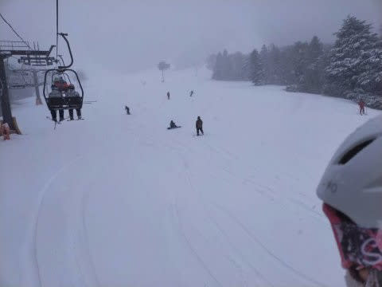
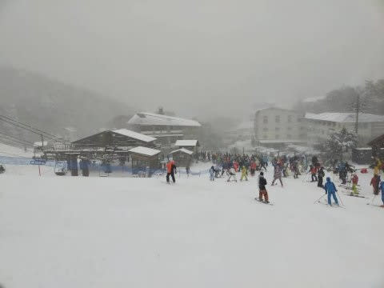
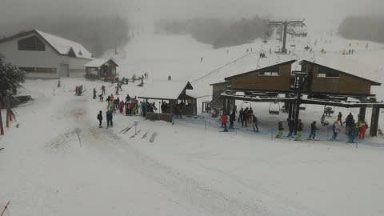
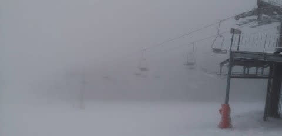
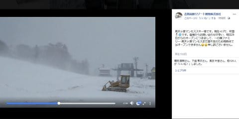
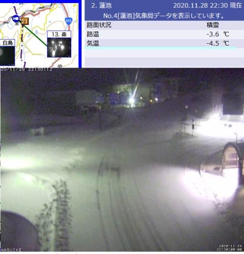
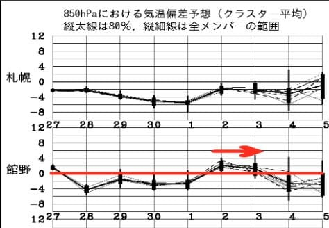

# 明日29日日曜も冷えて小雪がぱらつく天気，志賀は路面凍結に注意！…そしてその後1日までは冷えて時々雪

📅 投稿日時: 2020-11-28 23:14:34

ということで．

特派員からの情報によると．

本日土曜，28日の朝からの雪で，

志賀高原の熊の湯，ゲレンデは

真っ白になったようです…！

ただ，積雪は10cmほどなので，人工降雪が

ないところは雪が薄く，かなりヤバいのですが…

真っ白になったので，どこが人工降雪が

ある場所で，どこが地雷原か分からない

ですね(笑)

熊の湯，横手ともそこそこリフトは

混んだようですが…

ただ，熊の湯はリフトを2本動かして

くれたので，午後はそれほど混んでなかった

みたいです．

横手，熊の湯とも，ゲレンデは昼間も

人工降雪機を動かしていて，スキーヤーは

人工降雪を浴びながらの滑走になったようですが…

夕方の営業終了ごろまで雪はぱらついていて．

このまま明日の午前中まで，雪がぱらついたり

止んだり…

という天気が続きそう．

今晩から明日にかけて，天然雪は数cm程度の

うっすらしか積もらないけど．

冷え冷え気温は続くので，人工雪がガッツリ

打てるはず！

ガンバレ，人工降雪機っ！！

…でも，一の瀬ファミリー＆高天ヶ原は，29日も営業を

諦めたようなのが残念…

とりあえず，今の志賀高原．

気温も-4.5℃と冷えていて，道路にも

積雪が残ってますし．

明日の朝の志賀高原への道，

積雪＆ツルツルだと思うので，

明日志賀に行く方はご注意を…

で，この28日からの冷え冷え期間．

これからもしばらく続いてくれそう！

赤矢印で記した，2日から3日にかけて，

ちょっと気温が上がりそうですが…

また3日の夜からは気温も下がってくれ

そうで．

5日の週末までに，壊滅的に気温が上がる

心配はなさそうで，一安心…

…ただ，天然雪がドサドサ積もる日はなさそうなので．

5日の週末には，人工降雪のパワーがある

アサマ２０００等やかぐらなんかのスキー場は，

オープンできそうです…！

ということで．

私は明日は熊の湯出没予定です．

皆さん，志賀高原でお会いしましょう…！！

## 💬 コメント一覧

### 💬 コメント by (Unknown)
**タイトル**: Unknown
**投稿日**: 2020-11-29 14:47:08

sさん

今日はありがとうございました。まさか今シーズンの1本目のリフトをsさんとご一緒するとは思いませんでした！これは今シーズンは良いシーズンになる予感！

ところで、シーズン券はなんでソフトカードなんですかね？今日さっそくしっとりとして、ゲートエラー喰らいました。耐久性に不安が募ります。シーズン券くらいは昨シーズンまでのハードカードで良かったと思います。何か対策を考えなきゃです。

### 💬 コメント by (Skier_S)
**タイトル**: ＞Unknownさま
**投稿日**: 2020-11-30 00:30:56

名前がUnknownのままになってますが(笑)．

今日はお会いできて良かったです！

今シーズンは良いシーズンになるはずです！！

で，早速しっとりしちゃったんですか？

ケースに入れててもだめだったんですか…

100円ショップで売ってるようなカードケースに入れるのが

良いかもしれません．

私はそうしています…

### 💬 コメント by (ikkun)
**タイトル**: Unknown
**投稿日**: 2020-12-01 20:10:42

志賀は標高高いですからまだ良いですが我が家？ゲレンデは温かい予想の今週です 安全祈願祭も昨年に続き❄️無しかなあ？

### 💬 コメント by (Skier_S)
**タイトル**: ＞ikkunさま
**投稿日**: 2020-12-02 01:46:21

今週は天然雪はほぼ期待できないので…

人工降雪機が無くて，標高が低いスキー場は厳しいかと．

