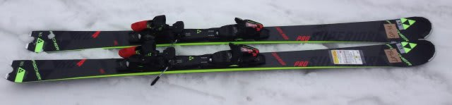
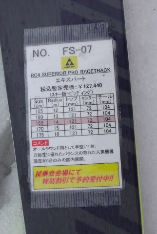
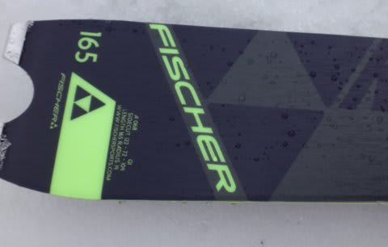

# 2016シーズンモデル，スキー試乗レポート第9回…FISCHER編

📅 投稿日時: 2015-04-03 22:20:38

えー．

みなさん．

ご安心ください．

土曜日，雨が降る可能性はほとんどなくなりました．

大事なところなので，繰り返します．

土曜日は．私の日ごろの行いが良かったため，

雨が降らずに済みそうです．

曇りベースだけど，晴れ間も結構ありそうで．

気温が高く，雪はザブザブ，ところどころ滑りが悪い感じの，

春の雪になりそうな感じだけど…

でも，雨は降らなさそう．

日曜は，まだ微妙…

パラパラと雨が降る可能性はあります．

いつごろ降るのかの予想は，まだ不可能ですが．

ただ，時折日も射す可能性もあり，

雨が降ってもパラパラ，という感じです…

あー．

気温はすごく上がります．

早朝から，もう雪は柔らかくなっていきそう…

って感じで．

まだ続く，2016シーズンモデルのスキー板，試乗インプレッション．

今日は，フィッシャーです．

では，どうぞ～！

○FISCHER RC4 SUPERIOR PRO Racetrack 165cm

基礎オールラウンド．

RC SCが小回り専用機とすると．

165でもR=14と比較的サイドカーブもゆるめで，

多少オールラウンド性に振っているように見える，この板ですが．

履いてみたところ．軽快・素直なフレックス．

ウッドコアの平板っぽい感じで．

ドライなウッドコアが素直に，きれいにたわむ感じ．

エッジグリップも，トップとテールが突っ張って

ガッチリ線で効く感じより，全体の面で抑えて行く感じ．

…決してエッジグリップが弱いわけではないのですが，

「トップとテールのエッジが頑張ってます！」

って感じではない，板全体で捉えていく感じ．

フレックスもコアで出してる感じで，メタルが効いてる

感じは弱く，返りが早かったり強かったりせず，

切りかえで強い反動をもらったりすることはないです．

極めて素直に返ってきます．

トップとテールが妙に頑張らないので，ずらしもOK.

高速安定性も結構あるので，決してフレックスが弱いわけでは

ないですが．

全体的に扱いやすい，優等生の素直な平板って感じで．

…なんだか，印象がオガサカっぽいなぁ…
