# 2019シーズンスタート…10月20日，オープン翌日のYetiのゲレンデ詳細

📅 投稿日時: 2018-10-22 01:18:28

🏷️ カテゴリ: [2019スキー滑走日記](c3e4496fc0fb7f9c17ff21214a35b1ace.md)

えー．

本来ならば．

本日，土曜に滑ってきたゲレンデ動画を

お送りしたかったのですが．

土曜は動画を撮る前に，

雷雨により営業中断

という憂き目にあい，帰宅したため．

動画がありません…（涙）

だもんで．

本日は，昨日報告した土曜の状況に，

ちょいと追加のゲレンデ情報を報告します…

まず．

今シーズン．

オープニングスペシャルなのか．

窓口からゲレンデに向かう途中に，

謎の富士山型ゲートがありましたね…

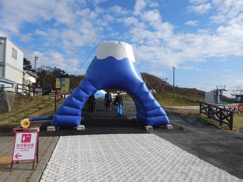

そして．

これもオープニングセレモニーで使ったのか．

富士山を模した雪山がありました…

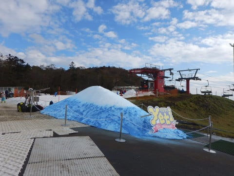

…って．

ゲレンデ状況に関係ないことは

どうでもいいですよね．

とりあえず，ゲレンデは…

まぁ，雪質はアイスクラッシュの雪ですが．

比較的ここ数日気温が冷え気味ってのもあるのか．

あるいは曇り気味で，日光が強く当たらないのが

良かったのか．

比較的板が良く滑る，しっかり圧雪がかかった

雪で

結構いい感じ…！！

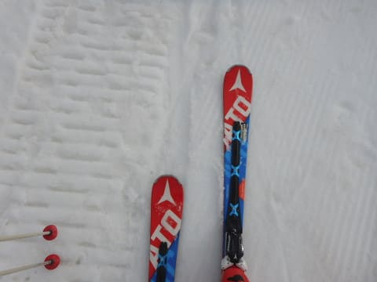

昨シーズンの最後に滑った，かぐらや月山の

ひどい雪に比べれば，涙が出るほどすごくいい雪に

感じます…←比較対象が悪すぎるから，それ

コースの幅や，雪の厚み自体は．

完全に例年のオープン時期と同じ程度の

幅，厚みですね．

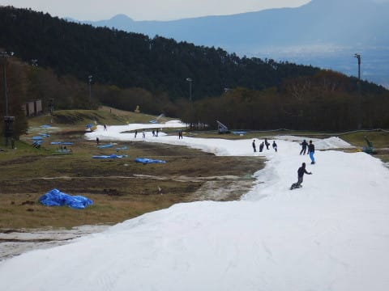

いつもより広くもなく，

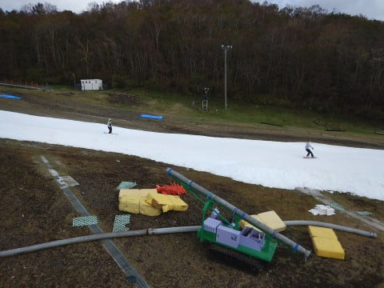

薄くもない感じ．

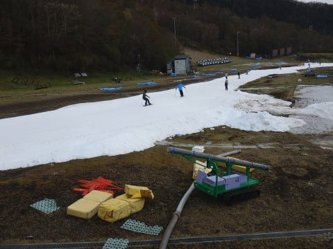

ただ，土曜は全体的に人が少なめだったので．

いつもより心持ち広めに感じたかも…

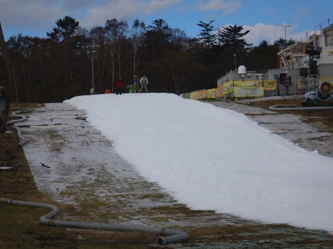

リフト降り場も，十分雪がついてますし．

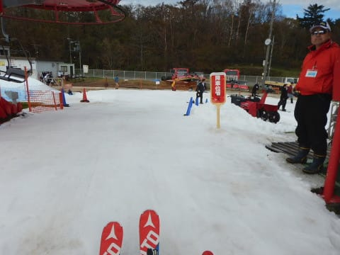

乗り場も，ゲートまではしっかり雪がついてます．

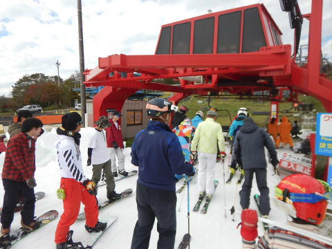

ただ，乗り場の搬器に乗るあたりは，

雪が無くてPislabマットむき出しになってますが…

雪は，全体的に硫安が撒いてあるからか．

朝のうちは締まり気味のいい感じなんですが．

昼を過ぎてくると…

硫安で固まったところとそうじゃないところの

硬さの差で，雪が凸凹に掘れて行き…

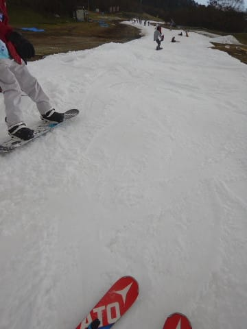

ごく一部ですが．

掘れて行ったところに…

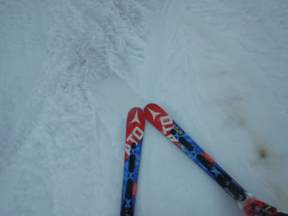

何ヶ所か，

ちょっと土が出始めてきたのですが…（涙）

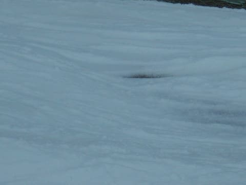

ここが一番ヤバいところだったんですが．

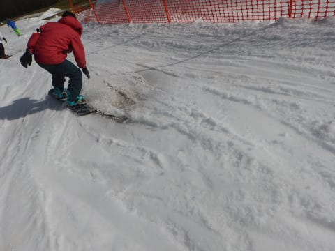

ただ，ヤバいところをスタッフはちゃんと

認識しているようで．

昼間のうちに，そこの横に雪山を積み上げてあり．

その雪を使って，ちゃんと人力で穴埋めをして

ました…

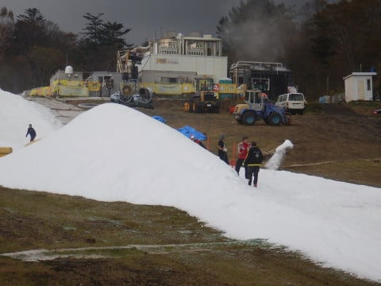

最後の急斜面部分にちょっと穴が残った

以外，ほとんどゲレンデに土は出ておらず．

思ったよりゲレンデの厚さはしっかり

していました．

ゲレンデの混雑自体は…

意外とマシだったかな．

いつも通り，リフトを降りたすぐ，

ボードを履くあたりは人が溜まってたけど…

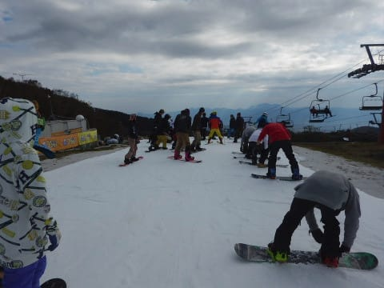

まぁ，平均的にこんな程度で．

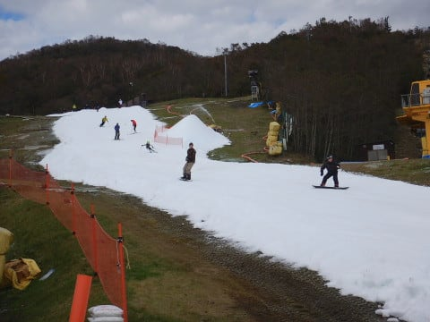

人が少ないときは，クリアラップが

取れる時もあるし．

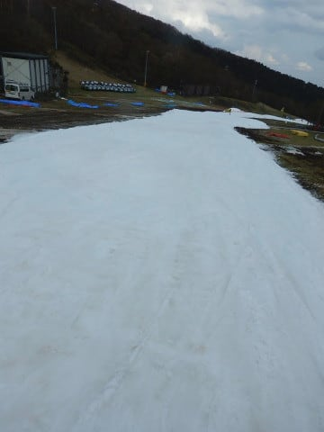

リフト待ちも，朝イチは

ほとんど飛び乗り．

一番混んだ昼前後でも，平均はこの程度で．

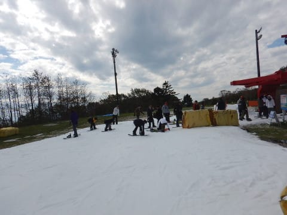

まぁ，この時期のコースが狭いYetiとしては．

割とまともに滑れた方かな～．

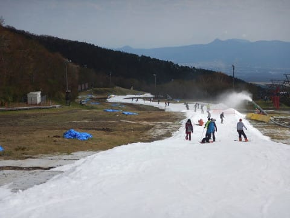

ってことで．

午後に雨の予報だったので，

意外と空いてたYeti．

「それほどひどい雨降らなさそうだけど，

　雨の予報で空いてていいな～♪」

とか，ゴキゲンで滑っていたところ．

突然の雷雨・停電により帰宅を余儀なく

されたことを考えると．

天気予報を信じて，滑りに来なかった人は

正解だったのかもしれない…

と思った，Skier_Sだったのでした…

## 💬 コメント一覧

### 💬 コメント by (ほっぽ)
**タイトル**: 10/22　イエティナイター
**投稿日**: 2018-10-23 00:11:17

Ｓさん

今夜、仕事帰りにナイターに寄ってみました。

月曜日なので人も少なく、雪質はまぁまぁでした。

詳細な滑走レポートは下記ＵＲＬに貼ってあります。

### 💬 コメント by (Skier_S)
**タイトル**: ほっぽさま
**投稿日**: 2018-10-23 01:17:00

今晩も行かれたのですね…

ちょっと雪は荒れてるっぽいですが，

ガラガラでうらやましいです…

