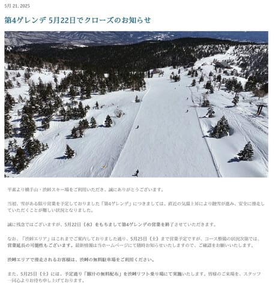
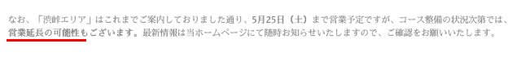
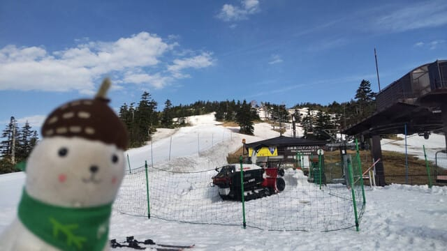
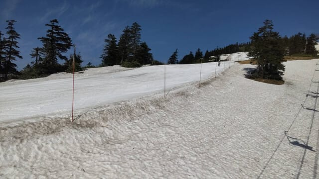
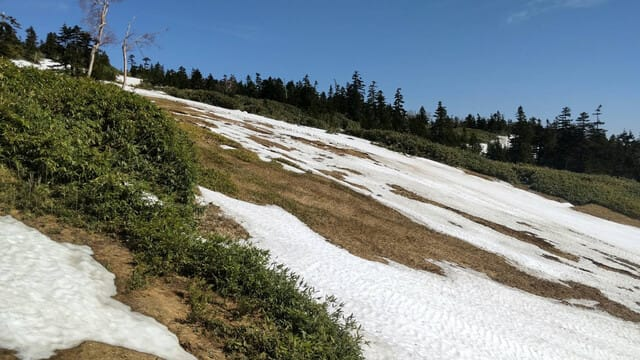
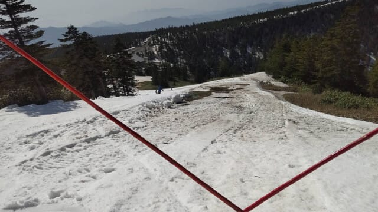
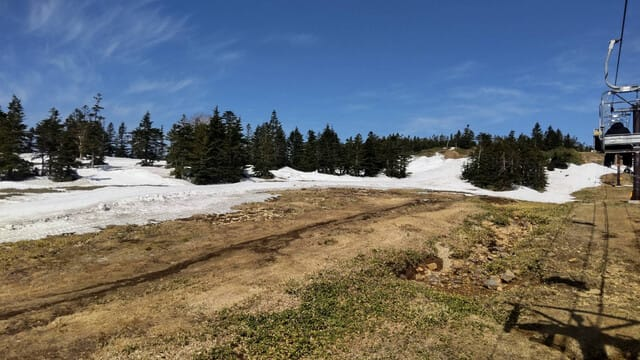
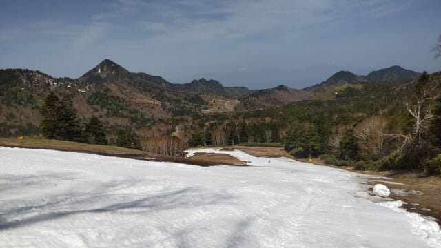

# 渋峠スキー場，公式HPで5月25日(日)以降も延長営業の可能性をアナウンス！…でも，たぶん延長は厳しいかな…

📅 投稿日時: 2025-05-22 03:30:20

🏷️ カテゴリ: [日記](cc4b5682fb7b8b144980957a978653fb0.md)

例年，

スキーシーズンがもう大詰めに入っているな…

と自分に認識させるためのイベントである，

かぐらファイナルの週末のスキーに行けな

かったので．

…まだまだスキーシーズンが続くんじゃないか？

とまだ身体が錯覚している，Skier_Sです．

まだ，今週末は渋峠が滑れますが．

うううーーーん．

志賀草津道が朝からオープンしていれば

考えるけど．現在，志賀草津道は朝8時からの

オープンなので，朝イチから滑るには

中野経由か万座経由．

渋峠のリフト1本のために，高い有料道路代と

リフト代を払ってまで滑るのか…？

というと，ちょっと考える（涙）

ってな状況ですが．

5月22日で横手山第4ゲレンデが終わり，

23日以降は渋峠のみの営業になる横手・渋．

（[横手山スキー場ホームページ](https://yokoteyama2307.com/2025/05/21/4th-slope-closed/)より）

でも，この案内を見ると…

ええええ！！！

渋峠，5月25日以降も営業延長の可能性！！！？？

…す，素晴らしぃっ！！！！

…ただ．今週末の天気は．

24日(土)：終日曇り空．朝イチは薄日が

　射すかも？雨はぎりぎり夕方まで

　降らずにすみそう．ただ，午後はガスが

　出たり霧雨ぽかったりする可能性あり．

25日(日)：前日土曜の夜から雨．終日雨．

　時折強く降る．低気圧の通過位置に

　よっては，風が強まりリフトの営業が

　ヤバいかも…

という感じで．土曜は何とか　

ぎりぎり降らずに済みそうだけど，

日曜はかなりの雨になりそうなので…

これ，渋峠も25日の雨で雪が解けて，

延長営業は雪不足で無理でした～！！

…となる可能性が高い気が…(涙)

とりあえず．

今日の渋・横手がどうだったか．

いつものおこみん特派員からの情報を見ると…

うん．

渋峠はまだ雪がありそうに見えるものの…

うーん．

実態はかなり雪が減って来たかも…(激泣)

コースの最後のあたり，かなり幅が狭く

なっているので…

…これ，やっぱり25日が豪雨になったら

ちょっとヤバいかも（泣）

うーん．

どっちにしろ，31日の週末までの営業は

ちょっとかなり無理っぽい感じ…

ちなみに，横手の第4の方は．

午前中はまだコース上に土は出てませんが．

コース幅も狭くなっていき，明日22日の

営業終了日に向けて，ラストスパート

状態ですね…

ということで．

おそらくほぼ間違いなく，週末に渋峠が滑れるのは

今週末がラストになると思いますが．

うーん．

25日に強風でリフトが動かず，実質24日の

土曜日がラスト営業…という悲しいシナリオも

考えておいた方がよさそう…（涙）

ここ3週間続けて，週末の天気悪すぎ（泣）

## 💬 コメント一覧

### 💬 コメント by (地元民)
**タイトル**: Unknown
**投稿日**: 2025-05-23 21:32:28

渋峠スキ━場・・・。地元だけど、人生で１回といか、1本しか滑ったことない。

暴言吐いてよいですか？

あんなつまんないゲレンデ、1本で充分🙏

### 💬 コメント by (Skier_S)
**タイトル**: ＞地元民さま
**投稿日**: 2025-05-24 00:39:33

渋峠…

私も実はトップシーズンに滑ったことは数回しかありません（笑）．

確かに，シーズン中は他にもっと面白いゲレンデがあるのは否定できないところ．

でも，この時期は渋峠しか滑れないとなると…

雪が無いと死んじゃう人は，渋峠でもシアワセになれるんです…（それを白い粉中毒という）

### 💬 コメント by (Skier_S)
**タイトル**: Unknown
**投稿日**: 2025-05-25 08:41:03

＞ Skier_S さんへ

なるほど、中毒なんすね🤣

渋峠、貴重な存在ですね〜。

失礼しました🙏

### 💬 コメント by (Skier_S)
**タイトル**: ＞地元民さま
**投稿日**: 2025-05-25 20:09:08

中毒患者は，中毒が進むにつれ白い粉であれば純度や品質を問わなくなっていきます（笑）

最後には，白い粉要素がわずかにでもあれば，チョコレートアイスみたいな雪でも

滑るようになるようです（私はそこまでは行ってない…と思う）

