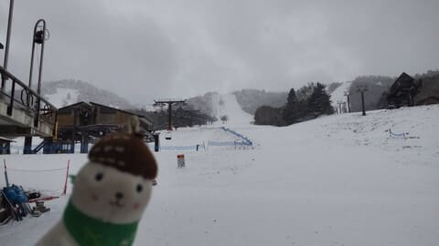
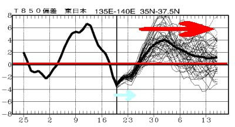
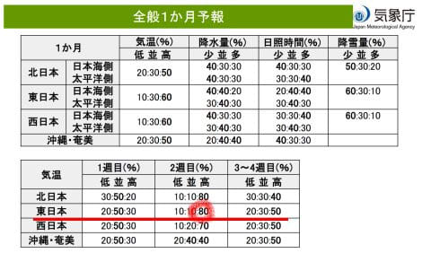
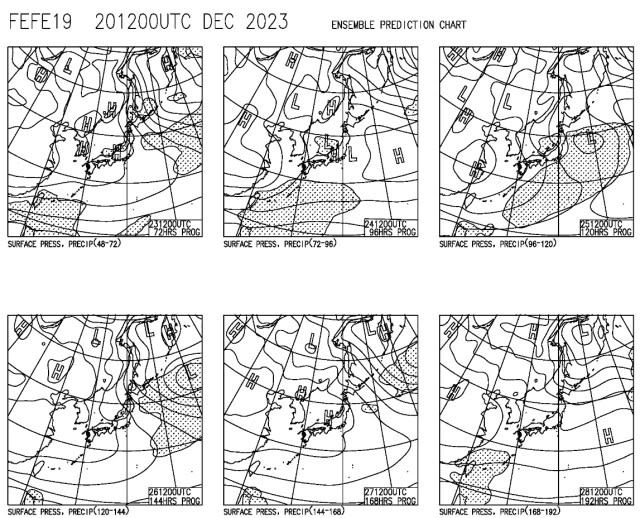

# 12月21日の志賀高原スキー場，特派員によると朝の積雪はわずか3cm．そして12月25日以降，1月中旬までは高温が続くよ（泣）

📅 投稿日時: 2023-12-22 02:08:54

えー．

本日，久しぶりに，

おこみん特派員からの

写真が送られてきました～！

昨日，

曇り時々小雪．冷え冷え．

朝の積雪は2-3cm程度？

と予想した通り，積雪はせいぜい3cm（涙）

そして，予想通り，冷え冷えの曇りで

時々小雪が舞う一日だったようです…

一応熊の湯も山頂から滑れるようになった

ようですが…

雪はまだ薄いみたいで．

志賀高原全域でも，まだ滑れるのは

横手第1，第4ペア

熊の湯第2山頂から

高天ヶ原トリプル

一ノ瀬ファミリーペア

焼額第4ロマンス，第2高速

だけ．

恐ろしいことに，12月9日の週末から

滑れるリフトは1本も増えてません（涙）

せっかく17日から冷えてるんだから，

もっと雪が降ってほしい…

暖かい15日に大雨が降ったのに，

17日以降，冷えるようになったら全く

降らないとは，嫌がらせとしか

思えない…（泣）

とりあえず，これから冷え冷えが続くのか，

毎週木曜恒例の，気象庁発表の一か月予報を

見てみますが…

なんじゃこりゃ（屍）

水色矢印で示した，せっかくの17日からの

冷え冷え期間はそんなに続かずに26日には

終わってしまい．

27日以降は，赤矢印で示したように，

1月中旬までずっと高温が続くんですが…！？

…そして．

[FCXX92](https://www.sunny-spot.net/chart/FCXX92.pdf)を見ても…

うがーーー！！

12月30日から1月5日までの2週目，

高温になる確率が80％！！？？

第3，4週も高温になる確率が50％だし…

うーん．

今回の冷え冷え期間が終わったら，

1月中旬まで，冷えそうな気配がない…（泣）

これ，もしかしたら…

2016シーズン並みに，正月休みに焼額第1

ゴンドラのGSコースが滑れるかどうか

ぎりぎりのヤバいレベルになるのかも…？？

この後の天気図を見ても．

冷え冷えの23，24，25，26日には

日本海側に降水域があるものの，

きれいな縦じまの冬型気圧配置になって

おらず，志賀高原まで降水域の網掛けが

伸びておらず，志賀はそんなに積もら

なさそうだし…

それ以降の27，28日は本州は高気圧に

覆われていて，全く何も降る気配がなく．

そしてこれ以降，高温が続くとなると…

もしかしたら，26日までに焼額第1ゴンドラが

動かないと，それ以降はしばらく雪が降らず，

かなり厳しいことになるかも…？

…いや．

降るはず．

22日夜から23日にかけて，

一晩で1mほど積もって，

23日は第1ゴンドラ，第2ゴンドラとも

そろって動くはず！！！

…なんてことはないだろうな（泣）

うーん．

今シーズン，焼額のGSコースが滑れるのが

いつになるか，ヤバい感じになってきた…

とりあえず．

12月ということですので

全国2億4000万のこのBlog読者の皆さんは，

全員そろって休まず止まらず寝ずに

寒気の歌をひたすら歌い続け．

ひたすら冷え冷え寒気が居座ってくれる

ことを神に願い続けましょう…

## 💬 コメント一覧

### 💬 コメント by (大阪のK)
**タイトル**: Unknown
**投稿日**: 2023-12-22 06:36:51

おっかしいなあ、職場で寒いギャグを言いまくってるのに。

何で降らないかなぁ？

今日からパワー上げて、くそ寒いギャグを飛ばしときます。

### 💬 コメント by (レインボー76)
**タイトル**: Unknown
**投稿日**: 2023-12-22 13:05:33

金曜日の志賀高原情報

朝の蓮池-11℃、めっちゃ寒い。ヤケビは新雪20センチを圧雪。

まずはサウス。すっごく気持ちいいけど、四ロマ(冷凍人間製造搬器)がいかにも遅すぎるので、カラマツ(二高)をグルグル。

やっと雪がついてバーンは硬め。気持ちいいのなんの。

だけど指先が冷える冷える。まだ寒さに慣れていない温室育ちのボンボン(？)にはちょっと荷が重い。

西館に学生の団体さんも入ったし、「まあいいか」で11時終了。最後のサウスは削られた雪がたまって、丁度いいやめ時でした。

そして朗報。初めて、ニゴンが試運転してましたよ。明日からの稼働に期待大ですが、従業員によって返答がまちまちだったので、微妙？

今夜はもっと降るようなので、いよいよ本格化、だといいなあ。

### 💬 コメント by (Skier_S)
**タイトル**: 今晩積もることに期待…
**投稿日**: 2023-12-23 00:10:56

＞大阪のKさま

うーん．

ギャグが面白すぎるのかも？？（笑）

＞レインボー76さま

今日は寒かったみたいですね…

そして，明日は2ゴン動かないようです（涙）

昼頃に，雪が積もったから運転します～！

とかいうことがあればいいな，と思ってますが，期待薄かも…

明日も冷えるので，明日までに積もって日曜にはゴンドラが動くことに期待！！

