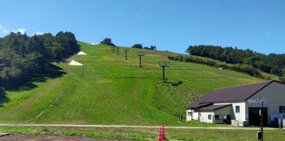
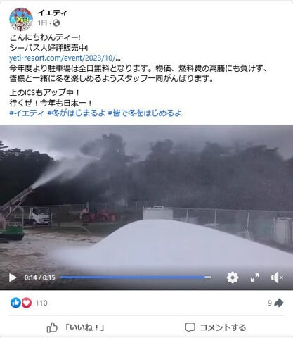
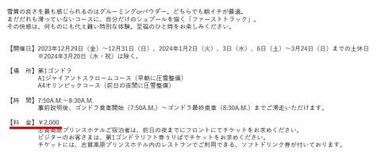
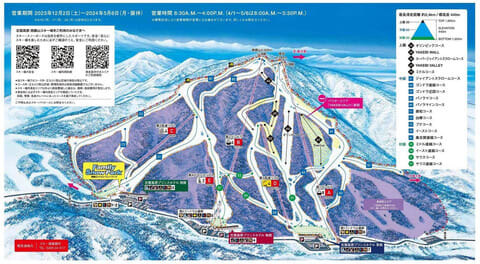
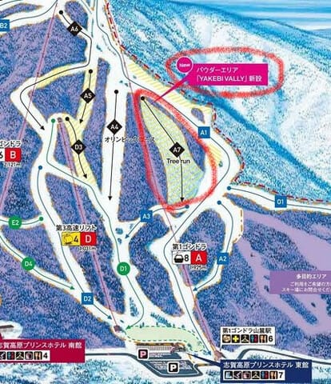
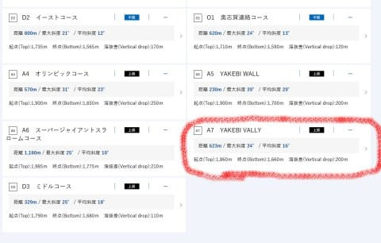
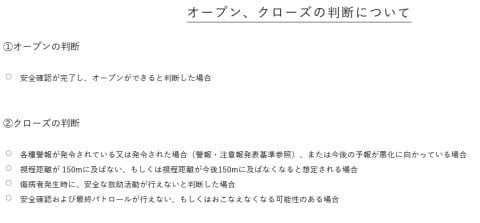

# 志賀高原 焼額山スキー場，2023/2024シーズンから新コースオープン！そしてファーストトラックは2000円に値上げ

📅 投稿日時: 2023-10-05 07:07:11

えー．

とある特派員から先週金曜日に送られてきた

写真によると．

菅平スキー場もアイスクラッシュの雪を撒き

初めてるようだし…

イエティもオープン日がまだ公表されて

ないけど，昨日から雪を撒き始めたよう

です…！！

（[イエティFacebook](https://www.facebook.com/YetiSnowtown/)より）

ということで．

そろそろ2023/2024シーズンインが近づいた

感があふれてきているわけですが…

先日，ひっそりと焼額山のホームページが

一部だけ更新されてました…！！

更新された一つは，ファーストラックの

情報が出てたこと！

…時間は変わらず，7:50から8:30までですが…

料金が2000円にアップしてます（泣）

（[焼額山スキー場ホームページ](https://www.princehotels.co.jp/ski/shiga/informations/descente_first_track/)より）

そして，ラストの営業が3月24日までのよう

なので．

昨シーズンは3月最終週までやっていた

ファーストトラック．

次のシーズンは，最終週1週間前に終わるよう

です…

っていうことは．

朝6時からの早朝営業は，昨シーズンの4月

第1週より1週間早まって，3月末から

オープンになるのかな？？

そのほかにも，コースマップがひっそりと

2024シーズン版に変わっていて…

（[焼額山スキー場ホームページ　コースマップページ](https://www.princehotels.co.jp/ski/shiga/winter/coursemap/)より．以下同）

営業開始・終了は12月2日からGW5連休

最終日の5月6日までと，まぁ予想の範囲内．

5連休後の週末，5月10日まではやって

くれなかったか…

あとは，4月1日からは通常営業開始が

30分繰り上がって，8時スタートになるのは

今年と同じみたいです．

で．コメント欄で教えてもらった

「新コースオープン予定」という，

私を含めたほとんどの人が気づかずスルーする

目立たない情報について．

ついに詳細が明らかになりました！！！

新しくオープンするコースは…

ここだ！！！

そうです…第1ゴンドラとGSコースの間，

木が割とまばらで，すり鉢状の地形なので

雪が溜まる部分．

ここを，ツリーランコースとして非圧雪で

オープンするみたいです！！！

その名も，YAKEBI VALLY．

最大斜度は34度と，オリンピックコースより

きついですね…

ちなみにこのコース，ヤケビウォールと同じ

条件付きオープンのコースのようで，

天気や雪の状態や，視程が良くないとオープン

しないようで．

おそらく朝9時とか10時とかに，安全確認が

できてからオープンする感じになりそう．

とはいえ…

かなり長いコースが追加されて，

さらにそれも新雪コースとなると…

これはかなり期待！！

焼額山も，かなり営業努力をしている感じで…

すばらしい！！

値上げばかりのBad Newsが続いたけど．

これは久々のいいニュースですね…！

とりあえず．

今シーズンの焼額山に，期待！！

## 💬 コメント一覧

### 💬 コメント by (副院長)
**タイトル**: Unknown
**投稿日**: 2023-10-05 11:03:06

おはようございます。新コース個人的によく偵察しています。昔は雪庇ができて、危険だったんですが、最近は雪が少ないのか　雪庇できませんから、コースに格上げですかね。

### 💬 コメント by (いか)
**タイトル**: Unknown
**投稿日**: 2023-10-05 21:48:00

焼額山は雪が積もっているようですね…！

今年は暑すぎて釣り延長の計画だったのですが、いつも通り滑走開始できるかもしれませんね～

### 💬 コメント by (だい)
**タイトル**: Unknown
**投稿日**: 2023-10-06 00:26:11

新コースはツリーランコースだったんですね。

志賀は今流行りのこの手のコース整備が遅れてる印象ありますし、今後整備が進むといいですね～（今でも自己責任であちこち滑ってる人は見かけますが…）

ただ、人気が出るのは嬉しいけど混むのは嫌という悲しい矛盾。。。

### 💬 コメント by (Skier_S)
**タイトル**: シーズン間近
**投稿日**: 2023-10-06 04:55:55

＞副院長さま

あら．新コース事前自己責任偵察済みですか…

一体どの程度木を切ってコース化するのかわかりませんが，

私は滑ったことがないのでちょっと楽しみです．

＞いかさま

焼額，いい降りっぷりで雪みたいですね…！

ただ，この冷え込みがいつまで続くのか．

でも，一つ言えるのは，冷えるのは今じゃない…

早く冷えすぎると，11月や12月に冷えなかったりするので，10月末ごろから冷えてほしいところです．

＞だいさま

ツリーランコースだったみたいです～！！

ようやっと焼額もオフピステっぽいところをオープンするようになってきたようで，

私としてはうれしい方向性だと思ってます…

