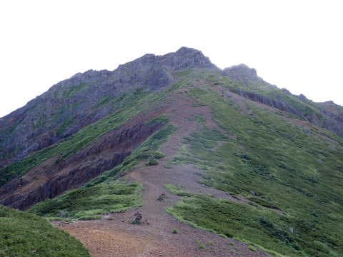

# 八ヶ岳の阿弥陀岳・赤岳ピストン登山！その6…赤岳登頂！

📅 投稿日時: 2022-09-30 01:29:50

もしかすると．

…もしかすると．

9月末締め切りの仕事が明日までに終わるので，

今週末は，久しぶりに一日くらい休んでも

大丈夫そうな仕事量の感じ…

ただし，明日，突発の仕事が来なければ．

…突発の仕事がなければ…

明日職場から帰るまでに，とんでもない宿題が

出されないことを祈ろう…←これまでの経験則上，

この祈りが無駄になる可能性90%

でも．

赤岳の記事を書いているけど．

最後に山に行ったのが8月中旬．

9月は一度も山に行かなかったなぁ…

今週末は，1か月半ぶりに山に行けると

いいなぁ…

…そもそも1か月半も全く運動してなくて，

山に行く体力，残ってるかな？？

とりあえず．

今日も赤岳の山歩きレポートです～！

ーーー

ってなことで．

中岳を超えて，目の前の赤岳へ向かいますが…

ここからまた下って，あれを

登り返すのね…（涙）

中岳から赤岳方向へ下りる一瞬だけ，

ちょっと急な斜面だけど…

あとはこんな感じの斜面を，距離にして

100mちょいも下りれば…

中岳と赤岳の中間のコルへ到着．

そして…

ここから，この道を赤岳に向かって

登っていくわけですね…

森林限界を超えた，広々と広がる傾斜を

ジグザグと登っていく道に沿って，

淡々と歩いていきますが…

登っていく途中で振り返ると．

手前にさっき降りた中岳が，

その向こうに阿弥陀岳がそびえたっていて…

…

これから，赤岳に登り切った後．

…今度は，あれを登り返すのか…（泣）

ってなことで．

息を切らしながら，かなり体力的に来る

登り坂を上っていくと…

文三郎尾根から登ってくる道と

合流しました！

文三郎尾根分岐の到着時間は，8:42．

阿弥陀岳山頂から，約50分．

心拍数は150を超えていて，結構厳しい

登りだったのが分かります…

ここまでくれば，山頂まで500mほど．

もうあと標高差150mくらいです！

…が．

ここからがめちゃくちゃ急なんだよな…（泣）

ここから先は，岩場のこういう

急傾斜をえんえん進んでいき．

鎖場もところどころ現れてきます…

うん．

本格的な山歩きっぽくなってきたぞ～！

このあたりまで来ると，皆さんヘルメット

着用してますが．

私もちゃんとヘルメット着用で登ってます…

ここまでくれば，あとちょっと！！

最後のはしごを登れば…

山頂は目の前です！

ってなことで．

山頂到着～！！

山頂到着時のGarminさんの写真が

ないのですが…

赤岳山頂到着は，9:04．

阿弥陀岳山頂から1時間15分かかりました…

空は晴れていてるけど…

遠くの山々は雲を被っていて，

北アルプスの山並みがちょうど雲に

覆われているような状況だったのが，

ちと残念…

でも．

青空が気持ちいい！

今朝の段階では，赤岳まで来れるかなぁ…

と心配してたけど．

無事赤岳に到着できました～！！

（続く）

## 💬 コメント一覧

### 💬 コメント by (マルハバ)
**タイトル**: ヘルメット・・？？
**投稿日**: 2022-09-30 07:32:37

あっ！💡

「固いニット帽」の事ですね⁉

### 💬 コメント by (Skier_S)
**タイトル**: ＞マルハバさま
**投稿日**: 2022-10-01 00:31:38

おっと．硬いニット帽でした…（笑）

