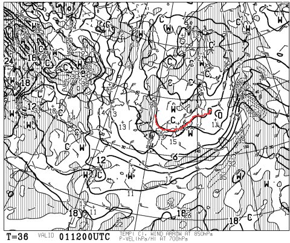
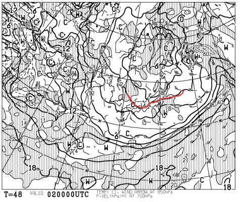
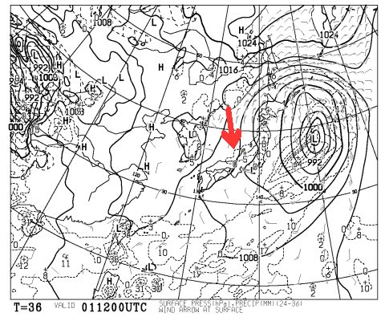
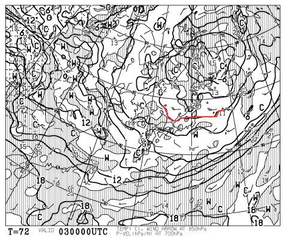
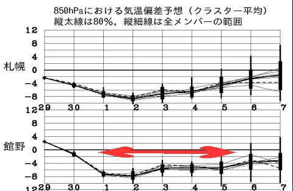
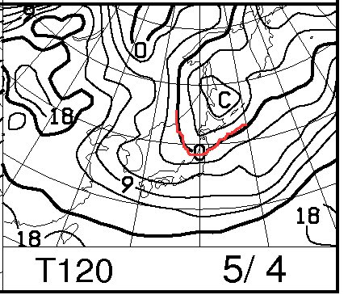
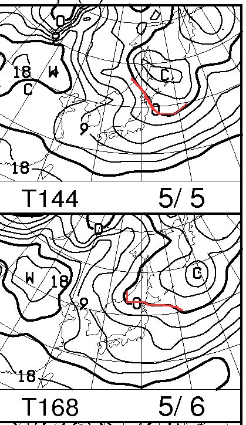
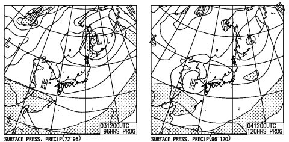
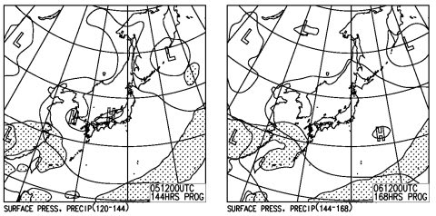

# このGWは後半も寒め…4連休は晴れて比較的いいコンディション！

📅 投稿日時: 2013-04-30 18:08:59

🏷️ カテゴリ: [スキー天気予想](c6554f5c3c106093b511a8daae23757e8.md)

…天気図を見て．

神様は，まだ何か勘違いをしているように思えてしまった今日この頃，

皆様いかがお過ごしでしょうか．

…いや，その．

どうやら，3月ごろの高温＆悪天候が続いたときの

「冷えひえになってちょうだい～」

っていう私の強い祈りが．

かな～りの時間差攻撃で，いまさらになって強烈に効いたらしく．

また，冷えます…

そして，雪が積もるかも…

まず，明日5月1日の夜9時の850hpa気温ですが…

なんだか，5月ではほとんどありえないことに，0度線が志賀高原より

南側にあるんですね～．

そして，次の日の2日，朝9時ですが…

oh!なんと！

0度線が志賀より南にあるどころか…

なんと．

なんとっ！

志賀高原は-3度線がかかっているではないですか！

…そして，1日夜9時の地上天気図は…

こーんな感じで見事な冬型．

志賀高原が雪になる，北風パターンです．

冬型は，2日朝まで継続するので．

1日夜から2日朝にかけて．

…また雪です．積もりそうです…．

ふはははは．

実は，私は1日からまた志賀に舞い戻るのだ！

5月2日は，また最高の朝になりそう！

やはり日ごろの行いが…(ビシィッ)←読者の怒りの鉄拳

…

で．

4連休ですが．

4連休初日，3日の朝も，こんな感じで0度線が志賀高原近くまで南下しているので．

志賀はマイナスの気温からスタートです．

…ただ，降雪はないので，硬いバーンだと思いますが…

しっかりと暖かいウェアを着ていってくださいね！

そして．

なんだか．

これから4連休にかけて．

ありえないくらいの低温が続きます．

平年比マイナス8度～4度くらい低い日が続きますね～．

まぁ，とはいっても．

こんな感じで．0度線は北へ行ってしまうので．

昼間はプラス5度近くまで上がってしまいますが…

でも，例年並のプラス10度以上とかの，「暑いよ～」ってくらいまで上がることはなさそうなので．

この時期としては比較的雪が融けず，いい感じで雪がもちそうです！

で，天気は…

こんな感じで，4連休の間ずっと高気圧に覆われているので．

基本的に晴れそうです．

ということで．

この4連休．

初日朝は氷点下で冷えひえ．

それ以降も例年よりは低めの気温で．

毎日晴れが続き．

昼間はちょっとやわらかい雪になるものの．

GWとしては，いいコンディションの4日間となるでしょう！！

いやー．

奇跡の3連休で，例年より雪が残っているGWになっているし．

志賀高原は宿もがら空きらしいし．

4連休はねらい目でしょうっ！

## 💬 コメント一覧

### 💬 コメント by (komu)
**タイトル**: Unknown
**投稿日**: 2013-04-30 21:13:44

GW前半は一の瀬で試乗会で来季モデル乗りまくりでした。

そして明日は焼額デビューします。

初ヤケビ＼(^o^)／

Sさん見かけたら声掛けますね。

ちなみに板は頭と心臓（共に古いモデルです）で滑ってます。

### 💬 コメント by (ゆうこ)
**タイトル**: やっと
**投稿日**: 2013-05-01 19:13:36

私も明後日からやっとスキーに行けます。

雪がなくならないかヒヤヒヤしましたが、ちゃんともってくれてよかった。さすが志賀！

私も、Sさんのように明日休んじゃいたいなぁって思いましたが、夕方仕事がトラブってやっぱり無理でした。

明後日の朝から行きます！

### 💬 コメント by (Skier_S)
**タイトル**: このGWは恵まれてます…
**投稿日**: 2013-05-01 19:41:27

>komuさま

今日はご一緒いただきありがとうございました～

いやー．恵まれた一日でしたねー．

あしたはもっといい一日になるかもです．

…でも，最後に転ん打ったところが痛くなってきて

びっこひいて歩いてます…

明日の滑りに響きそう（涙)

＃痛くても滑る！(笑）．

>ゆうこさま

このGWはいいですよ～！！

明後日午前中まで，冷え込みは続きそうです．

私もGWは基本的にう焼額にいます～．

また，お会いしましょう～

