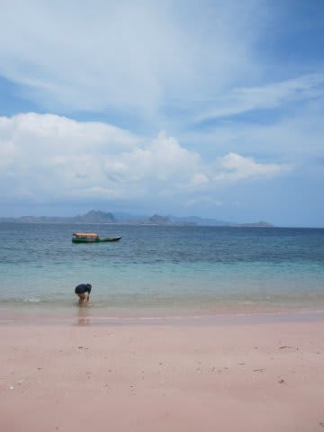
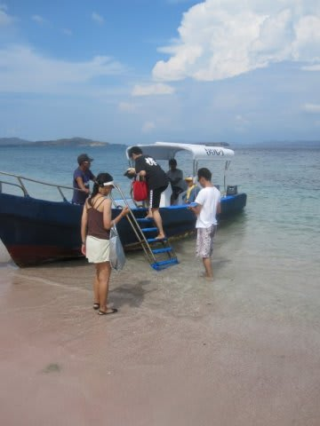

# コドモとコモド！子連れダイブクルーズ17　ピンクビーチで海水浴！？

📅 投稿日時: 2011-07-20 00:29:21

台風にも邪魔されず．

風邪もなんとかなり．

無事，本日座間味で潜れました．

高速船は欠航したけど，フェリーで無事座間味に渡れたので，

午後，妻と私と1本ずつ潜ってきました．

本来なら，座間味レポートを書こうかと思うんですが．

ちょっと時間がないので，書き溜めておいたコモドレポートを…

--------

というわけで．

マンタフィーバーだったけど，かなり悔しい2本目のダイビングを終えると

昼食です．

お昼ごはんのあいだに，船はコモド島南エリアを離れ，2時間ほどかけて

今日午後の予定地，ピンクビーチへ移動していきます．

ピンクビーチ到着予定は2時．

ご飯を食べ終わってからしばらく時間がありますね～

ということで，デッキで娘と遊びます．

今回は，凧をもってきたので凧揚げにチャレンジ！

船が走っていて結構風が当たるので，ぐんぐん凧があがっていく！！！

しかし…

何でわざわざコモドにまで，凧なんかもってきたの？＞うちの妻

で，あれやこれや遊んでいるうちに，ピンクビーチに到着したので，

ボートに乗ってピンクビーチへGo!

ピンクビーチへ上陸～

いやー．

久しぶりに見ると，ピンクですね．

いつもどおり，K村さんの「オルガンパイプコーラル」の

実物による説明があります．

このビーチ，この赤い珊瑚のかけらが混ざっているので，

ピンク色になっているという．

で．

しばらくビーチをうろついたら，

高台に上ります．

高台の上から景色を眺め…

またビーチへ．

そして，今回．

いずれは娘を連れてコモドクルーズに来よう，

と誓ったときから．

2年越しの念願だった…

ピンクビーチでの娘を連れての海水浴！

世界遺産の海で．

世界にもまれに見るピンク色のビーチで．

泳げるなんて，お前はなんて贅沢なんだ！！！！

…でも．

わが娘は．

地元の海でも，インドネシアの世界遺産の海でも．

いつもと同じテンションで喜んでいるので，

この海のありがたみが分かっているのやら…

しばらく大喜びで泳いでいたけど．

ぼちぼち帰る時間．

ボートに乗って「しまじ」へ戻ります．

普通のダイビングクルーズだと，こういうビーチでのんびりタイムって

無いですけど．

このクルーズは，こんなビーチでのんびり観光タイムがあるのが

いいですね～．

この日は，朝からマンタダイブ2本，

そしてピンクビーチ上陸，と続きましたが，

まだまだ，午後のダイビングがあるのです．

盛りだくさんの一日だこと…
