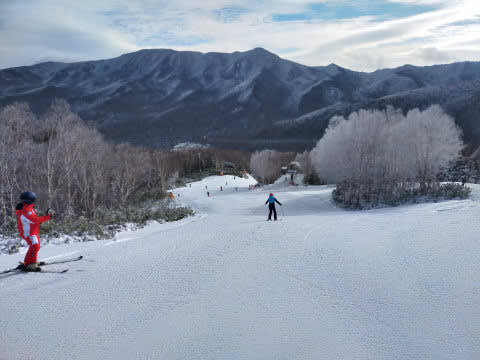
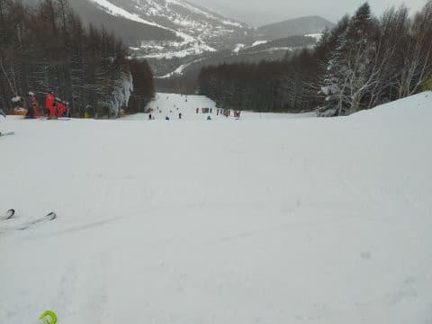
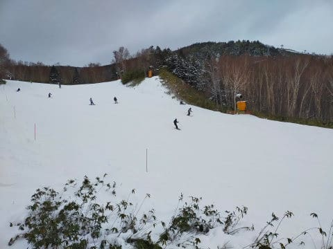

# 2022/12/17(土)の志賀高原焼額山スキー場は…晴れのち曇りのち小雪，ガチガチ&コロコロバーンだけど空いてる第2高速か，雪はいいけど混んでる第4ロマンス化

📅 投稿日時: 2022-12-18 00:04:39

ってなわけで．

本日，（睡眠時間1時間半で）予告通り

志賀高原にやってきました～！！

で．本日も焼額山で滑っていたわけですが…

17日(土)：朝のうちは晴れてるかも

　しれないけどじき曇り，

という予想が当たって…

あさイチは晴れ！

今日は第2高速と第4ロマンスの2本の

営業でしたが．

私は第4ロマンスからのスタートでしたが．

朝8:30の営業開始時には，かなりの列（涙）

第2高速との2本の営業ですが．

今日は混みそうな予感…

とりあえず．

あさイチのゲレンデに出ると…

晴天＆フラットな最高コンディション！！

4ロマ沿いのサウスコースは．

人工雪の硬さもなく，柔らかくて

エッジが効く気持ちいいバーン！！

あさイチの晴天の中，サウスコースは

気持ちいい一本目を滑れました…！！

ただ…

今日から営業を開始した第2高速沿いの

唐松コース．

今秋オープンしたてのこのコースは，ほぼ100％

人工降雪でオープンしたてなので…

あさイチから，バーンは殺人コロコロ100％（涙）

一見気持ちよさそうなんですが…

殺人コロコロがコース全面を覆う

残念なバーンです…（泣）

それに比べ，先週からオープンしている

第4ロマンス側コースは．人工雪は

先週に打ち終わっていて．

その上は天然雪が乗っているので…

こっち側の方が，雪はやわらかくて

すごい気もちいいコース！

でも．

気持ちいい第4ロマンス側のサウスコースは．

輸送力がペアリフトしかないので，

リフトが最大10分近く待つのが

ちょっと残念なところで…

それに対し．

全面殺人コロコロの第2高速側は．

高速リフトの輸送力があるので，

リフト待ちはほとんどありません…

が…第2高速側の唐松コースは，

まだ人工降雪をつけたばかりで，

コース幅は半分強しか雪が着いてないし．

高速リフトの輸送力でコース上の

人口密度はちと高め…（涙）

果たして．

リフト待ちが少ないけど殺人コロコロ

だらけで人口密度が高い第2高速

側か．

リフト待ちはめちゃくちゃ長いけど…

雪はやわらかく，コース幅も広く，

コース上もそこまで人口密度は高くない

第4ロマンス側か．

究極の選択の一日だった，

本日の焼額でした…

ただ．

混んだ方の第4ロマンスも．

昼はそれ程混んでなかったし．

午後2時半以降は結構空いてたので．

まぁ，リフトが混んでいた午前中と，

午後1時から2時過ぎまで，雪が硬い

第2高速に逃げていれば．

それ以外の時間は人が少なく

快適な4ロマ側のサウスコースをグルグルできたし…

サウスコース側は，終日雪も良かったし．

天気は昼からは予想通り曇りになり，

午後は雪降りで寒かったけど…

そのせいで，雪は終日緩まず．

4ロマ側のサウスコースは終日いい感じの

締まったバーンを滑ることができたのでした…

…逆に言うと，2高側の唐松コースは，

終日雪が緩まず硬いバーンでした…

ってなことで．

本日も16時のリフト終了時間まで

滑り倒しましたが．

明日の日曜は，朝の営業開始までに5cmほど

雪が積もってくれれば．

いい感じのあさイチになるんじゃないかな…？

（終日雪降りの，根性がないスキーヤー

　ふるい落としの一日になりそうだけど）

また明日，焼額滑ってます～！！
