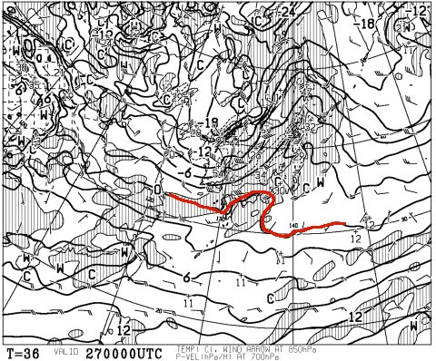
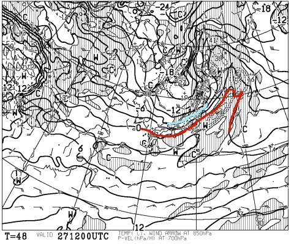
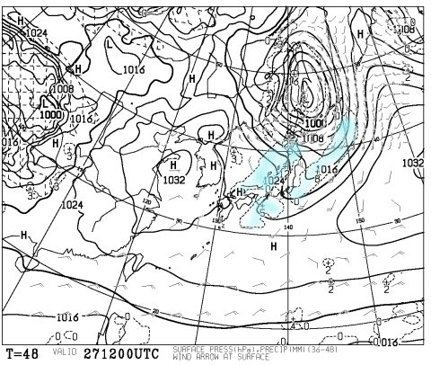
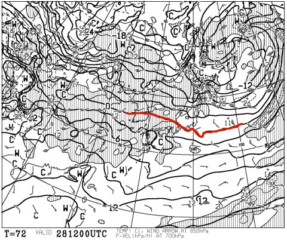
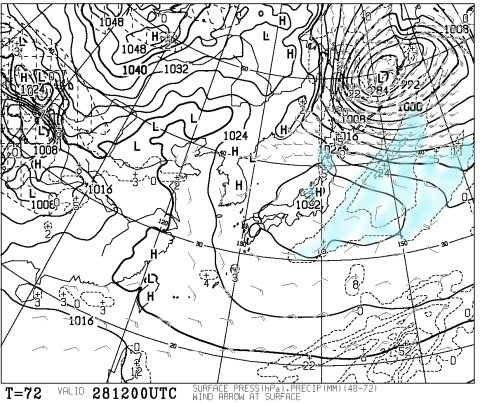
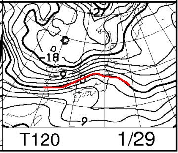
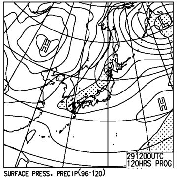

# 1月28，29日の週末の志賀高原スキー場の天気は…冷え冷え祭り終了だけど，土曜朝は積雪!?日曜は晴れそう

📅 投稿日時: 2017-01-26 02:48:24

🏷️ カテゴリ: [スキー天気予想](c6554f5c3c106093b511a8daae23757e8.md)

えー．

本日（ってか，深夜2時過ぎてるので，もう昨日か…）は．

[このレポート](http://red.ap.teacup.com/applet/gokurakuskier/20170125/archive)によると．

激烈に冷えてたようですが．

志賀高原では雪が積もっていたようですが．

ひざ下パフくらいだったようですが．

…でも．

先日お伝えしたように．

この冷え冷え祭りも，これで一旦終了です…（ちょっと涙）．

ってことで．

冷え冷え祭りが終わった後．

果たして，この週末の天気はどうなるのか？？

まさか，雨が降るのか？あるいは，降らずにもつのか？？

…いつも通り，専門天気図から予想してみましょうか…

えー．

まず．

週末の前，金曜日ですが．

27日，金曜の朝9時の850hpa気温図は…

うーむ．

冷え冷え祭り期間はありえなかったのですが．

赤くマークした0℃線が，志賀高原にこんなに近づいてます…

…でも．

この0℃線．

まだ志賀高原より南だから，セーフか…

このあと，夜9時になるとこんな感じで．水色の-6℃線が

志賀に掛かるくらいなので．

この日は，昼間～夜に向かって，ぐんぐん気温が

落ちそう．

で，地上天気図はこんな感じで．

日本の北を低気圧が通過していくんですが．

水色の降水域はかすかに志賀高原に掛かってるかな～．

27日，わずかに雪が降るかな？？

でも．

27日の午前中はｍ，この低気圧に向かって

見事な南風が吹くので．

金曜朝はゴンドラが運休しそうな気配…

そして，肝心な週末．

28日の土曜日の，850hpa気温図は…

おっと．

まだセーフ！

赤くマークした0℃線は志賀高原より南です．

そして，地上天気図を見ると…

日本海側にうっすら降水域の水色がありますね…

でも．昼間は高気圧に覆われるので．

この日は基本的には晴れ．

…雪が降るのはおそらく夜のうち．

だもんで．

朝は雪がうっすら積もってるかも？？

で．

29日の日曜ですが．

850hpa図は…

うぎゃーー！

やっぱり，赤く印した0℃線は東北まで上がっちゃう！

+3℃線も，志賀高原より北に行ってます…

この日は…気温が上がりそう（涙）．

日曜の地上天気図を見ると…

でも，降水域の網掛けは日本に掛かってないので．

志賀は晴れるかな？

…とりあえず．

今のところ．

昨日の予想通り，土日は気温が多少上がるものの．

雨にならずに済みそう…（一安心）

この週末の天気をまとめると．

28日土曜日：前日からはうっすら積雪があるかも．

　運が良ければ10cm．

　朝の気温は高め．山頂でも-3℃程度．昼間は0℃近くまで上がるか？

　天気は，午前中は多少雲が残るものの，晴れ間が広がり，

　午後はすっきり晴れかな～．

　朝は気温が高めだけど，いい感じの圧雪（積雪によってはうっすら新雪）

　昼間は気温が上がり，日差しがあたる斜面はちょっと雪が緩むかも．

　でも，太陽も顔を出し，気持ちよく滑れる一日かな．

　雪もそんなにひどく荒れず，比較的恵まれた感じの一日かな．

29日日曜日：今のところ晴れそう．晴れれば朝は放射冷却で多少冷えるものの，

　じき雪は緩んでいく．

　とはいえ，朝イチは最高の圧雪バーン！

　気温はぐんぐん上昇し，昼過ぎに+5度くらいまで上がるかな？

　だもんで，北斜面の一部日が陰るところをのぞいて，

　雪質はちょっと固まったような感じになったり，

　しっとりした感じになりそう．

　

ということで．

冷え冷え祭りが終わったこの週末．

気温は上がりそうなものの．

致命的な天気にはならなさそうかな～．

…とりあえず，一安心．
