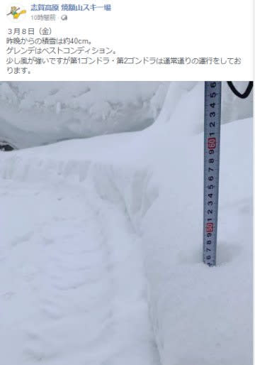
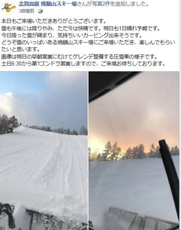
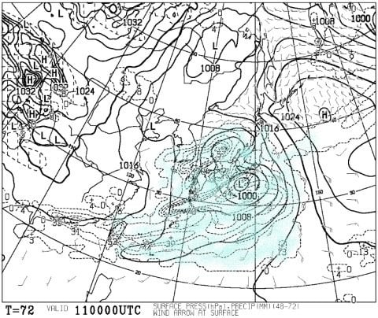

# 今週末も志賀高原に行ってます…この土日の志賀高原は，予想よりいい天気になるよ！でも，11日月曜は…雨（涙）

📅 投稿日時: 2019-03-08 22:25:50

🏷️ カテゴリ: [日記](cc4b5682fb7b8b144980957a978653fb0.md)

ってなわけで．

予想通り，昨晩から本日金曜にかけて．

そこそこの積雪があったようですね～！

（[焼額山FB](https://www.facebook.com/yakebitaiyama/)より）

そして．

数多くの焼額山特派員から情報が

入っていますが．

ちょいと重めながらも，朝は新雪が

楽しめたようですね！！

…でも．

　遅くとも昼ごろに晴れる

という予想だったのが．

実際に晴れ始めたのは，午後2時ごろ

からだったようで．

…ちょっと予想外したかも…

まぁ，でも．

午後3時ごろには，すっきり

晴れになったようなので．

（[焼額山FB](https://www.facebook.com/yakebitaiyama/)より）

…完全に外れではないかな…←自分に言い訳

しかし．

どうでもいいんですが．

なぜ，平日というのに．

焼額の状況を報告してくれる特派員が

5名もいらっしゃるのでしょうか…！？？

このBlogの読者は．

謎な人が多すぎます(笑)．

とりあえず．

土曜は．昼間にちょっと0℃を超えそうとはいうものの．

朝から終日晴れで，早朝は超絶に楽しそうな，

絶好のスキー日和になりそうですし．

（焼額のウインチ付き圧雪車が壊れて，

土曜朝はオリンピックコースが非圧雪になる

ようですが（涙））

そして，日曜も．

あさイチは晴れて冷えて，早朝は

いいんじゃないかな～．

そして．

昼過ぎにはくもり出す…

という予想でしたが．

さらに低気圧の接近が遅れてるので．

日曜も，意外と午後3時ごろまで

晴れてるかも？？

昼間，気温が+3℃～5℃くらいにまで

上がっちゃいそうなので．

晴れると雪が緩むから，あんまり

晴れない方がいいのかもしれないけど…

でも．

春スキーと割り切れば．

天気も良く，暖かくて．

そこそこ楽しめそうな感じで．

日曜は壊滅的な雨という，

当初予想と比べれば．

ずっとマシ！！

なんですが．

日曜は，雨が降らなくていい感じなんですが．

…それは．ただ単に．

雨が降る日が月曜にずれただけ

ということなので．

…みなさん．

月曜11日は，覚悟してください．

月曜の850hpa図はこんな感じで．

赤い0℃線ははるか北．

それどころか，水色の+6℃線が

近づいてきて…

そして，地上天気図では．

水色の降水域が本州をすっぽり

覆っているので．

…月曜の志賀高原は．

朝から晩まで雨です（涙）

それも，ザーザー降りです（泣）

まる一日以上，かなり荒れた天気で．

…月曜は，スキーをやろうと思わない方が

いいほど，ザーザー降り続けます…（激涙）．

それも，12日の火曜まで降り続けます．

あぁ．

雪が．

雪が解けていく…（泣）．

ただ．

12日のいずれかのタイミングで，

雨が雪に変わり，

それから13日にかけて，ちょっと

雪が降ってくれそうなので．

少しは回復してくれることを期待…

とりあえず．

この日曜までは，雨に祟られずに楽しめそう

なので．

今週末の志賀高原，楽しんできます～！

あと5時間後に出発です～！

今日はいつもより余裕があるな…

（でも4時間ちょいしか寝られないけど)

## 💬 コメント一覧

### 💬 コメント by (地元民)
**タイトル**: 里は１５cm
**投稿日**: 2019-03-09 03:59:15

８日朝は里も１５ｃｍくらい積もりました。里は中野～小布施付近まであまり変わらない降雪量パターン。

山は４０ｃｍくらい降ったかもなぁと思ってました。

里はどんどん融けて、昼頃にはほぼ雪はなくなりました。春の日差しですね～。

### 💬 コメント by (ozxyz.xyz)
**タイトル**: Unknown
**投稿日**: 2019-03-09 15:03:55

こんにちは。奥志賀で少しすべりました。ゴンドラのって戻りま～す。ちなみに53才のじじいと家族で～す。冷え冷え踊り。ありがとうございました！

### 💬 コメント by (ほっぽ)
**タイトル**: 今日の志賀高原
**投稿日**: 2019-03-09 22:06:34

今日も１日ナイターまでお疲れ様でした。

昼間はお会いしませんでしたが、お会いできてよかったです。

今日は奥志賀からサンバレーまで旅に出てきました。

日記もアップしておきました。

明日は夕方まで天気が持ちそうですね。

カッパ装着せずに済みそうで良かったです。

http://www2.tokai.or.jp/nana_hoppo/

### 💬 コメント by (Skier_S)
**タイトル**: 今日は良かった…
**投稿日**: 2019-03-09 23:16:38

＞地元民さま

焼額は，金曜の積雪は40cmだったようで．

久しぶりの積雪でした！

今日の昼間は日差しが強かったけど，

それほど緩まず住みましたよ！！

＞ozxyz.xyz

こちらは今日は終日焼額でした．

いや～．

でも，良かった．

今日は良かった…

明日も焼額滑ってますので，もしお会いできたら

よろしくお願いします～！

＞ほっぽさま

明日はさすがに午後は曇ってきそうですが．

でも，リフト営業中には降らずに

もちそうです～！！

