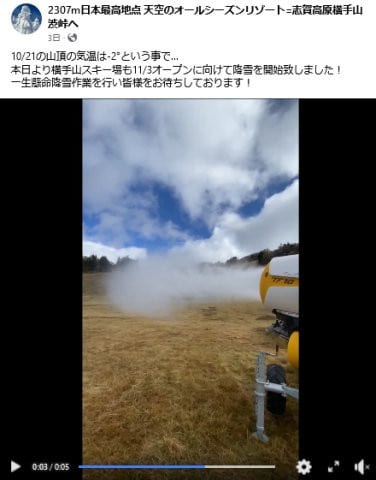
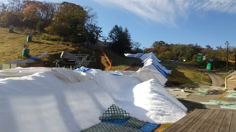

# 今週末のイエティの天気は，土曜は曇り～晴れ，日曜は晴れ時々曇りかな？そして軽井沢スキー場は順調に造雪作業進んでるようです

📅 投稿日時: 2023-10-26 04:06:51

ということで．

今週は（も？）いろいろクリティカルな

状況が続いてます（涙）

昨日は朝7時の新幹線に乗るために

朝6時前に家を出て．

今日も朝イチで都内出張で，

…23時前には帰れたけど．

出張で通常業務ができなかったので，

家で泣きながら仕事をこなし．

そしてまた明日も都内出張…

ってな状況で，Blogを書く時間も

取れないので．

今日は短めの更新！

えー．

11月3日オープン予定の横手山．

どうやら，先週末から人工降雪機を

動かしだしたようですが…

（[横手山Facebook](https://www.facebook.com/yokoteyama2307/)より）

うーん．

この後28，29日は横手山なら夜に

ぎりぎり人工降雪機が動かせるくらい

冷え込むかもしれないけど…

そのあとはまた気温が上がりそうなので…

たぶん，11月3日オープンは厳しい

でしょう（涙）

で．

一方．

11月1日オープンの軽井沢ですが…

特派員情報によると，造雪はばっちり

進んでいて，問題なく1日にはオープン

できそうな感じです！！

オープン1週間前で，ここまで造雪が

進んでいるとは…！

ってなことで．

11月1日には軽井沢もオープンしそうですが．

菅平は，10/21のオープン予定が延期された

あと，正式なオープン日程は未定のままです…

で．

今週末のイエティの天気ですが．

土曜：曇り時々日が差すかな？

　一瞬小雨がぱらつく瞬間もあるかも

　気温は平年よりわずかに低め．

　日が差さないと肌寒い

日曜：晴れ，時々曇り．

　気温は平年並みからちょい低め．

　日が差すとちょっと暖かく感じる

　レベル．でも日がかげると寒いので，

　寒い時の格好も準備しておいた方が

　いいかも

って感じでしょうか…

とりあえず，この週末もイエティに行けたら

行く予定です～１
