# 11月18，19日の週末に志賀高原はスキー場オープンできるのか？17日の大雨でイエティの雪は残るのか？そのあとの天気は？天気図を見てみた

📅 投稿日時: 2023-11-16 01:48:05

えー．

今日も比較的冷えた一日でしたが…

やはり，17日の高温の雨は避けられ

そうに無くなってきた今日この頃．

皆様におかれましてはご健勝のことと

存じます（時候の挨拶）

ってなことで．

果たして今週末．

志賀高原はオープンするのか？←いや，期待薄だから…

営業再開したばかりでまだコース幅が

狭いイエティが，17日を乗り越えられ

そうなのか？

…といったあたりを，天気図をもとに

読み込んでみましょう…

まず．

16日木曜の850hPa気温図ですが．

…うーん．微妙…

赤い0℃線はかなり北に行ってますが…

志賀高原は+3℃線よりは北にあるので．

朝晩はまだ人工降雪機がぎりぎり

動かせるか…

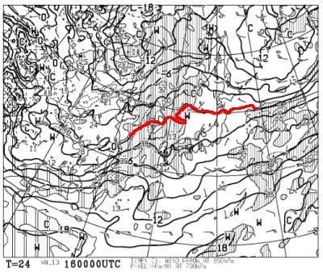

木曜の地上天気図では，日本に降水域が

ほとんどかかってないので，雨は降らなさそう．

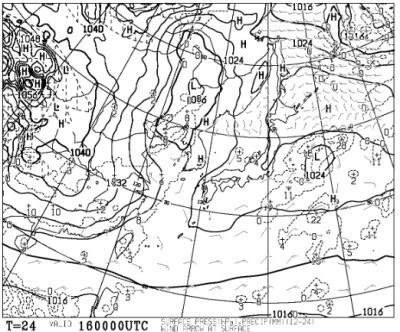

続いて，17日金曜の850hPa気温は…

うぎゃーーー！！

やっぱりだめだ！

赤い0℃線はかなり北なのはともかく．

水色の+9℃線が本州にかかっているので…

雪などは全く期待できない高温です（泣）

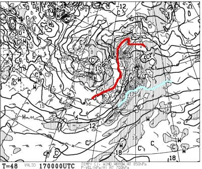

で．

地上天気図は…

はい．

すっかり降水域に覆われてますね．

ダメですね．

終わってますね．

17日は高温の雨ですね（涙）

これ…イエティはヤバいかも．

途中で営業休止の可能性がありますね…

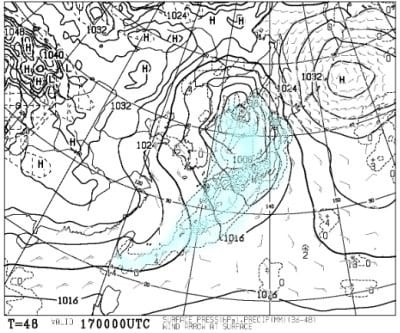

そして，翌18日の土曜日の850hPa気温は…

赤い0℃線が南下してくれて，志賀高原は

0℃以下に下がりますね！

これなら，降れば雪です…！！

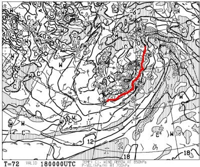

で．地上天気図は…

この日も全国的に降水域に覆われているので．

志賀高原は雪が積もりそう…！

10mm程度の降水量が予想されているので，

積雪量にすると10cmくらい積もって

くれるか…

うーん．ヘタするとイエティまでの

アクセス道路も雪が積もるかも？

でも，太平洋側は風が強そうなので…

前日の雨 ＆この日の風で，この日の

イエティは営業できない可能性が

高いです…（泣）

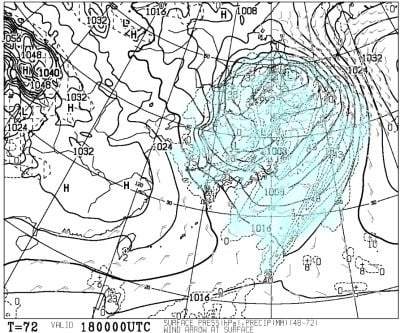

そして，日曜の19日は．

850hPaの赤い0℃線がまた北に戻ってしまい．

+3℃線すら志賀高原より北に行っちゃうので…

人工降雪機は動かせませんね（泣）

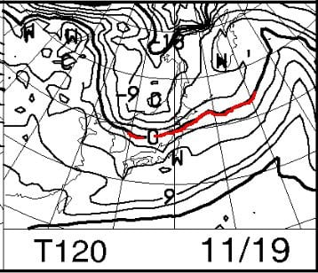

この日は降水域が日本にかかっておらず．

雨にはならなさそうですが…

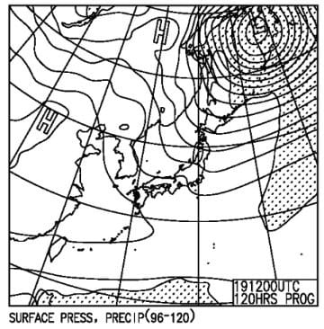

…ってなことで．

ここまでをまとめると．

16日木曜：志賀高原は朝は人工降雪機が動かせる．

　昼はたぶん動かせず，雪の積み増しは少ない．

　天然雪は全くなし．

　イエティは雨も降らず，平穏に営業できる

17日金曜：ダメな日．

　志賀高原も朝から雨．終日雨．

　時折強く降る．

　せっかくの人工降雪がかなり消える．

　ヘタすると全滅レベルに消える．

　イエティもヤバい．昼頃雨が強くなる

　ので営業見合わせるかも．

　この雨でヘタするとコースがまた

　途切れる

　

18日土曜：未明から冷えて，

　志賀は天然雪が降る．5～10㎝積もる．

　人工降雪機もなんとか再稼働．

　でも，湿度が高く気温もそこまで冷えず，

　人工降雪の出来高は低い．

　横手も熊もオープンは無理．

　イエティは風が強く，前日の雨の

　ゲレンデ状況悪化で営業しない可能性

19日日曜：志賀高原は午前中までは

　冷えて人工降雪できるけど，

　昼頃には気温が上がり降雪不可能に．

　おそらく熊も横手も17日の雨で

　やられているので，雪が足りずに

　この日もオープンできず．

　イエティは…うーん．

　何とか日曜までにはまた狭いながら

　営業復活してくれるんじゃないかな？

ってな感じで．

週末直前の雨で志賀もイエティもダメダメな

感じです…（激涙）

軽井沢は雨を乗り越えて，土日も営業して

くれるんじゃないかな…

で．

週末以降ですが．

20日はまた冷えてくれそうで，

人工降雪が打てそうですが．

21，22日はまた気温が上がり，

志賀高原は人工降雪機が動かせそうに

ありません（涙）

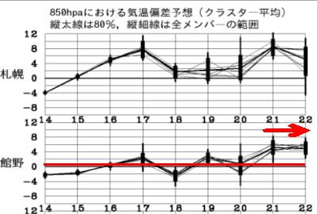

21，22日の850hPa図を見ると，

水色の+6℃線が志賀より北にあるので…

もう，人工降雪機が動かせないどころか

雪が融ける心配をしないといけないレベル．

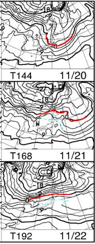

まぁ，でも．

21，22日は降水域が本州にかかっておらず，

雨にならなさそうなので．

雨で雪が消える心配はしなくてよさそう…

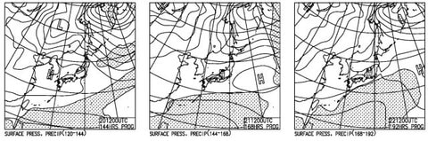

だけど，この状況を見ると．

23日までに横手・熊の湯がオープンする

可能性もほぼ0ですね（泣）

うーん．

24日以降は冷えそうな気配があるので，

それ以降に期待ですが…

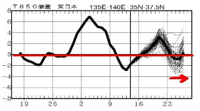

とりあえず．

今の状況では．

志賀高原も23日オープン予定の

他のスキー場も，23日までにオープンする

という期待はできない…

という予想です（激涙）

せめて25日までにオープンできるといいんだけど．

まだ23日以降の天気図がどうなるかは流動的

なので．

24日以降，冷え込むように全力で祈りましょう…
