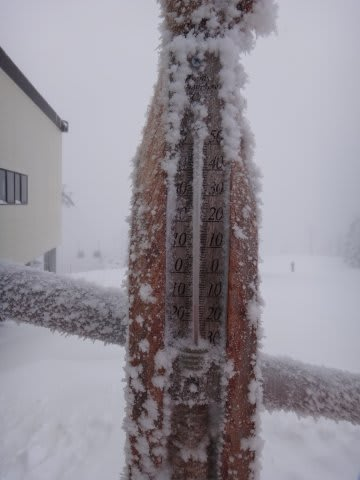

# 正月3が日の志賀高原ラスト…1月3日の焼額は最高っ！

📅 投稿日時: 2012-01-06 22:04:33

で．

正月休みの最終日となる1月3日の状況です．

＃ダイビングレポートみたいに，だんだんレポートが遅れてきている…

結論から述べましょう．

スキーはやっぱり太陽の下でやるものですな～

3日は晴れて最高のスキー日和．

スキーの神様ありがとう！

スキー最高！

体調も完全回復！

エネルギー充填，120％！

（20％がどこからか漏れてるってことかな？）

朝イチはマイナス15度．多少曇っていたものの，

ゲレンデはよだれじゅるじゅるもののシマシマバーン．

営業開始直後から日が射し始め…

開始30分後には晴天に！

うひょ～！！！さいこうっ！天国！

午前中は，人のいないバーンでひたすら重力に引かれ，

落下！落下！落下！

シアワセ～…

11時ごろ，一瞬ゴンドラ8分待ちまで行きましたが…

次にゴンドラに乗るときには，もうゴンドラの列は

これだけ短くなり，待ち時間も3分に．

8人乗りゴンドラの威力か．

このあと．12時ごろには，ゴンドラ待ち時間ほぼ0になってましたね～．

で．

午後も晴天が続くかと思いきや…

昼ごろには曇ってきました．

…でも．雪が降ってるわけじゃなく，ガスってもいないので，

視界良好．

雪も良好．

正月休み最終日の午後ということで，人も少なめ．

午後まで，ハイスピードロングターンOK.

あー．でも，2時過ぎてくると，ちょっとバンピーになってきたかな．

それでも，恵まれたコンディションでしたね…

体調も完全復活したし．

いやー．

楽しかった！

最後は良い感じで締めくくれて良かった～．

という感じで．

途中いろいろハプニングもあったものの．

無事，正月5連荘スキーは無事完了したのでした…

