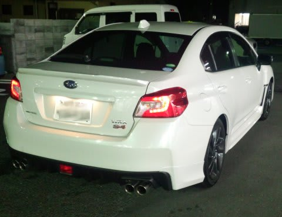
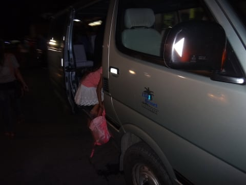
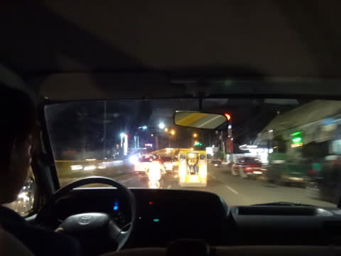
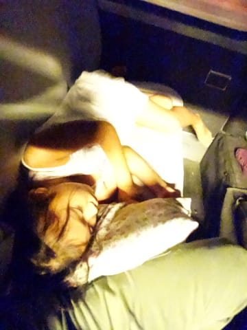
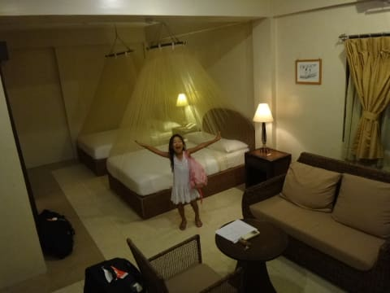

# 2014年8月　オスロブagain…再び，子連れでジンベエザメと泳ぐぞ！　その2

📅 投稿日時: 2014-09-02 01:08:30

🏷️ カテゴリ: [ダイビング日記](ce3a7a8d424d112fce83ee85c81a0e344.md)

そーいや，この日曜．

スバルに行って，出たばっかりの，

WRX S4に試乗してきました．

また後日，レポート書きますので，お楽しみに…

＃楽しみにしている人なんていないだろうけど←いつもの自己突込み

とりあえず．

徒然スキーヤー日記の

本題である，ダイビングレポートです…←なんのこっちゃ

----

…ということで．

我々を乗せた飛行機は，午後6時半ごろに

セブ空港に到着したわけですが．

…

そのあとは．

毎回「犯罪者じゃないのに…」と思いながらも，

[毎回別室に連れていかれてしまう](e3f297dded27f560b2aa0917a23a321a0.md)入国審査（またの名を，個室での尋問）を終え．

他の人が普通に入国し終わってしまった後，

寂しくぽつんとベルトコンベアーに残っている，

自分の荷物をピックアップして．

一人寂しく税関をくぐるわけで．

…その後，無事（無事じゃない気がするけど…）入国完了の儀式として，

ここでフィリピンペソに両替です．

日本で両替するより，フィリピンの空港で

替える方が，圧倒的にレートがいいので，

ここで両替しちゃいましょう．

今は，大体1ペソ2.6円くらいです．

といっても．

ホテルはクレジットカードを受け付けてくれるし，

空港でお土産を買う場合も，カードOKなので．

街中に買い物に出かけるつもりがなければ．

フィリピン出国税（550ペソx人数分…子供も同額（涙））だけ

換金しておけば，問題なしです．

＃帰りがセブーマニラ乗継便の場合，

＃このほか，国内線での空港使用料として，

＃セブ空港で200ペソ取られますが…

街中に買い物に行くとしても，せいぜい1000円～

2000円もあれば十分かと．

＃街中では，パン1個5ペソ（13円くらい），

＃ビール1本30ペソ（80円くらい）なので…

ちなみに．

我が家は，とりあえず10000円を両替しておいて，

現地最終日のホテルの清算の時に，余りそうなペソを

現金支払いにして，残額をカードで支払う…という

手段を使いました．

＃結局，3000円分くらい，ホテルでの現金払いに使ったかな

ってことで．

両替を終えたら．

空港前でホテルピックアップのバンに乗り込み…

セブ島中央部の空港からセブ島最南端のホテルまで．

車で約3時間のロングドライブが始まります…

…ここでも，娘は熟睡ですな．

そして．

夜10時ごろ，前回もお世話になった，

ルビ・リゾートへ到着！

