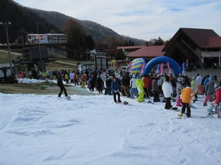
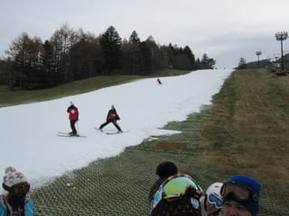
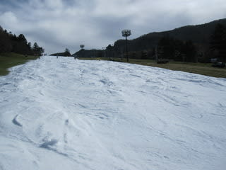

# 11月13日丸沼速報

📅 投稿日時: 2010-11-13 21:23:44

🏷️ カテゴリ: [2011スキー滑走日記](ca488c98cfb9169941c3e73770dcefb56.md)

11月13日の丸沼ですが…

結構込みました．

リフト待ち最大20分．

1時間4本平均ペースでした．

コース幅は例年通り．

大体20mくらいでしょうか．

Yetiに比べれば広かったです．

雪質がちょいとやわらかめで，昼ごろにはリフト前の急斜面が

結構荒れてぼこぼこになってましたね～．

部分的に下地のブラシも出てましたし．

でも，この時期に滑れるゲレンデとしては，斜度・幅ともに

いいほうではないでしょうか…
