# 大晦日の志賀高原は…ちょっとアイスバーン

📅 投稿日時: 2012-12-31 22:10:26

ってことで．

昨日の危惧のとおり．

昨晩からは，そんなに積もらず…わずか10cmほど(涙)

なので．

雪質は，下地が昨日の雨で融けた雪が凍ったアイスバーン(涙)

その上に，うっすらやわらかい雪，という感じ…

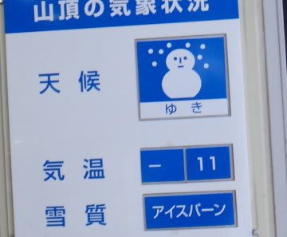

気温はかなり冷えて，マイナス10度程度だったので…

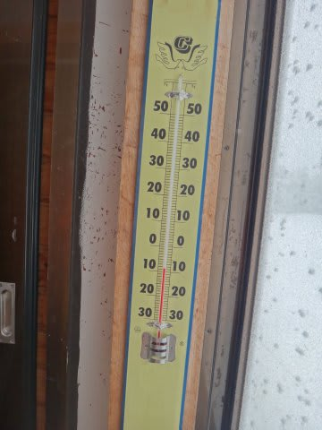

新しく積もった雪質自体は良かったんですけどね～

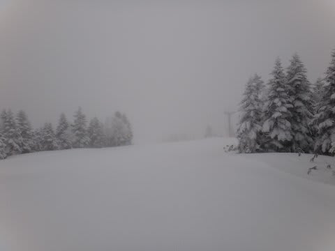

でも，ところどころこんな感じで，ピステンのキャタピラの形に凍ってたり…

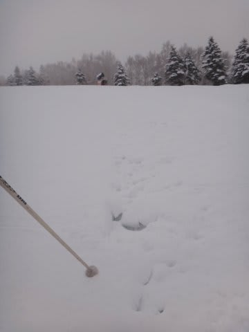

氷のころころが出てたり．

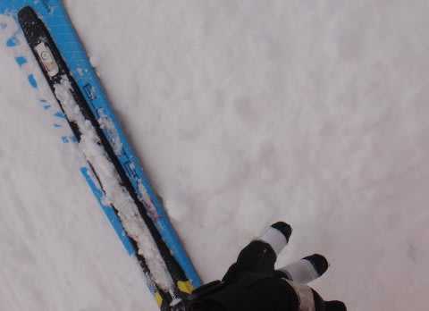

天気は，降ったり…

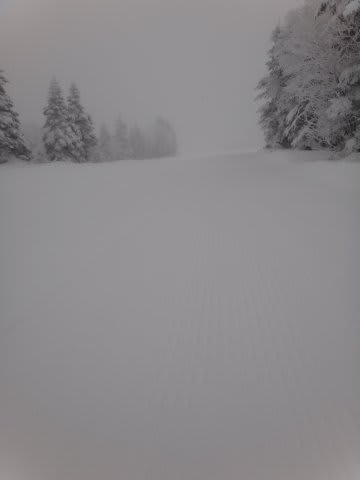

曇ったり…

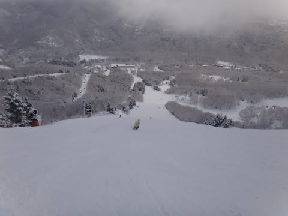

晴れたり…

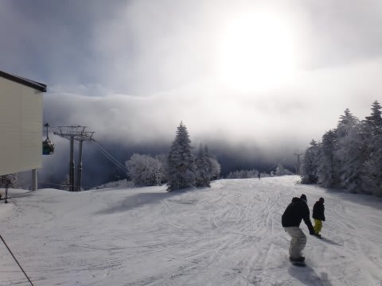

ってのが，何度も入れ替わるめまぐるしい天気．

あー．

ゲレンデ混雑は．

大晦日だけあって，込みましたね～

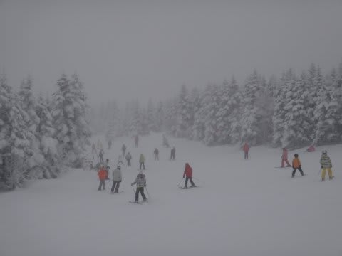

人口密度は高めだし…

第一ゴンドラ，午前10時ごろは最大10分以上待ちました．

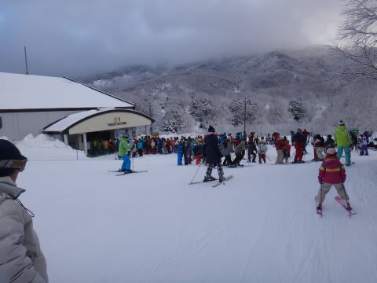

でも，昼ごろにはがらがらになったんですけどね．

午後は，コースはアイスバーンと溜まった雪によるコブが

入り乱れるコンディション．

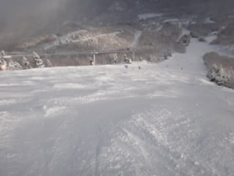

…ちょいと快適度は低めかな…(涙)

うーーーむ．

どうしたことだ．

この12月，上旬のほうがコンディション良かった気がするんだけど…？？

残念ながら，今晩もそんなに積もらなさそう…

元日も，ゲレンデ状況はあんまり改善しないかな～(涙)

うーーーん．

どかっと降ってくれることを期待っ！！
