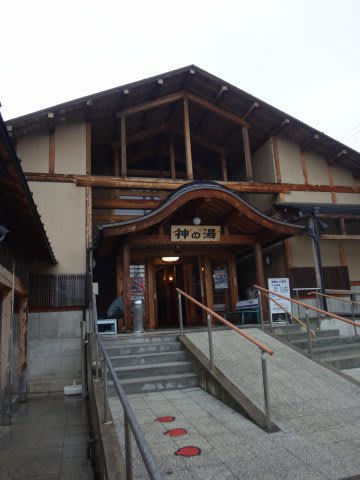

# 6月21日の月山速報その２

📅 投稿日時: 2014-06-23 02:25:06

いや，今日は．

日曜の今日は，月山には行ってないんですが．

今日は，

サクランボ狩りやら…

さらに，お城見学．

そのほかにも，博物館やら

郷土料理やら

牧場やら…

そして，最後に温泉まで．

と，いろいろ回ってきて．

帰宅が遅くなってしまい．

だもんで．

今日も，速報モードで…．

えー．

リフト運休中の，21日の土曜の月山ですが．

駐車場の車は，いつもに比べれば少なく．

いや，さすがに今日はガラガラだろう…

と，思ったところ．

いますよ～

リフト沿いを歩いて登っている人が．

そこまでして滑るのか～っ！

…って感じですね．

いや，リフト沿いだけじゃなく．

沢コースを登ってきている人もいますよ．

…スキーブーツを履いて，雪の上を

登ってくるとは…

うーむ．

信じられないっ！

この人たち，終わってるよっ！←お前に言われたくない

…終わっている人ではない私は，麓からリフト頂上まで，

気を失っている間に瞬間移動したので，

よくわからないのですが．

どうやら，リフト沿いのこういうところを登っていけば．

リフト乗り場～降り場までは，あまり休まず登れば40分．

あー．あれですよ．

…あくまで，リフト乗り場から降り場までです．

駐車場から乗り場まで＆リフト降り場からTバー乗り場まで…

ってのを入れると，超速い人で1時間15分．

普通の人は，1時間半以上見ておいた方がいいでしょう…．

板を肩に担いでいると，肩がすぐ痛くなって休憩が

多くなるので，もっと長くなるかな…

板やブーツは，ちゃんとバックパックに括り付けて

行くことをお勧め．

で．

意外と人が多く．

Tバーは10分以上待ちます（涙）．

Tバー沿いの雪は，そこそこ踏まれてますが，

それでもちょっと荒れ気味で，滑りにくいよ…

日野のTバーもちゃんと動いてます．

大斜面は，もうコブもほとんど消えて．

かなーりのナチュラルバーンです．

大斜面のコブを登って繰り返し滑っている人は，

なぜかほとんどいませんでしたね～．

ってことで．

雪はまだあるので．

「スキー板を履いて，滑ることはできる」

という感じの月山でしたが．

…さすがの私も，もう来週行く根性は無いです（^^;

これにてシーズン終了決定です…

＃速報っていっておきながら，かなり詳細な気がする…

## 💬 コメント一覧

### 💬 コメント by (ゆうこ)
**タイトル**: 期待を裏切らない
**投稿日**: 2014-06-23 21:11:37

期待を裏切らない展開ありがとうございます。

今年が月山1回だけだと、去年より少なめですね。

お仕事忙しかったから仕方ないんでしょうが。

でも、また数ヶ月でシーズンイン出来ますよ！

### 💬 コメント by (Goku)
**タイトル**: Unknown
**投稿日**: 2014-06-23 22:53:16

お！山形でも「根曲がり竹」あるのですね。

我が家では焼きタケノコは「味噌マヨ」で食べますが、山形ではナニ付けるんでしょう？

それにしても長～いシーズンお疲れ様でした。

### 💬 コメント by (Skier_S)
**タイトル**: 予想外の男でいたいのですが…
**投稿日**: 2014-06-24 00:01:07

＞ゆうこさま

月山に1回しか行けないのは，ちょっと

悲しいのですが．

まぁ，状況が状況なだけに仕方がないと

諦めています．

次のスキーシーズンにとんでもない

仕事の山場が来そうな気配なんですが…

スキーシーズン，大丈夫かな…（心配）

＞Gokuさま

この，根曲がり竹ですが．

月山近辺では，「月山筍」と呼ばれて，

かなりの名産だったりします．

山形では，ただの味噌をつけて食べますが．

私は何もつけずに食べるのが好きです～！

### 💬 コメント by (おーちゃん)
**タイトル**: おんなじだぁ
**投稿日**: 2014-08-29 20:45:33

初めまして。

このブログ、今日発掘させて頂きました。

私も、紫RB1から白BRM乗り換え者です。

しかも、私も6/21に、嫁をリフト山麓駅に放置し、気がついたらリフト山頂にいました！

大斜面の短いコブを、板担いでピストンしていたのですが、残念、私は写っていませんでした。

さらに、私も佐竹農園さんでした。志津のつたやさんに、お勧めされました。でも、最近はもっと寒河江SA寄りの佐藤農園さんになりました。

### 💬 コメント by (Skier_S)
**タイトル**: おーちゃんさま
**投稿日**: 2014-08-30 04:24:17

いやーーー！

メールありがとうございますっ！

まさか，こんな形で再会するとは…

そして．

まさか，私と同じBRレガシィで，

（それも，BRMってことはD型かE型ですよね…）

さらに，同じ日に月山に行き．

佐竹農園さんも行ったことがあるとはっ！！！

何たる偶然！

…そういえば，最近，丸沼オープン日が

遅くなってから，丸沼には行かなくなって

しまいましたが…

今でも丸沼に行ってらっしゃるんでしょうか？

また，トップシーズンにどこかのスキー場で

お会いしたいですよね～．

志賀で滑られることはあんまりないんでしょうか…

とりあえず，私は元気にスキーヤーやってます！

### 💬 コメント by (おーちゃん)
**タイトル**: ホント何たる偶然!
**投稿日**: 2014-08-30 07:27:52

何か、運命を感じますね！行動パターンに共通点が多すぎですね(笑)しかも、以前メアド交換した仲だったとは!だからこそ、同じ行動が生まれるんですかね?体格は大きく違いますが、先祖をたどると繋がっちゃうかも！

うちのレガシィは、D型の2.5i EyeSightですから、1年早いです。オデッセイは148,000kmでお別れしました。オデッセイも大好き(特に嫁が)でしたが、電装品がポロポロ壊れだしたので買い換えになりました。次はレヴォーグかなぁ♪(遠い未来の話ですけど)スバルAWDは雪道の安定感素晴らし過ぎるので！

うちのレガシィの月山往復の最高燃費は、16.8km/lですが、先日、那珂ICから磐越道まわりで岩槻ICまで、SA巡りをしたんですが、凄いです！19.2km/l出ました！設定は86km/hで、絶妙なON/OFFを使い分けるんです。そして、安全運転の大型トラックやバス見つけたら、EyeSightで飽きるまでついて行くんです。EyeSightの設定より近付けばさらに燃費は上がりますが、前車の小石をバンパーに受けやすくなるのでお奨めしません(お互い車大事にしてるので ピンとくるかと。)と、こんな小技で、燃費対策ハイテク車時代の車も、カタログスペック大幅超え出ますよ♪

おっと本来、スキーのブログでしたね。うっかり寝ぼけて起きて、脱線して書きまくりでしたね(失礼)

もう、50歳になりましたが、2週間に1回は滑ってます。あと2ヵ月弱で狭山行って、またリハビリ始めないといけませんね！

今もサロモン乗ってます。同じ時代のXRが乗りやすくて、まだ使っています。24 S5もハイシーズンに使ってますが重いので、こないだロッカーの24LTD Proの型落ち買いました。ちょっと楽しみです。

志賀方面は、北志賀夜間瀬、木島平に昨シーズン何度か通いました。そうそう3シーズン前から、嫁がスキー復活してくれて、ラブラブです♪

### 💬 コメント by (Skier_S)
**タイトル**: おーちゃんさま
**投稿日**: 2014-08-30 23:02:52

いやー．

ホントにここまで行動パターンが同じとは…（笑）．

うちのオデッセイは，記事にありますが21万㎞以上

頑張ってもらいました…

レガシィは，雪道が良すぎてもう他社に戻れません（笑）．

私も次はレヴォーグ2.0ほしいです…

私もEyeSightは勾配で設定スピード買えたり，

ところどころ細かいOn/Offを使って燃費稼いだり

しています．

でも，遅いのはダメな性格なので，100km以下で

設定することはないです…

でも，リッター16km越えするので，いい車です．

で，スキーの方は，あんまり志賀高原の

本体（？）まではいらっしゃらないんですね…

私は最近は，

10月Yetiオープン→アサマ2000→

12月第1週からGWまでひたすら志賀→

5月いっぱいかぐら→月山

というのがシーズンの定番パターンになりました．

スキー自体は毎週，うち2回に1回は子連れで

滑ってます！

そちらもご夫婦でスキーですか．

また，どこかで一緒に滑りたいですね～！！

スキーシーズンまでもうしばらくあるので，

しばらくは夏モード．

