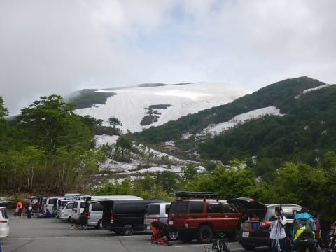
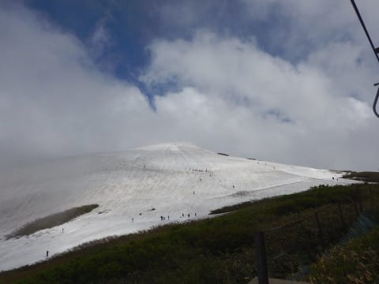

# 2019/6/9(日)の月山スキー場，詳細レポートその1…終日曇り，時折ガスも．朝は混んだけど，それほどひどい混雑じゃなかったよ．

📅 投稿日時: 2019-06-11 02:39:16

🏷️ カテゴリ: [2019スキー滑走日記](c3e4496fc0fb7f9c17ff21214a35b1ace.md)

ということで．

昨日日帰りで行ってきた月山ですが．

本日は詳細レポート！

…長くなりそうなので．

前編，後編の2晩連続ドラマにてお送りします．

まずは前編から！←いや，まずは後編からってことは無いから．そこは宣言しなくて大丈夫だと思う

えー．

我が家からはるか500km．

1時過ぎに出発し，駐車場には7:30ごろ

到着しましたが…

うーむ．

雲が切れて，大斜面が駐車場から見えてますが．

直前まではゲレンデは雲に隠れて全く見えない状況．

果たして今日は晴れてくれるのか？？

とりあえず．

朝7:30の段階ではまだ駐車場に空きがありますが．

あまり天気が良くないわりに，結構駐車場は

埋まってますね…

ってことで．

駐車場からリフト乗り場まで，

とぼとぼ歩いていきますが…

旧姥沢小屋あたりまでは完全除雪されてますね．

そこから先は雪が残ってますが…

雪が多い年なら，この時期はまだ全面雪が残って

いるところ．

もう下地が出始めているので，そんなに雪が

多いわけでは無さそうな感じ…

ってことで．

駐車場から歩くこと10分．

さらには雪の坂道を5分ほど歩いて，

やっとリフト下駅に到着！

朝8時からリフト営業開始ですが．

リフト券売り場は8時直前にオープンで．

窓口が開く前に，かなり長い列に

なってました…（泣）

ちなみにリフト券は一日券4600円．

結構高いです…（涙）

8時～12:30までの午前券，

11:30～営業終了までの午後券は

ともに3400円です．

ってなことで．

リフト券を買ったら，さっそくリフトに

乗りますが…

まだリフト乗り場には雪がつけてあって．

スキーを履いてリフトに乗れます！

スキーを履いて乗り降りするこの時期は，

リフトはまだ高い冬ポジションですね～．

ただ，6月11日から13日までの3日間，

リフトを夏ポジションの低い位置に

架け替えるため運休なので．

今週末は，板を履いてリフトに

乗れなくなります…

…ってなことで．

山頂付近にやってきますが…

山頂はガスの中ですね（涙）

まぁ，雨が降ってないだけマシですか．

うん．雨よりはいい！←何とか自分をごまかしに行く

リフトが山頂につくと…

リフト降り場にも，ちゃんと雪がつけてあります．

リフト降り場からゲレンデまでの通路は

狭い一本道ですが…

まぁ，まだ厚みはあるから．

もう1週間くらいはもちそうかな…

ってなわけで．

ゲレンデに出ますが．

まだまだ結構雪がありますね～！

…そして．

なんと．

シマシマ！

圧雪がかかってます！！

…月山って，圧雪かけるんだ…

でも，雪自体は朝から緩んでるし．

うっすらガスで，視界も良くないし．

雪もきれいじゃないので．

シマシマとはいえ．

いつもの焼額のあさイチみたいに，

「うひょひょひょ！シマシマっ！シマシマ！」

って感じではないですね…（残念）

とはいえ．

もう6月に入ってこれだけ滑れるんですから．

白い粉中毒の皆さんにとっては．

日本最後の楽園ですね．

もう，滑れるだけありがたい！

他のスキー場が無い時期，月山があって良かった！！

ってことで．

最初は沢コースを滑りましたが．

沢コースの最後の方，ちょっと

藪が出始めてますね…

うーん．

沢コースがいつまでもつか…

でも．

沢コースが終わったあと．

リフト乗り場に向かっては，

雪がかなり運び込んであって，

問題なくリフト乗り場まで

滑りこめます…

そして．

朝9時ごろまではリフト待ちも

少なく．

快適にグルグル回せました…！

うーむ．

これで，ゲレンデの視界さえよくなって

くれれば…（涙）

山頂付近は時折雲の切れ間があるものの．

朝のうちは，大斜面方向は完全に

ガスの中に隠れてました…（泣）

ってことで．

ここまででかなり長くなったし．

昨日は活動時間25時間だったというのに．

今日ももうこんな時間（涙）

死ぬほど眠いので…続きは明日！！
