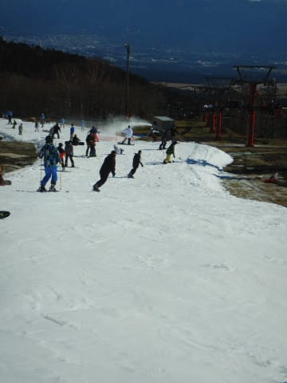
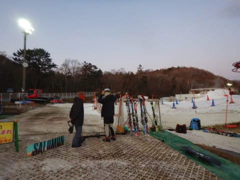

# 2019/11/17(土)のイエティ，詳細レポート…すっきり晴天なれど，気温低めで午前は空いてていい感じ！午後はイマイチ…

📅 投稿日時: 2019-11-19 02:23:14

🏷️ カテゴリ: [2020スキー滑走日記](c282e9230de179e245c7334eabeb0a3b3.md)

ってなことで．

某国出張中なわけですが．

ちょっと今さら感がある，この土曜の

Yetiのゲレンデレポート詳細です…！

…まず．

朝8時の営業オープン前の

列に並びますが…

うむ．

今日は並んでいる人も少なく．

そんなに混まなさそうな予感！？？

8時のゲートオープンと同時に，

雲一つない晴天のゲレンデに出てみると…

そこに待っていたのは．

明け方は氷点下まで冷えた，

冷え冷えシマシマのゲレンデ！

うひゃーーー！

一番乗りじゃないけど．

しっかり冷えたシマシマゲレンデ．

ちょっと板が潜り気味のところも

あるとはいえ．

ピカピカ晴天の中で，このコンディションで

これだけガラガラなゲレンデを滑れれば…

これは気持ちいい！！

うーむ．

Yetiって，時々こうやって

いい時があるから，ついつい来ちゃうん

だよな…

さらに，

朝のうちはリフトも飛び乗りなので，

いいコンディションのゲレンデを，

ひたすらグルグルできます！

どうやら，アイクスラッシュだけ

じゃなく，人工降雪機でばら撒かれた

雪の跡もあったので．

今朝にかけて，人工降雪機も

動いたようですね…

だもんで．

人工降雪パワーもあり．

コース幅も，先週までに比べて

そこそこ広がった感じ…！

大回りとは言わないけど．

中回りくらいはできるコース幅は

あります！

…ちょっとゲレンデは朝から凸凹

してたのが惜しいけど．

で．

今日はすっきり晴天のいいコンディションにも

関わらず．

なぜか，営業開始から2時間経った10時近く

になってもガラガラ！

10時を過ぎても，それほど混まず．

今日は午前中は，クワッドと並行して

かかる，青いペアリフトは動きません

でした…

って感じで．

普段に比べればガラガラな，

本日午前中だったのですが．

11時を過ぎるころになると，

さすがにゲレンデの人口密度が

増え始め…

うはーー．

リフト待ちも，3分を過ぎ，

最大5分程度に伸びてきました…（涙）

当然，それに伴い，

ゲレンデの人口密度も

上がっていきます…（泣）

さらに．

午後1時ごろになると．

ちょっと，ゲレンデの人口密度は

楽しく滑れる感じじゃなくなってきたかな(泣）．

気温は低めとはいえ．

晴天の日差しがあたっているので．

雪もちょっとだけ，粘りつく感じに

なってきました…

さらに．

コース上数カ所だけですが．

ちょっと茶色くなってきた

ところも…（涙）

とはいえ．

コースに穴が開くほどじゃなかった

ので，それほど気にはならない

レベルでしたが…

しかし．

このスキー場．

午後になるほど人が増えていき．

午後2時半には…

なんじゃこりゃ（泣）

この状況を見て，並行してかかる

青のペアリフトが運転開始して．

青のペアリフトは飛び乗り，

クワッドリフトもこの程度の

混雑に収まりましたが．

いや…

普通のスキー場なら，午後に

向かって空いていくのに．

やっぱりYetiは，午後になるほど

混むという，不思議なスキー場だなぁ…

で．

リフト2本でゲレンデに人が送り込まれるので．

ゲレンデの人口密度はやっぱり上がりますが．

でも，コース幅が広がっているので．

先週ほど，コースの人が多すぎて

どうしようもない…

って感じじゃなかったかな．

コースの雪の厚みも，

先週までに比べれば増していて．

午後最後には，こんな感じで

ちょっと茶色くなった部分が

3カ所ほどありましたが．

土が出てくるようなことは，

もうさすがになかったです…

…ってなことで．

午後4時にはコース整備タイムが

始まり，1時間ほどの一旦中断が

入ります．

そして．

狙うは当然．

圧雪直後のシマシマ！！

…なわけで．

午後5時のコースオープンを並んで待ち．

圧雪車がコース整備を完了して．

コースがオープンされたら…

待ってました！！

シマシマゲレンデ！！！

Oh!!

シマシマっ！！！

気温は低めで，しっかり締まり気味の，

気持ちよく傾ける雪質！！

前に誰もいないポールポジションで，

気持ちよく傾きたい放題！

…この時期に．

これだけの幅で，これだけのシマシマが

滑れれば，上出来でしょう…←だから，なぜいつもそんな上から目線なの？

とはいえ，気持ちよかったのは

せいぜい2本目まで．

それ以降になると，ゲレンデの人口密度は

昼間と変わらないレベルに高くなって

しまいました（涙）

そして…

リフト待ちも伸びていき．

…なぜ…

なぜ，昼間よりリフト待ちが

長くなるの？？（泣）

ってなことで．

ナイターなのに，昼間以上のリフト待ち

5分越えになってきたので．

前日の寝不足もあり，午後6時過ぎに

退散したのでした…

ってな感じで．

終電帰りの次の日．

それも，海外出張前日という，

常識的な人ならスキーに行くところじゃない

ところを，強引にスキーに行ってきた

土曜でしたが．

すっきり晴天で，気温も低く．

午前中は信じられないくらいのガラガラ状態で

3時間以上滑れたし．

無理してでも行ったかいがあった…

という土曜日だったのでした．
