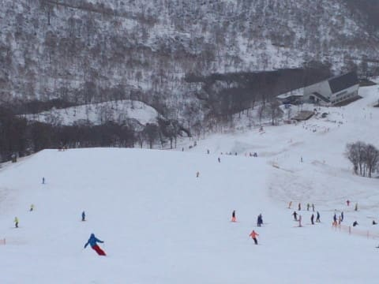

# 5月13日（土）のスキー場は，雨＆風でひどいことに…そして，涙の一日（泣）．

📅 投稿日時: 2017-05-14 00:53:45

🏷️ カテゴリ: [2017スキー滑走日記](c7d777cecfc91bdf0fa464ad62c6d49ab.md)

えー．

大変悲しいことに，明日用事があるために．

こんな雨の天気にもかかわらず，

本日スキーに行くしかなかった，

Skier_Sです．

ってことで．

予告通り，奥志賀へ行ったわけですが…

かなりの雨，ですね…（涙）

そして．

朝8時に奥志賀へ到着すると…

え？

なに？強風で，リフト運休だとっ！！！？？？

私「あの…今日，リフト動きそうでしょうか…」

係員「これから風が強くなりそうだし…

　厳しいでしょうねぇ…．

　横手も熊の湯も止まってますよ」

私「えええ…っ！？？」

がががががーーーん！

なんてこった！

なんてこった！

交通費と時間をかけてここまで来て，

全く滑ることなく帰らざるを得ないのか…っ！？？

とりあえず．

奥志賀の駐車場で，9時ごろまで待ってみたけど．

…志賀高原のどのリフトも，全く動く気配なし．

…ってか，風がだんだん強くなってきてる気が…（涙）．

私「これ，今日ダメですかね…」

係員「厳しそうですね…」

私「雪が残ってたら，来週まで営業しようって

　話でしたけど…」

係員「おそらく，今日のこの天気でかなりやられちゃってるので，

　来週は無いんじゃないかな…」

…

…うがーーー！！

なんてこった！！

…ダメだ．

なんだか，いろいろダメだ，今日は…（泣）．

しかし，日帰りでここまで来て，リフトが

うごいてないなんて…（涙）．

何のためにここまで来たんだ～っ！！

私の時間を返せ～！

あぁ…

この無駄な時間．

無かったことにしたい．

この午前中，なかったことにしたい…

…

…

（しばらくお待ちください）

…

…えー．

雨にもかかわらず，本日スキーに行ってきた，

Skier_Sです．

本日は，かぐらスキー場にやってきました～！

なんと．

かぐらスキー場．

この時期でも，かぐら・みつまたエリア，

ほぼ全面滑走可能です！

素晴らしいっ！！！

…なぜか本日のかぐらの到着は，

11時を過ぎてしまいましたが…

…え？奥志賀？

…

…な，なんのことかな？

…いや．

人から聞いたところ，リフトが動いてなかったみたいなんで，

かぐらに来たんですよ．

…他人とは思えない人に聞いたんです．

ええ．

まぁ．

志賀高原は．

横手第2が10時から11時まで，

熊の湯第2リフトが11時から12時くらいまで，

一瞬動いたらしいのですが…

強風ですぐ止まっちゃって．

渋峠の遅いリフト1本だけ，10時から夕方まで

動いたらしいです．

それに比べ．

かぐら・みつまたは朝から全面営業！

そして，かぐらは下のみつまたまで，

かなり雪がありますよ！

みつまたは，かなり硫安が効いててフラットで．

意外と楽しく大回りできましたよ～！

天気は，昼ごろまでパラパラ雨が降ってましたが．

1時くらいからは，雨はほぼやみ．

降ってもポツポツ程度．

午後2時以降は，雨はほとんど降ってない感じで，

午後は意外と濡れずに滑れました～！

ゴンドラは，11時過ぎから13時近くまで，

強風で一旦運転を見合わせましたけど…

13時前からは減速ながら運転再開！

ゴンドラ乗り場近辺まで，雪はたっぷりありますし，

ピスラボを滑ることなくゴンドラに乗れますよ～！

そして，かぐらメインバーン．

まだ，全くブッシュの気配はありませんね～．

テクニカルコースも，まだコブ溝に

土が出てきたりしてませんし．

ジャイアントコースも，ほぼ100％滑れて．

コブ溝の底が抜けてるのはほんの数か所だけでした．

…ただ．

本来なら，本日オープンしているはずのパノラマコース．

なぜか今日は開いてませんでしたね…

で．

天気が悪かったため，ゲレンデの人は少なめで…

かぐらの高速クワッドは終日

強風のため減速運転ながら，

午後はずっと搬器2-3台待ち程度で乗れましたよ～！

ということで．

また明日，詳細モードで報告します…

で．

さらに本日．

追い打ちをかけるような悲しいことが…

…これまでのBlog写真撮影に大活躍してきたデジカメ．

なんと．ゲレンデに落っことしてきちゃいました（涙）

ゲレンデで写真を撮ったあと，

リフトに乗った時にデジカメが無いことに気づき．

必死にゲレンデを探しましたが…

見つかりませんでした（泣）．

拾得物としても届いてなかった…（激泣）

もし，かぐらメインゲレンデで，

SONYのTX-30を拾った方．

それは，わたしのカメラです…（泣）．

＃なので，奥志賀で撮ってきた写真が無い（涙）

## 💬 コメント一覧

### 💬 コメント by (Goku)
**タイトル**: 言葉を失います・・・
**投稿日**: 2017-05-14 09:14:44

ナント、志賀からかぐらに移動っすか！！！！！！！

ビックリマークいくつ付けたらいいのかわかりません(笑)

その行動力、スキーへの執着心、ホント神です。

いや、神以上だ～

でも、かぐらが良くて良かったですね!(^^)!

ＰＳ：デジカメ、出てくるといいですね。

### 💬 コメント by (マルハバ)
**タイトル**: ホテル銀嶺さんのブログから・・
**投稿日**: 2017-05-14 11:55:57

当日の志賀の状況を知り

前半の記事は予想どおりでしてが

まさか かぐらへワープしていたとは・・

私の頭の中では

「ホントに行った！？ホントに行った！！」

という言葉が何度も駆け巡っておりました（笑）

正月、家族で万座へ行った時

食中毒騒ぎで「代宿として苗場プリンスへ・・」

と言われ「ここから苗場？今から苗場？ジョーダンでしょ！」

とフロントに噛み付いた私が恥ずかしい。

### 💬 コメント by (しんちゃん)
**タイトル**: ええーーーー!!
**投稿日**: 2017-05-14 17:26:43

志賀高原で天気待ちしたあとに、くじけずに移動するなんてええーーーー!!

す、す、凄すぎる!!

デジカメ、ホント見つかって欲しいですね

m(_ _)m

### 💬 コメント by (michi)
**タイトル**: Unknown
**投稿日**: 2017-05-14 18:29:24

凄いです。いや、言葉を失いました(^^;)

志賀高原からかぐらまで何時間？

いや、他の方が言われるとおり、神です。

デジカメ、戻ってくると良いですね。

### 💬 コメント by (はなげ親分)
**タイトル**: う～む！
**投稿日**: 2017-05-14 23:22:31

その病気・・・

重症ですなぁ～（笑）

### 💬 コメント by (ぴよ＠太田市)
**タイトル**: どうやって？
**投稿日**: 2017-05-15 09:47:22

信州中野IC→藤岡JCT→湯沢ICルートですか？

### 💬 コメント by (Skier_S)
**タイトル**: これって驚かれるんですね…やっぱり
**投稿日**: 2017-05-16 02:33:53

＞Gokuさま

実は，自宅→志賀→かぐら→自宅とめぐっても，中野経由で志賀往復するのと距離的には変わらないんですよ…

自宅→志賀が4時間ちょい，

志賀→かぐら2.5時間，かぐら→自宅で2.5時間の計5時間．

私にとって，志賀直接も志賀→かぐら→自宅も，

そんなに変わらない感じでした（笑）

＞マルハバさま

私にとっては，移動時間がかかることより，

「滑れない」

ことが致死的ですので…

長時間運転では死にませんが，

滑れないと死ぬので（笑）

移動するにあたっては，全くためらいなかったです．

…でも．

万座で，「苗場へ行け」ってのは噛みついて良いかと（笑）

＞しんちゃんさま

え？

わざわざ時間をかけて移動して，

滑れないと悔しいので，

滑れるスキー場があれば，

普通は移動しますよね…

普通は…

…

もしかすると，普通じゃなかったですか！？

…と，驚いてみる（笑）

デジカメはまだ出てきてません（涙）

でも，3年間で4万枚近く撮影したカメラ

なので，もうボロボロで「買い替え時だなぁ…」

と思っていた…というのが救いでしょうか．

＞michiさま

志賀からかぐらまで，2時間半です～．

もう，滑らなかったら往復運転8時間

＆交通費がまるまる無駄じゃないですか…

かぐらで滑れば，無駄にならずに済む！

という心境でした…

志賀→かぐらは下道なので高速料金は

かかりませんし，意外と費用負担無く

移動できるな，と．

…デジカメ，まだ見つかりません（涙）．

＞はなげ親分さま

重症というより，不治の病ですから…

もう，致死性のビョーキです（笑）

＞ぴよ＠太田市さま

いや，完全下道です．

飯山→国道117→津南→湯沢

という感じの，北回りルートです…

詳しくは本日の記事をご覧ください！

